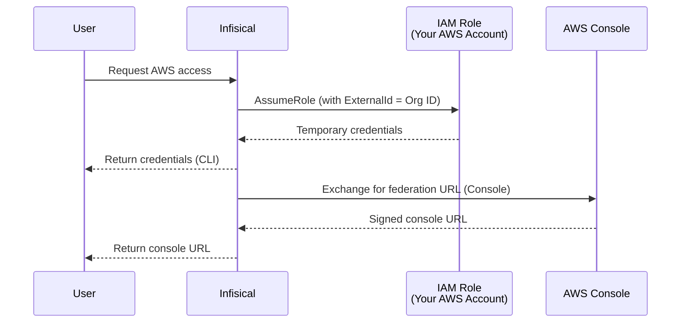

AWS IAM accounts let you manage access to AWS through IAM role assumption. Users can open the AWS console directly or use the CLI to get temporary credentials, and every access is logged.

Infisical assumes the IAM role you configure directly, then returns short-lived STS credentials. Those credentials work with the AWS CLI and can also be exchanged for a federated AWS Management Console sign-in URL.

<Note>
AWS IAM accounts do not require a Gateway. Infisical communicates directly with the AWS STS API.
</Note>

## How It Works

When a user accesses an AWS IAM account, Infisical assumes the account's IAM role using AWS STS and returns the temporary credentials:



There is a single role per account. Its trust policy allows Infisical to assume it, scoped by an **External ID** set to your **Infisical Organization ID**. The External ID prevents [confused deputy attacks](https://docs.aws.amazon.com/IAM/latest/UserGuide/confused-deputy.html), where another Infisical customer could otherwise trick Infisical into assuming your role.

## Prerequisites

Before adding the account in Infisical, create the IAM role in your AWS account with a trust policy that allows Infisical to assume it.

<Steps>
  <Step title="Create the role with a trust policy">
    Create an IAM role (e.g., `infisical-pam-readonly`) with the following trust policy. Replace `<INFISICAL_AWS_ACCOUNT_ID>` with the Infisical account ID for your region and `<YOUR_INFISICAL_ORG_ID>` with your Infisical Organization ID.

    ```json
    {
      "Version": "2012-10-17",
      "Statement": [{
        "Effect": "Allow",
        "Principal": {
          "AWS": "arn:aws:iam::<INFISICAL_AWS_ACCOUNT_ID>:root"
        },
        "Action": "sts:AssumeRole",
        "Condition": {
          "StringEquals": {
            "sts:ExternalId": "<YOUR_INFISICAL_ORG_ID>"
          }
        }
      }]
    }
    ```

    <Warning>
      Always include the External ID condition. Without it, another Infisical customer could potentially trick Infisical into assuming your role.
    </Warning>

    **Infisical AWS Account IDs:**

    | Region | Account ID |
    |--------|------------|
    | US | `381492033652` |
    | EU | `345594589636` |

    <Note>
      **For Dedicated Instances**: Your AWS account ID differs from the ones listed above. Contact Infisical support to obtain your dedicated AWS account ID.
    </Note>
    <Note>
      **For Self-Hosted Instances**: Use the AWS account ID where your Infisical instance is deployed. This is the account that hosts your Infisical infrastructure and will be assuming the role.
    </Note>

    You can find your Infisical Organization ID under **Organization Settings**.
  </Step>
  <Step title="Attach permissions to the role">
    Attach whatever permissions policies define what this role can do in AWS. These are the permissions users receive when they access this account through Infisical.
  </Step>
</Steps>

## Creating an Account

<Steps>
  <Step title="Start adding an account">
    Go to **Privileged Access Management → Accounts** and click **Add Account**.
  </Step>
  <Step title="Select a folder and template">
    Choose which [folder](/documentation/platform/pam/folders/overview) to add the account to, then select an AWS IAM [template](/documentation/platform/pam/templates/overview).
  </Step>
  <Step title="Enter connection details">
    | Field | Description |
    |-------|-------------|
    | **Name** | A descriptive name (e.g., `prod-admin-access`) |
    | **Role ARN** | The ARN of the IAM role Infisical assumes for this account (e.g., `arn:aws:iam::123456789012:role/infisical-pam-readonly`) |
  </Step>
  <Step title="Save">
    Click **Create**.
  </Step>
</Steps>

<Note>
  To expose the same role in more than one folder, add an account in each folder pointing at the same **Role ARN**. Each account is a distinct entry that references the same underlying IAM role.
</Note>

## Session Duration

Sessions use short-lived STS credentials. The duration is bounded by the target role's **maximum session duration** in AWS (`MaxSessionDuration`), with a minimum of 15 minutes. Requesting longer than the role allows will cause AWS to reject the request, so set the role's `MaxSessionDuration` to cover the session lengths you expect.

<Info>
  AWS Console sessions cannot be terminated early. Once a federated URL is generated, the session remains valid until it expires. You can [revoke active sessions](https://docs.aws.amazon.com/IAM/latest/UserGuide/id_roles_use_revoke-sessions.html) by modifying the role's trust policy.
</Info>

All actions performed with the credentials are logged in [AWS CloudTrail](https://console.aws.amazon.com/cloudtrail). The session is identified by the `RoleSessionName`, which includes the user's email for attribution.

## Connecting

<Tabs>
  <Tab title="AWS Console">
    1. Go to **Privileged Access Management → Accounts**
    2. Find the account and click the rocket icon, then select **Connect in Browser**
    3. You'll be taken directly to the AWS console, logged in with the role
  </Tab>
  <Tab title="CLI">
    The CLI writes temporary credentials to your AWS credentials file as a named profile:

    ```bash
    infisical pam access my-folder/prod-admin-access
    ```

    This creates a profile named `infisical-pam/my-folder/prod-admin-access` in `~/.aws/credentials`. Use it with the AWS CLI:

    ```bash
    aws s3 ls --profile "infisical-pam/my-folder/prod-admin-access"
    ```

    Or set the `AWS_PROFILE` environment variable:

    ```bash
    export AWS_PROFILE="infisical-pam/my-folder/prod-admin-access"
    aws sts get-caller-identity
    ```

    Press **Ctrl+C** to stop and remove the credentials profile.

    **Flags:**
    - `--reason <reason>`: provide an access reason (if required by template)
  </Tab>
</Tabs>

## Next Steps

<CardGroup cols={2}>
  <Card title="Kubernetes Accounts" icon="dharmachakra" href="/documentation/platform/pam/accounts/kubernetes">
    Add Kubernetes cluster accounts.
  </Card>
  <Card title="Sessions" icon="display" href="/documentation/platform/pam/sessions/overview">
    View and manage sessions.
  </Card>
</CardGroup>
