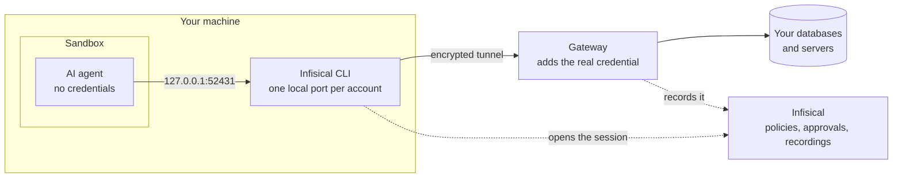

AI agents increasingly do work that needs privileged access: a coding agent tracing a bug through production data, or an agent you built yourself running a nightly task against a database. The usual way to arrange that is a connection string in the agent's environment, which leaves a long-lived credential sitting in a process that reads untrusted input all day.

**Agentic access** brokers that access instead. One command opens the [accounts](/documentation/platform/pam/accounts/overview) an agent is allowed to use, hands it instructions describing them, and starts it inside a sandbox:

```bash
infisical pam agentic access -- claude
```

From there the agent works on its own, and no credential ever reaches it. Any agent can be run this way: Claude Code, Codex, and Gemini are recognized by name and told what they can reach in their own format, and an agent you wrote yourself reads the same instructions from [an environment variable](#agents-you-build-yourself).

## How it works

Each account the agent may use is opened as a port on `127.0.0.1`. The agent connects to a port the way it would connect to any database or host, and the [Gateway](/documentation/platform/gateways/overview) on the far side supplies the real credential:



1. **The ports open first, and nothing is connected.** No [session](/documentation/platform/pam/sessions/overview) exists until the agent actually reaches for an account.
2. **The agent connects when its task calls for it.** That first connection is what opens the session, subject to the usual checks: role, duration, and [approval](/documentation/platform/pam/access-requests/overview).
3. **The Gateway holds the credential.** It injects it on the way to the database or host, so the agent authenticates to nothing and stores nothing.
4. **Everything is recorded**, attributed to whoever the run authenticated as, exactly like a person's session.

## Prerequisites

- The [Infisical CLI](/cli/overview) installed, and either `infisical login` completed or a machine identity to authenticate as.
- The Connector or Admin [role](/documentation/platform/pam/concepts/access-control) on the folders or accounts the agent should reach, held by whoever the run authenticates as.
- macOS, or Linux with [bubblewrap](https://github.com/containers/bubblewrap) installed. The sandbox comes from the operating system, so where one is unavailable the command refuses to start unless you [turn the sandbox off](#turning-the-sandbox-off) yourself.

## Who the agent runs as

An agent has no access of its own. It borrows the access of whoever starts the run, and that can be either of two things:

- **You.** Log in with `infisical login` and the agent uses your own access. Its sessions and any access requests are attributed to you, exactly as if you had opened them yourself. This is the normal way to work with a coding agent at your terminal.
- **A [machine identity](/documentation/platform/identities/machine-identities).** For an agent that runs with nobody watching, give it an identity of its own so its sessions and requests belong to it rather than to a person. See [Running unattended](#running-unattended).

Nothing else on this page changes between the two.

## Starting an agent

Everything after `--` is the command that starts your agent. By default it can reach every account you could launch a session on yourself, which is usually more than a single task needs, so narrow it with `--account`:

```bash
infisical pam agentic access --account prod/orders-db --account prod/bastion -- claude
```

<Tip>
  Give the agent the accounts the task needs, not everything you have. The instructions tell it to stay on the accounts it was given, but a smaller set is a smaller blast radius.
</Tip>

Before the agent starts, the run prints what it can reach:

```text
  Infisical PAM proxies ready for claude

    127.0.0.1:52431  prod/orders-db (PostgreSQL)
    127.0.0.1:52432  prod/bastion (SSH)
    127.0.0.1:52433  prod/payments-db (PostgreSQL)  [awaiting approval]

  Not started:
    prod/legacy-db: you don't have permission to launch sessions for this account

  Proxy logs: /Users/you/.infisical/pam-agentic/access.log
```

Anything left out appears under **Not started** with the reason, so no account goes missing silently. One reason worth knowing in advance: an account whose [template](/documentation/platform/pam/templates/overview) requires a reason needs `--reason` on the command line, since the agent owns the terminal and there is nothing to prompt.

Sessions are created lazily, on the agent's first connection to each account, so accounts it never touches produce no sessions at all.

### Supported account types

Agents can reach:

- **Databases** — [PostgreSQL](/documentation/platform/pam/accounts/postgresql), [MySQL](/documentation/platform/pam/accounts/mysql), [SQL Server](/documentation/platform/pam/accounts/mssql), [MongoDB](/documentation/platform/pam/accounts/mongodb), and [Redis](/documentation/platform/pam/accounts/redis)
- **Servers** — [SSH](/documentation/platform/pam/accounts/ssh), and [Windows](/documentation/platform/pam/accounts/windows) over RDP
- **Clusters** — [Kubernetes](/documentation/platform/pam/accounts/kubernetes)

Kubernetes accounts are set up for the agent automatically, so `kubectl` works inside the run without touching your own kubeconfig.

<Note>
  Accounts whose template requires **MFA** can't be used here yet, whoever the run authenticates as. Reach those with `infisical pam access`, which prompts for MFA in the browser. Support for MFA in agent runs is planned.
</Note>

## How the agent is told

An agent that doesn't know these accounts exist won't use them, so every run writes an instruction document. It names the accounts the agent can reach, tells it that no credentials are needed because the Gateway supplies them, that everything it runs is recorded, and that it shouldn't connect to anything else.

The document is delivered in whichever way the agent understands, so there is nothing to configure:

| Agent | How it arrives |
|---|---|
| `claude` | Passed to Claude Code directly. Your repo is untouched. |
| `codex` | A block in `AGENTS.md`, removed when the run ends. |
| `gemini` | A block in `GEMINI.md`, removed when the run ends. |
| Anything else | A block in `AGENTS.md`, removed when the run ends. |

Use `--agent` if your agent runs under a wrapper script and isn't recognized by name.

### Agents you build yourself

You aren't limited to the agents above. Every run exports **`INFISICAL_PAM_CONTEXT_FILE`**, the path to that same document, so an agent that follows no convention of its own can still be told what it may reach. Read the file and put it in front of your model:

```python
import os

with open(os.environ["INFISICAL_PAM_CONTEXT_FILE"]) as file:
    pam_context = file.read()  # add this to your agent's system prompt
```

The variable is set for every run, so a wrapper around one of the agents above can read it too.

## The sandbox

Instructions tell the agent where to go. The sandbox is an additional layer aimed at keeping it away from your Infisical credentials: while your login stays unreadable, an agent can't open sessions beyond the accounts, duration, and approvals the run was started with.

| The agent can | The agent shouldn't be able to |
|---|---|
| Read and write in your working directory | Read your Infisical login or credential store |
| Use its own tools, subprocesses, and state | Open PAM sessions on other accounts |
| Reach the accounts listed when the run started | Use Docker or another container runtime |

Everyday development files such as `~/.aws`, `~/.ssh`, and `~/.kube` stay readable, so ordinary work like `git` over SSH keeps working. The sandbox is aimed at your access to PAM itself, not at every secret on the machine.

### How far the sandbox goes

The sandbox does real work. It closes the paths an agent would actually take to your Infisical credentials, it survives the agent's own subprocesses because the operating system enforces it, and nothing the agent can do from inside lifts it.

<Note>
  **It's still defense in depth, not a guarantee.** No operating system sandbox is airtight, and this one isn't an exfiltration control either, since the agent keeps its own network access. An agent built or manipulated into hunting for secrets on the host may well be stopped, and may not be.
</Note>

Underneath it, PAM's own guarantees hold either way: the account's credential is never on the machine at all, every connection is a [session](/documentation/platform/pam/sessions/overview) you can watch and end, and access stays bounded by role, duration, and [approval](/documentation/platform/pam/access-requests/overview). For anything sensitive, [running the agent as its own scoped identity](#running-unattended) is what bounds the worst case.

### Turning the sandbox off

`--no-sandbox` runs the agent with no local boundary at all. Keep the sandbox on wherever your operating system provides one.

## Accounts that need approval

Sensitive accounts can be put behind [approval](/documentation/platform/pam/access-requests/overview), and an agent is held to that gate like anyone else. Such an account is still offered to the agent, marked `[awaiting approval]` in the list above, and stays unusable until a person clears it.

The first time the agent reaches for one, a request is filed and that attempt fails. Once a reviewer approves it, the agent's next attempt works, with nothing to restart. A grant that expires part-way through a long run behaves the same way: the agent waits rather than losing the account.

Pass `--no-approval-request` if you would rather nothing was filed on your behalf.

## Running unattended

Everything so far assumed you at a terminal. An agent that runs on a schedule or on a server should instead run as its own machine identity, so its sessions and access requests belong to it rather than to a person.

This is also the strongest way to run an agent you don't fully trust, watched or not: no human's credentials are part of the run at all, and the identity's scope becomes the ceiling on what the agent can reach.

<Steps>
  <Step title="Create the identity">
    Go to **Privileged Access Management → Access Control**, open the **Identities** tab, and select **Add Identity**. **Create** makes an identity that belongs to PAM; **Assign** adds one that already exists in your organization. Either way, choose **Product Admin** or **Product Member**, the two roles PAM offers.

    A new identity arrives with [Universal Auth](/documentation/platform/identities/universal-auth) attached, so its page has a **Client ID** and can generate a **Client Secret** right away. Attach a different [auth method](/documentation/platform/identities/machine-identities#authentication-methods) instead if the agent's host can authenticate itself through Kubernetes, AWS, GCP, Azure, OIDC, JWT, or LDAP.
  </Step>
  <Step title="Grant it access">
    Open the [folder](/documentation/platform/pam/folders/overview) the agent needs, go to **Permissions**, select **Assign Access**, and give the identity the **Connector** role on the accounts its task needs and nothing else. Set an expiration if the access is temporary.
  </Step>
  <Step title="Run the agent as the identity">
    Pass the credentials through the environment:

    ```bash
    export INFISICAL_AUTH_METHOD=universal-auth
    export INFISICAL_UNIVERSAL_AUTH_CLIENT_ID=<client-id>
    export INFISICAL_UNIVERSAL_AUTH_CLIENT_SECRET=<client-secret>

    infisical pam agentic access --reason "nightly triage agent" -- python triage_agent.py
    ```
  </Step>
</Steps>

<Tip>
  Use the environment rather than `--client-secret` and friends. A secret on the command line lands in your shell history and is visible to anything that can list processes. The CLI also strips its own variables before the agent starts, so the agent never inherits the credentials the run was authenticated with.
</Tip>

See the [CLI reference](/cli/commands/pam-agentic) for the other authentication methods and their variables.

For a sensitive workload, pair that with a **dedicated machine**: an isolated host or container holding nothing else worth taking, so even an agent that gets past every local defense finds only that one narrowly scoped identity. Its access is still bounded by role, duration, and [approval](/documentation/platform/pam/access-requests/overview), and everything it does is on record.

## Reviewing what the agent did

Because every connection is a normal PAM session, reviewing an agent's work is the same job as reviewing a person's. Each account it connected to has a [session](/documentation/platform/pam/sessions/overview) with its queries or commands in the [recording](/documentation/platform/pam/sessions/session-recording), attributed to whoever the run authenticated as. An identity has no email address, so its sessions and [audit log](/documentation/platform/pam/auditing) entries show **Machine Identity** where a person's email would appear.

## Frequently asked questions

<AccordionGroup>
  <Accordion title="An account is missing from the list">
    Check the **Not started** list, printed with every run, which gives the reason for each account left out. If the account isn't there either, you can't launch sessions on it: check your role on the folder or account.
  </Accordion>
  <Accordion title="An account stays stuck on awaiting approval">
    It's waiting on a person. Check the folder's **Approvals** tab: with no approvers seated there, no one can clear the request. After approval, the agent's next attempt works on its own.
  </Accordion>
  <Accordion title="Can an agent approve an access request?">
    No. Approving stays with people, whoever the agent runs as. It can file a request and wait for a user or group to clear it.
  </Accordion>
  <Accordion title="What does running as a machine identity change?">
    The attribution. Sessions and access requests belong to the identity rather than to you, and its roles decide what the agent can reach.
  </Accordion>
  <Accordion title="The command will not start on Linux">
    The sandbox is unavailable, usually because bubblewrap is missing or user namespaces are restricted on the host. The message says which. The command stops rather than quietly running your agent without a boundary. Fix the host if you can, or pass [`--no-sandbox`](#turning-the-sandbox-off) deliberately.
  </Accordion>
  <Accordion title="How do I cut an agent off quickly?">
    Remove its identity's role on the folder or account to stop it launching anything new, and terminate any live session from the **Sessions** page. For a gated account, revoking its grant on the folder's **Approvals** tab also ends its sessions right away.
  </Accordion>
</AccordionGroup>

## Next steps

<CardGroup cols={2}>
  <Card title="Access Requests" icon="key" href="/documentation/platform/pam/access-requests/overview">
    Require approval before an agent can use an account.
  </Card>
  <Card title="Access Control" icon="shield-halved" href="/documentation/platform/pam/concepts/access-control">
    The roles you grant an agent's identity.
  </Card>
  <Card title="Session Recording" icon="video" href="/documentation/platform/pam/sessions/session-recording">
    Review exactly what the agent ran.
  </Card>
  <Card title="CLI Reference" icon="terminal" href="/cli/commands/pam-agentic">
    Every flag for `pam agentic access`.
  </Card>
</CardGroup>
