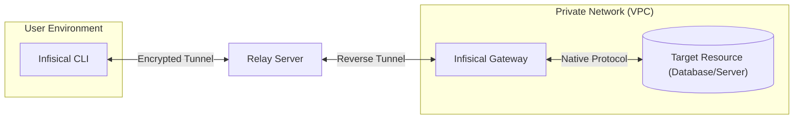

Infisical PAM utilizes a secure, proxy-based architecture designed to provide access to private resources without exposing them directly to the internet. This system relies on a combination of the Infisical CLI, a Relay server, and a self-hosted Gateway. For more information on Gateways, refer to the [Gateway Overview](/documentation/platform/gateways/overview).

## Core Components

The architecture consists of three main components working in unison:

<Steps>
  <Step title="Infisical CLI">
    The client-side interface used to initiate access requests. It creates a local listener that forwards traffic securely to the Gateway.
  </Step>
  <Step title="Infisical Gateway">
    A lightweight service deployed within your private network (e.g., VPC, on-prem). It acts as a proxy, intercepting traffic to enforce policies and record sessions before forwarding requests to the target resource.
  </Step>
  <Step title="Target Resource">
    The actual infrastructure being accessed, such as a PostgreSQL database, a Linux server, or a web application.
  </Step>
</Steps>

## Access Flow

When a user accesses a resource (e.g., via `infisical access`), the following workflow occurs:

1. **Connection Initiation**: The Infisical CLI initiates a connection to the Relay server.
2. **Tunnel Establishment**: The Relay facilitates an end-to-end encrypted tunnel between the CLI and the Gateway.
3. **Proxy & Credential Injection**: The Gateway authenticates the request and connects to the target resource on the user's behalf. It automatically injects the necessary credentials (e.g., database passwords, SSH keys), ensuring the user never directly handles sensitive secrets.
4. **Traffic Forwarding**: Traffic flows securely from the user's machine, through the Relay, to the Gateway, and finally to the resource.

## Session Recording & Auditing

A key feature of the Gateway is its ability to act as a "middleman" for all session traffic.

- **Interception**: Because the Gateway sits between the secure tunnel and the target resource, it intercepts all data flowing through the connection.
- **Logging**: This traffic is logged as part of [Session Recording](/documentation/platform/pam/product-reference/session-recording). The Gateway temporarily stores encrypted session logs locally.
- **Upload**: Once the session concludes, the logs are securely uploaded to the Infisical platform for storage and review.

## Security Architecture

The PAM security model allows you to maintain a zero-trust environment while enabling convenient access.

### End-to-End Encryption
The connection between the Infisical CLI (client) and the Gateway is end-to-end encrypted. The Relay server acts solely as a router for encrypted packets and **cannot decrypt or inspect** the traffic passing through it.

### Network Security
The Gateway uses **SSH reverse tunnels** to connect to the Relay. This design offers significant security benefits:
- **No Inbound Ports**: You do not need to open any inbound firewall ports (like 22 or 5432) to the internet.
- **Outbound-Only**: The Gateway only requires outbound connectivity to the Relay server and Infisical API.

For a deep dive into the underlying cryptography, certificate management, and isolation guarantees, refer to the [Gateway Security Architecture](/documentation/platform/gateways/security).

### Deployment
For instructions on setting up the necessary infrastructure, see the [Gateway Deployment Guide](/documentation/platform/gateways/gateway-deployment).
