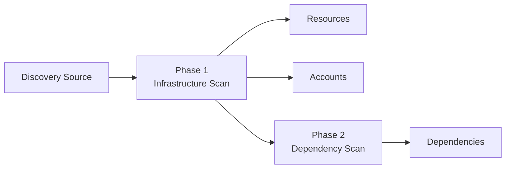

Infisical PAM Discovery automates the process of finding and cataloging privileged accounts, resources, and service dependencies in your environment. Instead of manually enumerating every server, account, and service, Discovery scans your infrastructure and builds a complete inventory automatically.

## How It Works

Discovery operates in phases that vary by source type. A typical scan includes:

1. **Infrastructure Scan** — Connects to your environment and enumerates machines and accounts. Each machine becomes a PAM Resource, and each account becomes a PAM Account.

2. **Dependency Scan** — Connects to each discovered machine and enumerates services and tasks that run under specific accounts. These are stored as **Dependencies** linked to the account whose credentials they use.

All network traffic flows through your [Infisical Gateway](/documentation/platform/gateways/overview), so no inbound firewall rules are needed.

## Core Concepts

<CardGroup cols={3}>
  <Card title="Discovery Source" icon="radar">
    A configured scan target that defines where and how to discover resources and accounts in your environment.
  </Card>
  <Card title="Discovery Run" icon="play">
    A single execution of a scan. Runs can be triggered manually or on a schedule.
  </Card>
  <Card title="Dependency" icon="link">
    A service, task, or application that runs under a discovered account's credentials.
  </Card>
</CardGroup>

### Discovery Sources

A Discovery Source is the configuration that tells Infisical what to scan. It includes:

- **Connection details** — How to reach the target environment (addresses, ports, protocols)
- **Credentials** — An account with the necessary access to perform the scan (encrypted at rest)
- **Gateway** — The Infisical Gateway that routes scan traffic into your network
- **Schedule** — Manual, daily, or weekly

### Discovery Runs

Each scan creates a Run record that tracks:

- **Status** — Running, completed, or failed
- **Phase progress** — Per-phase status with machine-level error details
- **Discovery counts** — How many resources, accounts, and dependencies were found, including counts of newly discovered and stale items

### Staleness Tracking

Resources and accounts that were present in a previous run but not found in the current run are marked as **Stale**. Stale items are never automatically deleted — they remain visible with a "Stale" badge so you can investigate why a previously-discovered item is no longer responding.

### Dependencies

Dependencies represent services and tasks that rely on a specific account's credentials. Discovery currently detects three types:

| Type | Description |
|------|-------------|
| **Windows Service** | A Windows service configured to run under a specific account |
| **Scheduled Task** | A Windows scheduled task that runs under a specific account |
| **IIS App Pool** | An IIS application pool configured with a specific identity |

Each dependency has an **Enabled** toggle that defaults to off. When enabled, Infisical will automatically update the dependency's credentials after rotating the linked account's password during [credential rotation](/documentation/platform/pam/product-reference/credential-rotation).

<Info>
  Dependencies discovered by a scan will never have their **Enabled** status overwritten by subsequent scans. Your explicit enable/disable decisions are always preserved.
</Info>

## Supported Discovery Types

<CardGroup cols={2}>
  <Card title="Active Directory" icon="windows" href="/documentation/platform/pam/discovery/active-directory">
    Discover domain-joined Windows servers, domain and local user accounts, and service dependencies across your AD environment.
  </Card>
</CardGroup>

## Prerequisites

Prerequisites vary by discovery type, but all sources require:

1. **Infisical Gateway** — A Gateway deployed in your network with access to the target infrastructure
2. **Scan credentials** — An account with the necessary permissions to enumerate your environment (encrypted at rest)

Refer to the specific discovery type documentation for detailed prerequisites.

<Warning>
  Discovery requires an Infisical Gateway. All scan traffic is routed through the Gateway. No direct connectivity from Infisical to your infrastructure is needed.
</Warning>
