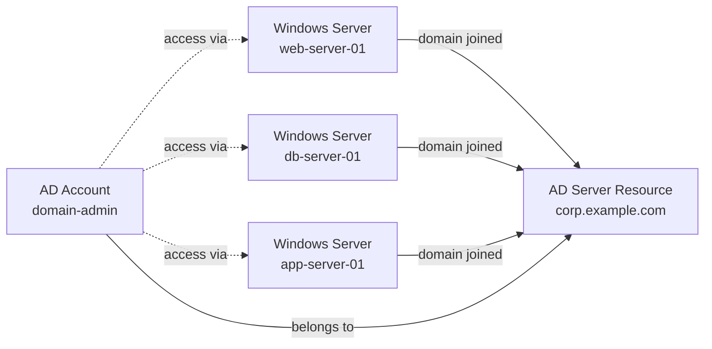

Infisical PAM supports secure management of Active Directory (AD) domain controllers.
An AD Server resource represents a domain controller and serves as the central point for managing domain-joined Windows servers, enabling you to organize your infrastructure by domain.

## How It Works

An Active Directory resource in Infisical PAM represents a domain controller and acts as the organizational hub for domain-joined machines. Windows Server resources can be linked to an AD resource to indicate they belong to that domain. When a user needs to access domain resources, they navigate to an AD account and select from the list of related Windows servers that are joined to the domain.

### Key Concepts

1. **Domain Controller**: The AD Server resource represents your domain controller. It stores the domain name, DC address, and serves as the parent for domain-joined resources and domain accounts.

2. **Domain Join**: Windows Server resources can be associated with an AD Server resource to indicate they are part of that Active Directory domain. This enables you to view all domain-joined servers from the AD resource's **Related Resources** tab.

3. **Related Resources**: From an AD account's detail page, users can see all Windows servers joined to the domain. This provides a clear view of which machines are accessible with domain credentials.

4. **Account Types**: AD accounts can be categorized as either **User** accounts or **Service** accounts, allowing you to organize and manage different types of domain credentials.

## Prerequisites

Before configuring Active Directory access in Infisical PAM, you need:

1. **Infisical Gateway** - A Gateway deployed in your network with access to the AD domain controller
2. **LDAP Access** - The domain controller must be reachable on the LDAP port (default: 389)
3. **Domain Credentials** - A username and password for an Active Directory account

<Warning>
  **Gateway Required**: Active Directory access requires an Infisical Gateway to be deployed and registered with your Infisical instance. The Gateway must have network connectivity to your domain controller on the LDAP port (default: 389).
</Warning>

## Create the PAM Resource

The PAM Resource represents the Active Directory domain controller you want to manage.

<Steps>
  <Step title="Ensure Gateway is Running">
    Before creating the resource, ensure you have an Infisical Gateway running and registered with your Infisical instance. The Gateway must have network access to your AD domain controller.
  </Step>

  <Step title="Create the Resource in Infisical">
    1. Navigate to your PAM project and go to the **Resources** tab
    2. Click **Add Resource** and select **Active Directory**
    3. Fill in the connection details:

    <ParamField path="Name" type="string" required>
      A friendly name for this resource (e.g., `corp-dc`, `prod-domain-controller`)
    </ParamField>

    <ParamField path="Gateway" type="string" required>
      Select the Gateway that has network access to this domain controller
    </ParamField>

    <ParamField path="Domain" type="string" required>
      The Active Directory domain name (e.g., `corp.example.com`)
    </ParamField>

    <ParamField path="DC Address" type="string" required>
      The hostname or IP address of the domain controller (e.g., `10.0.1.10` or `dc.corp.example.com`)
    </ParamField>

    <ParamField path="Port" type="number" required>
      The LDAP port (default: `389`)
    </ParamField>

    Clicking **Create Resource** will trigger a connection test from the selected Gateway to your domain controller. Infisical verifies that the server is reachable and responds to LDAP requests.
  </Step>
</Steps>

## Create PAM Accounts

A PAM Account represents a specific Active Directory user account in the domain. You can create multiple accounts per resource with different permission levels.

<Steps>
  <Step title="Navigate to the Resource">
    After creating the resource, click into it to open the resource detail view. Select the **Accounts** tab on the right.
  </Step>

  <Step title="Add Account">
    Click **Add Account**.
  </Step>

  <Step title="Fill in Account Details">
    Fill in the account details:

    <ParamField path="Name" type="string" required>
      A friendly name for this account (e.g., `domain-admin`, `svc-deploy`)
    </ParamField>

    <ParamField path="Account Type" type="string" required>
      Select the type of AD account:
      - **User Account** - A standard Active Directory user account
      - **Service Account** - An Active Directory service account
    </ParamField>

    <ParamField path="Username" type="string" required>
      The Active Directory username (e.g., `admin` or `svc-deploy`). Credentials are validated using UPN format (`username@domain`) against the domain controller.
    </ParamField>

    <ParamField path="Password" type="string" required>
      The Active Directory password for this user
    </ParamField>

    Clicking **Create Account** will validate the credentials by performing an LDAP bind against the domain controller through the Gateway.
  </Step>
</Steps>

## Domain Join (Related Resources)

Active Directory resources support linking Windows Server resources to represent domain membership. This allows you to see all servers that belong to a particular AD domain from a single view.

### Joining a Windows Server to a Domain

When creating or editing a [Windows Server](/documentation/platform/pam/getting-started/resources/windows-server) resource, you can select an **Active Directory Domain** from the dropdown. This associates the Windows server with the AD domain controller, indicating that it is a domain-joined machine.

### Viewing Related Resources

Once Windows servers are associated with an AD resource, you can view them from the AD resource's detail page:

1. Navigate to the Active Directory resource
2. Select the **Related Resources** tab (next to the **Accounts** tab)
3. All Windows servers (and other resources) joined to this domain are listed here

This provides a centralized view of your domain infrastructure, making it easy to understand which servers belong to which domain.
