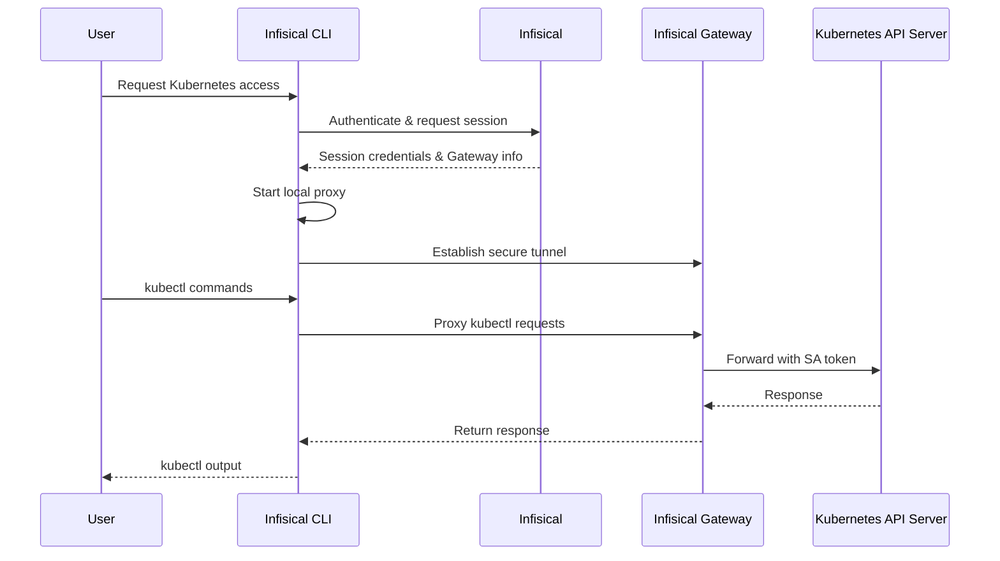

Infisical PAM supports secure, just-in-time access to Kubernetes clusters through service account token authentication. This allows your team to access Kubernetes clusters without sharing long-lived credentials, while maintaining a complete audit trail of who accessed what and when.

## How It Works

Kubernetes access in Infisical PAM uses an Infisical Gateway to securely proxy connections to your Kubernetes API server. When a user requests access, Infisical generates a temporary kubeconfig that routes traffic through the Gateway, enabling secure access without exposing your cluster directly.



### Key Concepts

1. **Gateway**: An Infisical Gateway deployed in your network that can reach the Kubernetes API server. The Gateway handles secure communication between users and your cluster.

2. **Service Account Token**: A Kubernetes service account token that grants access to the cluster. This token is stored securely in Infisical and used by the Gateway to authenticate with the Kubernetes API.

3. **Local Proxy**: The Infisical CLI starts a local proxy on your machine that intercepts kubectl commands and routes them securely through the Gateway to your cluster.

4. **Session Tracking**: All access sessions are logged, including when the session was created, who accessed the cluster, session duration, and when it ended.

### Session Tracking

Infisical tracks:
- When the session was created
- Who accessed which cluster
- Session duration
- All kubectl commands executed during the session
- When the session ended

<Info>
  **Session Logs**: After ending a session (by stopping the proxy), you can view detailed session logs in the Sessions page, including all commands executed during the session.
</Info>

## Prerequisites

Before configuring Kubernetes access in Infisical PAM, you need:

1. **Infisical Gateway** - A Gateway deployed in your network with access to the Kubernetes API server
2. **Service Account** - A Kubernetes service account with appropriate RBAC permissions
3. **Infisical CLI** - The Infisical CLI installed on user machines

<Warning>
  **Gateway Required**: Unlike AWS Console access, Kubernetes access requires an Infisical Gateway to be deployed and registered with your Infisical instance. The Gateway must have network connectivity to your Kubernetes API server.
</Warning>

## Create the PAM Resource

The PAM Resource represents the connection between Infisical and your Kubernetes cluster.

<Steps>
  <Step title="Ensure Gateway is Running">
    Before creating the resource, ensure you have an Infisical Gateway running and registered with your Infisical instance. The Gateway must have network access to your Kubernetes API server.
  </Step>

  <Step title="Create the Resource in Infisical">
    1. Navigate to your PAM project and go to the **Resources** tab
    2. Click **Add Resource** and select **Kubernetes**
    3. Enter a name for the resource (e.g., `production-k8s`, `staging-cluster`)
    4. Enter the **Kubernetes API Server URL** - the URL to your Kubernetes API endpoint (e.g.`https://kubernetes.example.com:6443`)
    5. Select the **Gateway** that has access to this cluster
    6. Configure SSL verification options if needed

    <Note>
      **SSL Verification**: You may need to disable SSL verification if your Kubernetes API server uses a self-signed certificate or if the certificate's hostname doesn't match the URL you're using to access it.
    </Note>
  </Step>
</Steps>

## Create a Service Account

Infisical PAM currently supports service account token authentication for Kubernetes. You'll need to create a service account with appropriate permissions in your cluster.

<Steps>
  <Step title="Create the Service Account YAML">
    Create a file named `sa.yaml` with the following content:

    ```yaml sa.yaml
    apiVersion: v1
    kind: ServiceAccount
    metadata:
      name: infisical-pam-sa
      namespace: kube-system
    ---
    # Bind the ServiceAccount to the desired ClusterRole
    # This example uses cluster-admin - adjust based on your needs
    apiVersion: rbac.authorization.k8s.io/v1
    kind: ClusterRoleBinding
    metadata:
      name: infisical-pam-binding
    subjects:
      - kind: ServiceAccount
        name: infisical-pam-sa
        namespace: kube-system
    roleRef:
      kind: ClusterRole
      name: cluster-admin  # Change this to a more restrictive role as needed
      apiGroup: rbac.authorization.k8s.io
    ---
    # Create a static, non-expiring token for the ServiceAccount
    apiVersion: v1
    kind: Secret
    metadata:
      name: infisical-pam-sa-token
      namespace: kube-system
      annotations:
        kubernetes.io/service-account.name: infisical-pam-sa
    type: kubernetes.io/service-account-token
    ```

    <Warning>
      **Security Best Practice**: The example above uses `cluster-admin` for simplicity. In production environments, you should create custom ClusterRoles or Roles with the minimum permissions required for each use case.
    </Warning>
  </Step>

  <Step title="Apply the Service Account">
    Apply the configuration to your cluster:

    ```bash
    kubectl apply -f sa.yaml
    ```

    This creates:
    - A ServiceAccount named `infisical-pam-sa` in the `kube-system` namespace
    - A ClusterRoleBinding that grants the service account its permissions
    - A Secret containing a static, non-expiring token for the service account
  </Step>

  <Step title="Retrieve the Service Account Token">
    Get the service account token that you'll use when creating the PAM account:

    ```bash
    kubectl -n kube-system get secret infisical-pam-sa-token -o jsonpath='{.data.token}' | base64 -d
    ```

    Copy this token - you'll need it in the next step.
  </Step>
</Steps>

## Create PAM Accounts

Once you have configured the PAM resource, you'll need to configure a PAM account for your Kubernetes resource. 
A PAM Account represents a specific service account that users can request access to. You can create multiple accounts per resource, each with different permission levels.

<Steps>
  <Step title="Navigate to Accounts">
    Go to the **Accounts** tab in your PAM project.
  </Step>

  <Step title="Add New Account">
    Click **Add Account** and select the Kubernetes resource you created.
  </Step>

  <Step title="Fill in Account Details">
    Fill in the account details and paste the service account token you retrieved earlier.
  </Step>
</Steps>

## Access Kubernetes Cluster

Once your resource and accounts are configured, users can request access through the Infisical CLI:

<Steps>
  <Step title="Get the Access Command">
    1. Navigate to the **Accounts** tab in your PAM project
    2. Find the Kubernetes account you want to access
    3. Click the **Access** button
    4. Copy the provided CLI command

  </Step>

  <Step title="Run the Access Command">
    Run the copied command in your terminal.

    The CLI will:
    1. Authenticate with Infisical
    2. Establish a secure connection through the Gateway
    3. Start a local proxy on your machine
    4. Configure kubectl to use the proxy
  </Step>

  <Step title="Use kubectl">
    Once the proxy is running, you can use `kubectl` commands as normal:

    ```bash
    kubectl get pods
    kubectl get namespaces
    kubectl describe deployment my-app
    ```

    All commands are routed securely through the Infisical Gateway to your cluster.
  </Step>

  <Step title="End the Session">
    When you're done, stop the proxy by pressing `Ctrl+C` in the terminal where it's running. This will:
    - Close the secure tunnel
    - End the session
    - Log the session details to Infisical

    You can view session logs in the **Sessions** page of your PAM project.
  </Step>
</Steps>
