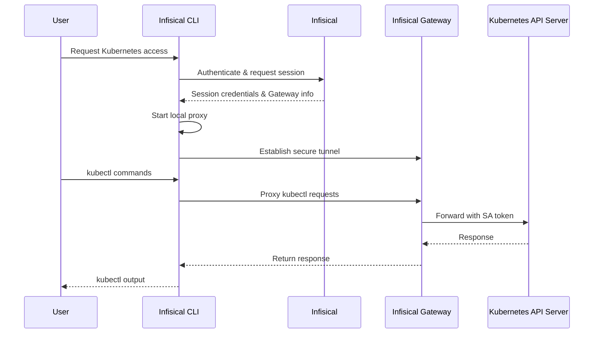
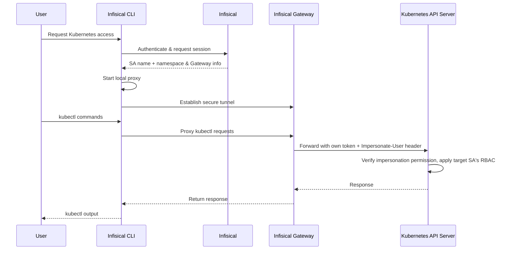

Infisical PAM supports secure, just-in-time access to Kubernetes clusters. Your team can access Kubernetes clusters without sharing long-lived credentials, while maintaining a complete audit trail of who accessed what and when.

There are two ways to authenticate:

- **Service Account Token** — you provide a static token that the Gateway injects into requests. Simple to set up, but the token is long-lived and stored in Infisical.
- **Gateway** — the Gateway uses its own pod identity and [Kubernetes impersonation](https://kubernetes.io/docs/reference/access-authn-authz/authentication/#user-impersonation) to act as a target service account. No tokens are stored in Infisical — you only provide a service account name and namespace.

## How It Works

### Service Account Token

When using a service account token, the Gateway forwards kubectl requests to the Kubernetes API server using the provided token.


```mermaid
sequenceDiagram
    participant User
    participant CLI as Infisical CLI
    participant Infisical
    participant Gateway as Infisical Gateway
    participant K8s as Kubernetes API Server

    User->>CLI: Request Kubernetes access
    CLI->>Infisical: Authenticate & request session
    Infisical-->>CLI: Session credentials & Gateway info
    CLI->>CLI: Start local proxy
    CLI->>Gateway: Establish secure tunnel
    User->>CLI: kubectl commands
    CLI->>Gateway: Proxy kubectl requests
    Gateway->>K8s: Forward with SA token
    K8s-->>Gateway: Response
    Gateway-->>CLI: Return response
    CLI-->>User: kubectl output
```

### Gateway (Impersonation)

When using Gateway auth, the Gateway authenticates as itself using its own pod service account, then tells the Kubernetes API to treat the request as if it came from the target service account.


```mermaid
sequenceDiagram
    participant User
    participant CLI as Infisical CLI
    participant Infisical
    participant Gateway as Infisical Gateway
    participant K8s as Kubernetes API Server

    User->>CLI: Request Kubernetes access
    CLI->>Infisical: Authenticate & request session
    Infisical-->>CLI: SA name + namespace & Gateway info
    CLI->>CLI: Start local proxy
    CLI->>Gateway: Establish secure tunnel
    User->>CLI: kubectl commands
    CLI->>Gateway: Proxy kubectl requests
    Gateway->>K8s: Forward with own token + Impersonate-User header
    K8s->>K8s: Verify impersonation permission, apply target SA's RBAC
    K8s-->>Gateway: Response
    Gateway-->>CLI: Return response
    CLI-->>User: kubectl output
```

No tokens are stored in Infisical. The Gateway reads its own pod token from the filesystem (auto-mounted by Kubernetes) and auto-discovers the Kubernetes API server from environment variables.

### Key Concepts

1. **Gateway**: An Infisical Gateway deployed in your network that can reach the Kubernetes API server. The Gateway handles secure communication between users and your cluster.

2. **Service Account Token**: A Kubernetes service account token that grants access to the cluster. This token is stored securely in Infisical and used by the Gateway to authenticate with the Kubernetes API.

3. **Impersonation**: A Kubernetes feature where one identity (the Gateway) can act on behalf of another (the target service account). The Gateway authenticates as itself and adds `Impersonate-User` headers. Kubernetes checks if the Gateway has permission to impersonate the target, then applies the target's RBAC rules.

4. **Local Proxy**: The Infisical CLI starts a local proxy on your machine that intercepts kubectl commands and routes them securely through the Gateway to your cluster.

5. **Session Tracking**: All access sessions are logged, including when the session was created, who accessed the cluster, session duration, and when it ended.

### Session Tracking

Infisical tracks:
- When the session was created
- Who accessed which cluster
- Session duration
- All kubectl commands executed during the session
- When the session ended

<Info>
  **Session Logs**: After ending a session (by stopping the proxy), you can view detailed session logs in the Sessions page, including all commands executed during the session.
</Info>

## Prerequisites

Before configuring Kubernetes access in Infisical PAM, you need:

1. **Infisical Gateway** - A Gateway deployed in your network with access to the Kubernetes API server
2. **Infisical CLI** - The Infisical CLI installed on user machines
3. Depending on your auth method:
   - **Service Account Token**: A Kubernetes service account with appropriate RBAC permissions and a static token
   - **Gateway**: The Gateway must be deployed **inside the Kubernetes cluster** as a pod, with a ClusterRole that allows impersonation of target service accounts

<Warning>
  **Gateway Required**: Kubernetes access requires an Infisical Gateway to be deployed and registered with your Infisical instance. For Gateway auth, the Gateway must be running as a pod inside the cluster.
</Warning>

## Create the PAM Resource

The PAM Resource represents the connection between Infisical and your Kubernetes cluster.

<Steps>
  <Step title="Ensure Gateway is Running">
    Before creating the resource, ensure you have an Infisical Gateway running and registered with your Infisical instance. The Gateway must have network access to your Kubernetes API server.
  </Step>

  <Step title="Create the Resource in Infisical">
    1. Navigate to your PAM project and go to the **Resources** tab
    2. Click **Add Resource** and select **Kubernetes**
    3. Enter a name for the resource (e.g., `production-k8s`, `staging-cluster`)
    4. Enter the **Kubernetes API Server URL** - the URL to your Kubernetes API endpoint (e.g.`https://kubernetes.example.com:6443`). If using Gateway auth with an in-cluster gateway, use `https://kubernetes.default.svc.cluster.local`.
    5. Select the **Gateway** that has access to this cluster
    6. Configure SSL verification options if needed

    <Note>
      **SSL Verification**: You may need to disable SSL verification if your Kubernetes API server uses a self-signed certificate or if the certificate's hostname doesn't match the URL you're using to access it. When using Gateway auth, the Gateway automatically uses the in-cluster CA certificate.
    </Note>
  </Step>
</Steps>

## Set Up Authentication

Choose one of the two authentication methods below based on your setup.

<Tabs>
  <Tab title="Service Account Token">
    Use this method when you have a static service account token, or when the Gateway is not running inside the Kubernetes cluster.

    ### Create a Service Account

    <Steps>
      <Step title="Create the Service Account YAML">
        Create a file named `sa.yaml` with the following content:

        ```yaml sa.yaml
        apiVersion: v1
        kind: ServiceAccount
        metadata:
          name: infisical-pam-sa
          namespace: kube-system
        ---
        # Bind the ServiceAccount to the desired ClusterRole
        # This example uses cluster-admin - adjust based on your needs
        apiVersion: rbac.authorization.k8s.io/v1
        kind: ClusterRoleBinding
        metadata:
          name: infisical-pam-binding
        subjects:
          - kind: ServiceAccount
            name: infisical-pam-sa
            namespace: kube-system
        roleRef:
          kind: ClusterRole
          name: cluster-admin  # Change this to a more restrictive role as needed
          apiGroup: rbac.authorization.k8s.io
        ---
        # Create a static, non-expiring token for the ServiceAccount
        apiVersion: v1
        kind: Secret
        metadata:
          name: infisical-pam-sa-token
          namespace: kube-system
          annotations:
            kubernetes.io/service-account.name: infisical-pam-sa
        type: kubernetes.io/service-account-token
        ```

        <Warning>
          **Security Best Practice**: The example above uses `cluster-admin` for simplicity. In production environments, you should create custom ClusterRoles or Roles with the minimum permissions required for each use case.
        </Warning>
      </Step>

      <Step title="Apply the Service Account">
        Apply the configuration to your cluster:

        ```bash
        kubectl apply -f sa.yaml
        ```

        This creates:
        - A ServiceAccount named `infisical-pam-sa` in the `kube-system` namespace
        - A ClusterRoleBinding that grants the service account its permissions
        - A Secret containing a static, non-expiring token for the service account
      </Step>

      <Step title="Retrieve the Service Account Token">
        Get the service account token that you'll use when creating the PAM account:

        ```bash
        kubectl -n kube-system get secret infisical-pam-sa-token -o jsonpath='{.data.token}' | base64 -d
        ```

        Copy this token - you'll need it in the next step.
      </Step>
    </Steps>
  </Tab>

  <Tab title="Gateway (Impersonation)">
    Use this method when the Gateway is deployed **inside the Kubernetes cluster** as a pod. No tokens need to be created or stored — the Gateway uses its own pod identity to impersonate target service accounts.

    ### Set Up Impersonation Permissions

    The Gateway's pod service account needs a ClusterRole that allows it to impersonate the target service accounts.

    <Steps>
      <Step title="Create the Impersonation ClusterRole">
        Create a file named `gateway-impersonation.yaml`:

        ```yaml gateway-impersonation.yaml
        apiVersion: rbac.authorization.k8s.io/v1
        kind: ClusterRole
        metadata:
          name: infisical-gateway-impersonator
        rules:
          - apiGroups: [""]
            resources: ["serviceaccounts"]
            verbs: ["impersonate"]
            resourceNames:
              - "deploy-bot"       # Add each SA the gateway should be able to impersonate
              - "ci-runner"
          - apiGroups: [""]
            resources: ["groups"]
            verbs: ["impersonate"]
            resourceNames:
              - "system:serviceaccounts"
              - "system:serviceaccounts:default"  # Match the namespace(s) of the target SAs
              - "system:authenticated"
        ---
        apiVersion: rbac.authorization.k8s.io/v1
        kind: ClusterRoleBinding
        metadata:
          name: infisical-gateway-impersonator-binding
        subjects:
          - kind: ServiceAccount
            name: <gateway-pod-service-account>  # The Gateway pod's own service account
            namespace: <gateway-namespace>
        roleRef:
          kind: ClusterRole
          name: infisical-gateway-impersonator
          apiGroup: rbac.authorization.k8s.io
        ```

        <Note>
          **Scoped by `resourceNames`**: The `resourceNames` field limits which service accounts the Gateway can impersonate. If someone creates a PAM account pointing at a service account not in this list, the session will fail with a 403 from Kubernetes. This is how you control which accounts are accessible through Infisical.
        </Note>
      </Step>

      <Step title="Apply the ClusterRole">
        ```bash
        kubectl apply -f gateway-impersonation.yaml
        ```
      </Step>

      <Step title="Ensure target service accounts exist">
        The service accounts you want to impersonate must already exist in the cluster with their own RBAC permissions. For example:

        ```yaml
        apiVersion: v1
        kind: ServiceAccount
        metadata:
          name: deploy-bot
          namespace: default
        ---
        apiVersion: rbac.authorization.k8s.io/v1
        kind: ClusterRoleBinding
        metadata:
          name: deploy-bot-binding
        subjects:
          - kind: ServiceAccount
            name: deploy-bot
            namespace: default
        roleRef:
          kind: ClusterRole
          name: view  # Or whatever permissions this SA should have
          apiGroup: rbac.authorization.k8s.io
        ```

        The target SA's own RBAC rules determine what the user can do during the session.
      </Step>
    </Steps>
  </Tab>
</Tabs>

## Create PAM Accounts

Once you have configured the PAM resource and set up authentication, create a PAM account to grant access.

<Steps>
  <Step title="Navigate to Resource">
    Go to the **Resources** tab in your PAM project and open the Kubernetes resource you created.
  </Step>

  <Step title="Add New Account">
    Click **Add Account**.
  </Step>

  <Step title="Select Authentication Method">
    Choose the authentication method:

    - **Service Account Token** — paste the service account token you retrieved earlier.
    - **Gateway** — enter the **Service Account Name** and **Namespace** of the Kubernetes service account you want to impersonate. No token is needed.
  </Step>
</Steps>

## Access Kubernetes Cluster

Once your resource and accounts are configured, users can request access through the Infisical CLI:

<Steps>
  <Step title="Get the Access Command">
    1. Navigate to the **Resources** tab in your PAM project and open the Kubernetes resource
    2. In the resource's accounts section, find the account you want to access
    3. Click the **Access** button for that account
    4. Copy the provided CLI command

  </Step>

  <Step title="Run the Access Command">
    Run the copied command in your terminal.

    The CLI will:
    1. Authenticate with Infisical
    2. Establish a secure connection through the Gateway
    3. Start a local proxy on your machine
    4. Configure kubectl to use the proxy
  </Step>

  <Step title="Use kubectl">
    Once the proxy is running, you can use `kubectl` commands as normal:

    ```bash
    kubectl get pods
    kubectl get namespaces
    kubectl describe deployment my-app
    ```

    All commands are routed securely through the Infisical Gateway to your cluster.
  </Step>

  <Step title="End the Session">
    When you're done, stop the proxy by pressing `Ctrl+C` in the terminal where it's running. This will:
    - Close the secure tunnel
    - End the session
    - Log the session details to Infisical

    You can view session logs in the **Sessions** page of your PAM project.
  </Step>
</Steps>

## FAQ

<AccordionGroup>
  <Accordion title="Which auth method should I use?">
    - Use **Gateway** if your Gateway is deployed as a pod inside the Kubernetes cluster. No tokens to create or manage — just enter a service account name and namespace.
    - Use **Service Account Token** if your Gateway runs outside the cluster (e.g., on a separate VM) and only has network access to the Kubernetes API. You'll need to create a service account token and paste it into Infisical.
  </Accordion>

  <Accordion title="Do I still need to enter a Kubernetes API URL when using Gateway auth?">
    Yes. The resource URL is still required even when using Gateway auth. For in-cluster gateways, enter `https://kubernetes.default.svc.cluster.local`. The Gateway auto-discovers the actual Kubernetes API address from its pod environment variables, so this URL isn't used for the connection itself — but the field is still required when creating the resource.
  </Accordion>

  <Accordion title="How does the Gateway find the Kubernetes API server?">
    When using Gateway auth, the Gateway reads the `KUBERNETES_SERVICE_HOST` and `KUBERNETES_SERVICE_PORT_HTTPS` environment variables that Kubernetes automatically sets in every pod. It ignores the URL configured on the resource and connects directly to the in-cluster API server.
  </Accordion>

  <Accordion title="Do I need to configure SSL certificates for Gateway auth?">
    No. When using Gateway auth, the Gateway automatically uses the in-cluster CA certificate mounted at `/var/run/secrets/kubernetes.io/serviceaccount/ca.crt`. The SSL settings on the resource (certificate, verification toggle) are only used for the Service Account Token method. If the in-cluster CA certificate is missing or invalid, the session will fail rather than falling back to an insecure connection.
  </Accordion>

  <Accordion title="What happens if the Gateway can't impersonate a service account?">
    The Kubernetes API server returns a 403 Forbidden error. Kubernetes itself enforces impersonation permissions — if the Gateway's ClusterRole doesn't include the target service account in its `resourceNames` list, the session fails. You don't need to configure any allowlist in Infisical; just update the ClusterRole in your cluster.
  </Accordion>

  <Accordion title="Can I use both auth methods on the same Kubernetes resource?">
    Yes. The auth method is configured per account, not per resource. You can have some accounts using Service Account Token and others using Gateway on the same Kubernetes resource.
  </Accordion>

  <Accordion title="Does the Gateway need to run inside the Kubernetes cluster?">
    For Gateway auth, yes — the Gateway must be deployed as a pod inside the cluster so it can read its own service account token and reach the Kubernetes API. For Service Account Token auth, the Gateway just needs network access to the Kubernetes API server and can run anywhere.
  </Accordion>
</AccordionGroup>
