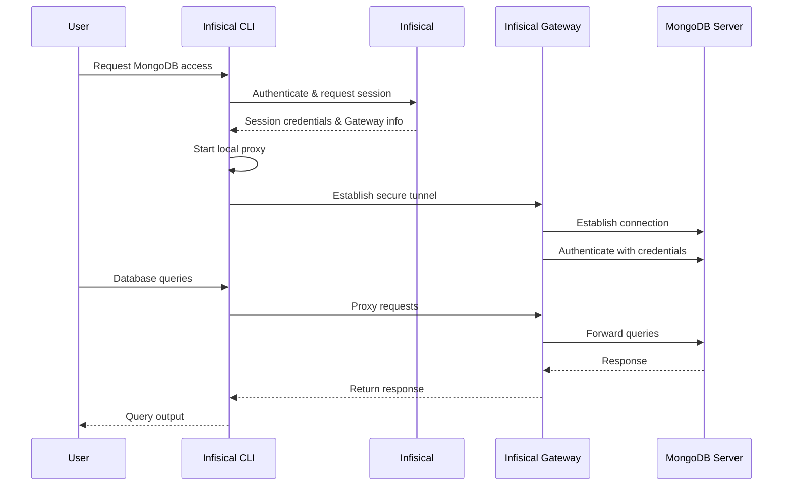

Infisical PAM supports secure, just-in-time access to MongoDB databases.
This allows your team to access MongoDB without sharing long-lived credentials, while maintaining a complete audit trail of who accessed what and when.

## How It Works

MongoDB access in Infisical PAM uses an Infisical Gateway to securely proxy connections to your MongoDB server. When a user requests access, Infisical establishes a secure tunnel through the Gateway, enabling secure access without exposing your MongoDB instance directly.



### Key Concepts

1. **Gateway**: An Infisical Gateway deployed in your network that can reach the MongoDB server. The Gateway handles secure communication between users and your MongoDB instance.

2. **Authentication**: Credentials (username/password) are stored securely in Infisical and used by the Gateway to authenticate with MongoDB on behalf of the user. Authentication is performed against the `admin` database.

3. **Local Proxy**: The Infisical CLI starts a local proxy on your machine that intercepts MongoDB connections and routes them securely through the Gateway to your MongoDB instance.

4. **Session Tracking**: All access sessions are logged, including when the session was created, who accessed the MongoDB instance, session duration, and when it ended.

### Session Tracking

Infisical tracks:

- When the session was created
- Who accessed which MongoDB instance
- Session duration
- When the session ended

<Info>
  **Session Logs**: After ending a session (by stopping the proxy), you can view
  detailed session logs in the Sessions page.
</Info>

## Prerequisites

Before configuring MongoDB access in Infisical PAM, you need:

1. **Infisical Gateway** - A Gateway deployed in your network with access to the MongoDB server
2. **MongoDB Credentials** - Username and password for the MongoDB instance
3. **Infisical CLI** - The Infisical CLI installed on user machines

<Warning>
  **Gateway Required**: MongoDB access requires an Infisical Gateway to be
  deployed and registered with your Infisical instance. The Gateway must have
  network connectivity to your MongoDB server.
</Warning>

## Create the PAM Resource

The PAM Resource represents the connection between Infisical and your MongoDB instance.

<Steps>
  <Step title="Ensure Gateway is Running">
    Before creating the resource, ensure you have an Infisical Gateway running and registered with your Infisical instance. The Gateway must have network access to your MongoDB server.
  </Step>

  <Step title="Create the Resource in Infisical">
    1. Navigate to your PAM project and go to the **Resources** tab
    2. Click **Add Resource** and select **MongoDB**
    3. Enter a **Name** for the resource (e.g., `production-mongo`, `staging-db`)
    4. Select the **Gateway** that has access to this MongoDB instance
    5. Enter the **Connection String** - a `mongodb://` or `mongodb+srv://` URI pointing to your MongoDB server (e.g., `mongodb://mongo.example.com:27017` or `mongodb+srv://cluster0.abc123.mongodb.net`). Do not include credentials or a database name in the URI — those are configured separately.
    6. Enter the **Database Name** - the authentication database to connect to (default: `admin`)
    7. Configure SSL/TLS options:
       - **Enable SSL**: Toggle to enable TLS/SSL connections (enabled by default)
       - **Reject Unauthorized**: Toggle to verify SSL certificates (enabled by default, recommended for production)
       - **CA Certificate**: Optional CA certificate for custom certificate authorities

    <Note>
      **SSL Configuration**: SSL is enabled by default. For self-signed certificates, you may need to provide the CA certificate or disable certificate validation (not recommended for production).
    </Note>

  </Step>
</Steps>

## Create PAM Accounts

Once you have configured the PAM resource, you'll need to configure a PAM account for your MongoDB resource.
A PAM Account represents a specific set of credentials that users can request access to. You can create multiple accounts per resource, each with different permission levels.

<Steps>
  <Step title="Navigate to Resource">
    Go to the **Resources** tab in your PAM project and open the MongoDB resource you created.
  </Step>

  <Step title="Add New Account">
    Click **Add Account**.
  </Step>

  <Step title="Fill in Account Details">
    Fill in the account details:

    <ParamField path="Name" type="string" required>
      A friendly name for this account (e.g., `readonly-user`, `admin-access`)
    </ParamField>

    <ParamField path="Description" type="string">
      An optional description for this account.
    </ParamField>

    <ParamField path="Username" type="string" required>
      The MongoDB username.
    </ParamField>

    <ParamField path="Password" type="string" required>
      The MongoDB password.
    </ParamField>

    <ParamField path="Require MFA for Access" type="boolean">
      When enabled, users must complete a multi-factor authentication (MFA) challenge before accessing this account. The MFA method used is determined by the organization's enforced method, the user's configured method, or email as a fallback.
    </ParamField>

  </Step>
</Steps>

## Access MongoDB Account

Once your resource and accounts are configured, users can request access through the Infisical CLI:

<Steps>
  <Step title="Get the Access Command">
    1. Navigate to the **Resources** tab in your PAM project and open the MongoDB resource
    2. In the resource's accounts section, find the account you want to access
    3. Click the **Access** button for that account
    4. Copy the provided CLI command

    The command follows this format:
    ```bash
    infisical pam db access --resource <resource-name> --account <account-name> --project-id <project-id> --duration <duration> --domain <infisical-url>
    ```

  </Step>

  <Step title="Run the Access Command">
    Run the copied command in your terminal.

    The CLI will:
    1. Authenticate with Infisical
    2. Establish a secure connection through the Gateway
    3. Start a local proxy on your machine
    4. Display a local connection URI you can use to connect

  </Step>

  <Step title="Connect to MongoDB">
    Once the proxy is running, connect to MongoDB using the connection URI displayed by the CLI. You can use any MongoDB client — no password is needed, as the Gateway injects the real credentials on your behalf.

    **Using mongosh:**
    ```bash
    mongosh "<connection-uri>"
    ```

    **Using other clients:**

    You can also use GUI clients such as MongoDB Compass, Studio 3T, DataGrip, or NoSQLBooster. Use the connection URI shown in the CLI output, or point them to `localhost` on the port shown. Leave the password field empty.

  </Step>

  <Step title="End the Session">
    When you're done, stop the proxy by pressing `Ctrl+C` in the terminal where it's running. This will:
    - Close the secure tunnel
    - End the session
    - Log the session details to Infisical

    You can view session logs in the **Sessions** page of your PAM project.

  </Step>
</Steps>
