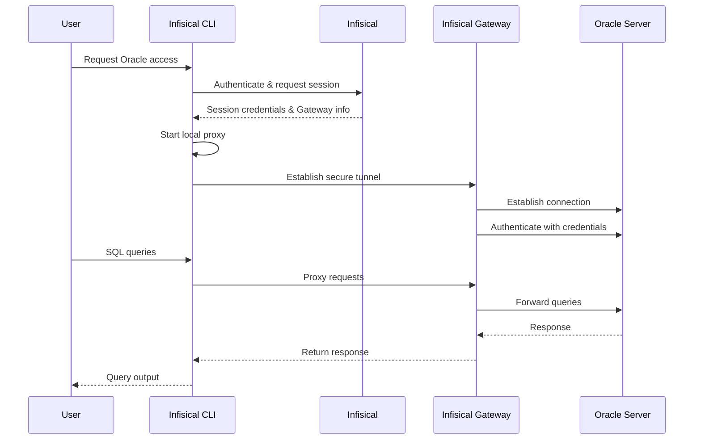

Infisical PAM supports secure, just-in-time access to Oracle Databases.
This allows your team to access Oracle without sharing long-lived credentials, while maintaining a complete audit trail of who accessed what and when.

## How It Works

Oracle access in Infisical PAM uses an Infisical Gateway to securely proxy connections to your Oracle server. When a user requests access, Infisical establishes a secure tunnel through the Gateway, enabling secure access without exposing your Oracle instance directly.



### Key Concepts

1. **Gateway**: An Infisical Gateway deployed in your network that can reach the Oracle server. The Gateway handles secure communication between users and your Oracle instance.

2. **Authentication**: Credentials (username/password) are stored securely in Infisical and used by the Gateway to authenticate with Oracle on behalf of the user.

3. **Local Proxy**: The Infisical CLI starts a local proxy on your machine that intercepts Oracle connections and routes them securely through the Gateway to your Oracle instance.

4. **Session Tracking**: All access sessions are logged, including when the session was created, who accessed the Oracle instance, session duration, and when it ended.

### Session Tracking

Infisical tracks:

- When the session was created
- Who accessed which Oracle instance
- Session duration
- When the session ended

<Info>
  **Session Logs**: After ending a session (by stopping the proxy), you can view
  detailed session logs in the Sessions page.
</Info>

## Prerequisites

Before configuring Oracle access in Infisical PAM, you need:

1. **Infisical Gateway** - A Gateway deployed in your network with access to the Oracle server
2. **Oracle Credentials** - Username and password for the Oracle instance
3. **Infisical CLI** - The Infisical CLI installed on user machines

<Warning>
  **Gateway Required**: Oracle access requires an Infisical Gateway to be
  deployed and registered with your Infisical instance. The Gateway must have
  network connectivity to your Oracle server.
</Warning>

## Create the PAM Resource

The PAM Resource represents the connection between Infisical and your Oracle instance.

<Steps>
  <Step title="Ensure Gateway is Running">
    Before creating the resource, ensure you have an Infisical Gateway running and registered with your Infisical instance. The Gateway must have network access to your Oracle server.
  </Step>

  <Step title="Create the Resource in Infisical">
    1. Navigate to your PAM project and go to the **Resources** tab
    2. Click **Add Resource** and select **Oracle**
    3. Enter a **Name** for the resource (e.g., `production-oracle`, `staging-db`)
    4. Select the **Gateway** that has access to this Oracle instance
    5. Enter the **Host** - the hostname or IP address of your Oracle server (e.g., `oracle.example.com` or `192.168.1.100`)
    6. Enter the **Database Name** - the Oracle service name (e.g., `ORCL`, `XEPDB1`)
    7. Enter the **Port** - `1521` for plain TCP (default) or `2484` for TCPS
    8. Configure SSL/TLS options:
       - **Enable SSL**: Toggle to connect to the Oracle TCPS listener
       - **Reject Unauthorized**: Toggle to verify SSL certificates (enabled by default, recommended for production)
       - **Trusted CA SSL Certificate**: Optional CA certificate for custom certificate authorities

    <Note>
      **SSL Configuration**: When SSL is enabled, the Oracle TCPS listener is usually on port 2484. For self-signed certificates, you may need to provide the CA certificate or disable certificate validation (not recommended for production).
    </Note>

  </Step>
</Steps>

## Create PAM Accounts

Once you have configured the PAM resource, you'll need to configure a PAM account for your Oracle resource.
A PAM Account represents a specific set of credentials that users can request access to. You can create multiple accounts per resource, each with different permission levels.

<Steps>
  <Step title="Navigate to Resource">
    Go to the **Resources** tab in your PAM project and open the Oracle resource you created.
  </Step>

  <Step title="Add New Account">
    Click **Add Account**.
  </Step>

  <Step title="Fill in Account Details">
    Fill in the account details:

    <ParamField path="Name" type="string" required>
      A friendly name for this account (e.g., `readonly-user`, `admin-access`)
    </ParamField>

    <ParamField path="Description" type="string">
      An optional description for this account.
    </ParamField>

    <ParamField path="Username" type="string" required>
      The Oracle username.
    </ParamField>

    <ParamField path="Password" type="string" required>
      The Oracle password.
    </ParamField>

    <ParamField path="Require MFA for Access" type="boolean">
      When enabled, users must complete a multi-factor authentication (MFA) challenge before accessing this account. The MFA method used is determined by the organization's enforced method, the user's configured method, or email as a fallback.
    </ParamField>

  </Step>
</Steps>

## Access Oracle Account

Once your resource and accounts are configured, users can request access through the Infisical CLI:

<Steps>
  <Step title="Get the Access Command">
    1. Navigate to the **Resources** tab in your PAM project and open the Oracle resource
    2. In the resource's accounts section, find the account you want to access
    3. Click the **Access** button for that account
    4. Copy the provided CLI command

    The command follows this format:
    ```bash
    infisical pam db access --resource <resource-name> --account <account-name> --project-id <project-id> --duration <duration> --domain <infisical-url>
    ```

  </Step>

  <Step title="Run the Access Command">
    Run the copied command in your terminal.

    The CLI will:
    1. Authenticate with Infisical
    2. Establish a secure connection through the Gateway
    3. Start a local proxy on your machine
    4. Display a local connection URL you can use to connect

  </Step>

  <Step title="Connect to Oracle">
    Once the proxy is running, connect to Oracle using the connection details displayed by the CLI. Oracle's login protocol requires the client to send a password, so the CLI prints a fixed placeholder (`password`) — type it literally in your client. The Gateway swaps in the real credential during login.

    **Using sqlcl:**
    ```bash
    sql <username>/password@localhost:<port>/<service-name>
    ```

    **Using other clients:**

    You can also use GUI clients such as SQL Developer, DBeaver, DataGrip, or Toad (JDBC thin mode). Point them to `localhost` on the port shown in the CLI output with the username and service name from the connection details, and type `password` in the password field.

  </Step>

  <Step title="End the Session">
    When you're done, stop the proxy by pressing `Ctrl+C` in the terminal where it's running. This will:
    - Close the secure tunnel
    - End the session
    - Log the session details to Infisical

    You can view session logs in the **Sessions** page of your PAM project.

  </Step>
</Steps>
