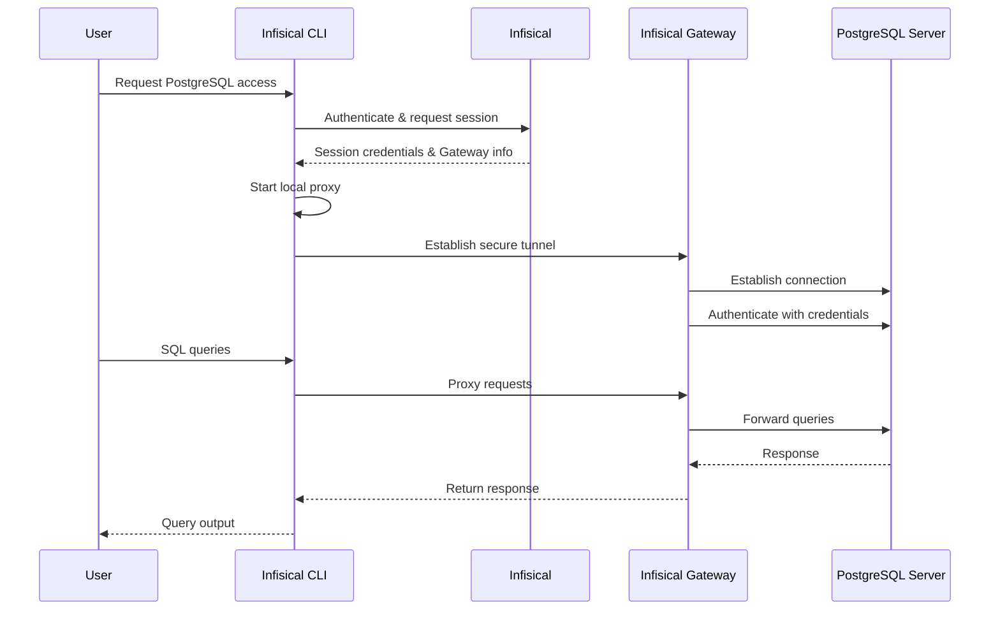

Infisical PAM supports secure, just-in-time access to PostgreSQL databases.
This allows your team to access PostgreSQL without sharing long-lived credentials, while maintaining a complete audit trail of who accessed what and when.

## How It Works

PostgreSQL access in Infisical PAM uses an Infisical Gateway to securely proxy connections to your PostgreSQL server. When a user requests access, Infisical establishes a secure tunnel through the Gateway, enabling secure access without exposing your PostgreSQL instance directly.



### Key Concepts

1. **Gateway**: An Infisical Gateway deployed in your network that can reach the PostgreSQL server. The Gateway handles secure communication between users and your PostgreSQL instance.

2. **Authentication**: Credentials (username/password) are stored securely in Infisical and used by the Gateway to authenticate with PostgreSQL on behalf of the user.

3. **Local Proxy**: The Infisical CLI starts a local proxy on your machine that intercepts PostgreSQL connections and routes them securely through the Gateway to your PostgreSQL instance.

4. **Session Tracking**: All access sessions are logged, including when the session was created, who accessed the PostgreSQL instance, session duration, and when it ended.

### Session Tracking

Infisical tracks:

- When the session was created
- Who accessed which PostgreSQL instance
- Session duration
- When the session ended

<Info>
  **Session Logs**: After ending a session (by stopping the proxy), you can view
  detailed session logs in the Sessions page.
</Info>

## Prerequisites

Before configuring PostgreSQL access in Infisical PAM, you need:

1. **Infisical Gateway** - A Gateway deployed in your network with access to the PostgreSQL server
2. **PostgreSQL Credentials** - Username and password for the PostgreSQL instance
3. **Infisical CLI** - The Infisical CLI installed on user machines

<Warning>
  **Gateway Required**: PostgreSQL access requires an Infisical Gateway to be
  deployed and registered with your Infisical instance. The Gateway must have
  network connectivity to your PostgreSQL server.
</Warning>

## Create the PAM Resource

The PAM Resource represents the connection between Infisical and your PostgreSQL instance.

<Steps>
  <Step title="Ensure Gateway is Running">
    Before creating the resource, ensure you have an Infisical Gateway running and registered with your Infisical instance. The Gateway must have network access to your PostgreSQL server.
  </Step>

  <Step title="Create the Resource in Infisical">
    1. Navigate to your PAM project and go to the **Resources** tab
    2. Click **Add Resource** and select **PostgreSQL**
    3. Enter a **Name** for the resource (e.g., `production-postgres`, `staging-db`)
    4. Select the **Gateway** that has access to this PostgreSQL instance
    5. Enter the **Host** - the hostname or IP address of your PostgreSQL server (e.g., `postgres.example.com` or `192.168.1.100`)
    6. Enter the **Database Name** - the database to connect to
    7. Enter the **Port** - the PostgreSQL port (default: `5432`)
    8. Configure SSL/TLS options:
       - **Enable SSL**: Toggle to enable TLS/SSL connections (enabled by default)
       - **Reject Unauthorized**: Toggle to verify SSL certificates (enabled by default, recommended for production)
       - **Trusted CA SSL Certificate**: Optional CA certificate for custom certificate authorities

    9. Optionally configure a **Rotation Account** by providing a username and password. This is required if you want to enable automated credential rotation for accounts on this resource.

    <Note>
      **SSL Configuration**: SSL is enabled by default. For self-signed certificates, you may need to provide the CA certificate or disable certificate validation (not recommended for production).
    </Note>

  </Step>
</Steps>

## Create PAM Accounts

Once you have configured the PAM resource, you'll need to configure a PAM account for your PostgreSQL resource.
A PAM Account represents a specific set of credentials that users can request access to. You can create multiple accounts per resource, each with different permission levels.

<Steps>
  <Step title="Navigate to Resource">
    Go to the **Resources** tab in your PAM project and open the PostgreSQL resource you created.
  </Step>

  <Step title="Add New Account">
    Click **Add Account**.
  </Step>

  <Step title="Fill in Account Details">
    Fill in the account details:

    <ParamField path="Name" type="string" required>
      A friendly name for this account (e.g., `readonly-user`, `admin-access`)
    </ParamField>

    <ParamField path="Description" type="string">
      An optional description for this account.
    </ParamField>

    <ParamField path="Username" type="string" required>
      The PostgreSQL username.
    </ParamField>

    <ParamField path="Password" type="string" required>
      The PostgreSQL password.
    </ParamField>

    <ParamField path="Require MFA for Access" type="boolean">
      When enabled, users must complete a multi-factor authentication (MFA) challenge before accessing this account. The MFA method used is determined by the organization's enforced method, the user's configured method, or email as a fallback.
    </ParamField>

    If the resource has rotation account credentials configured, you can also enable **Credential Rotation** for this account and select a rotation interval (1 day, 3 days, 7 days, or 30 days).

  </Step>
</Steps>

## Access PostgreSQL Account

There are two ways to access a PostgreSQL account: through the browser via Web Access, or locally via the CLI.

### Web Access

PostgreSQL resources can be accessed directly from the browser using Infisical's web-based SQL console. This provides a convenient way to run queries without installing any local tools.

For details, see [PostgreSQL Web Access](/documentation/platform/pam/product-reference/web-access/postgresql).

### CLI Access

The Infisical CLI starts a local proxy that allows you to connect with any PostgreSQL client (psql, pgAdmin, DBeaver, etc.) and supports multiple concurrent connections per session.

<Steps>
  <Step title="Get the Access Command">
    1. Navigate to the **Resources** tab in your PAM project and open the PostgreSQL resource
    2. In the resource's accounts section, find the account you want to access
    3. Click the **Access** button for that account
    4. Copy the provided CLI command

    The command follows this format:
    ```bash
    infisical pam db access --resource <resource-name> --account <account-name> --project-id <project-id> --duration <duration> --domain <infisical-url>
    ```

  </Step>

  <Step title="Run the Access Command">
    Run the copied command in your terminal.

    The CLI will:
    1. Authenticate with Infisical
    2. Establish a secure connection through the Gateway
    3. Start a local proxy on your machine
    4. Display a local connection URL you can use to connect

  </Step>

  <Step title="Connect to PostgreSQL">
    Once the proxy is running, connect to PostgreSQL using the connection URL displayed by the CLI. You can use any PostgreSQL client — no password is needed, as the Gateway injects the real credentials on your behalf.

    **Using psql:**
    ```bash
    psql "<connection-url>"
    ```

    **Using other clients:**

    You can also use GUI clients such as pgAdmin, DBeaver, DataGrip, or TablePlus. Point them to `localhost` on the port shown in the CLI output with the username and database from the connection URL. Leave the password field empty.

  </Step>

  <Step title="End the Session">
    When you're done, stop the proxy by pressing `Ctrl+C` in the terminal where it's running. This will:
    - Close the secure tunnel
    - End the session
    - Log the session details to Infisical

    You can view session logs in the **Sessions** page of your PAM project.

  </Step>
</Steps>

## Automated Credential Rotation

PostgreSQL supports automated credential rotation through Infisical. This allows you to automatically rotate database credentials on a schedule, reducing the risk of credential compromise.

For details, see [Credential Rotation](/documentation/platform/pam/product-reference/credential-rotation).
