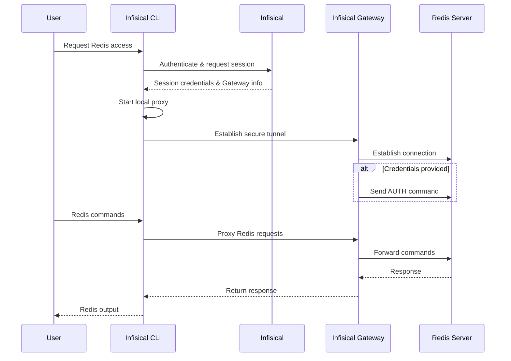

Infisical PAM supports secure, just-in-time access to Redis instances.
This allows your team to access Redis databases without sharing long-lived credentials, while maintaining a complete audit trail of who accessed what and when.
Infisical supports all major Redis server versions since Redis 1.0 that use the [RESP protocol](https://redis.io/docs/latest/develop/reference/protocol-spec/).
Redis server forks and variants based on the RESP protocol such as [Valkey](https://valkey.io) are also supported by Infisical PAM.

## How It Works

Redis access in Infisical PAM uses an Infisical Gateway to securely proxy connections to your Redis server. When a user requests access, Infisical establishes a secure tunnel through the Gateway, enabling secure access without exposing your Redis instance directly.



### Key Concepts

1. **Gateway**: An Infisical Gateway deployed in your network that can reach the Redis server. The Gateway handles secure communication between users and your Redis instance.

2. **Authentication**: Redis supports username/password authentication (ACL). Credentials are stored securely in Infisical and used by the Gateway to authenticate with Redis.

3. **Local Proxy**: The Infisical CLI starts a local proxy on your machine that intercepts Redis commands and routes them securely through the Gateway to your Redis instance.

4. **Session Tracking**: All access sessions are logged, including when the session was created, who accessed the Redis instance, session duration, and when it ended.

### Session Tracking

Infisical tracks:

- When the session was created
- Who accessed which Redis instance
- Session duration
- All Redis commands executed during the session
- When the session ended

<Info>
  **Session Logs**: After ending a session (by stopping the proxy), you can view
  detailed session logs in the Sessions page, including all commands executed
  during the session.
</Info>

## Prerequisites

Before configuring Redis access in Infisical PAM, you need:

1. **Infisical Gateway** - A Gateway deployed in your network with access to the Redis server
2. **Redis Credentials** - Username and password (if Redis ACL is enabled) or access to an unauthenticated Redis instance
3. **Infisical CLI** - The Infisical CLI installed on user machines

<Warning>
  **Gateway Required**: Redis access requires an Infisical Gateway to be
  deployed and registered with your Infisical instance. The Gateway must have
  network connectivity to your Redis server.
</Warning>

## Create the PAM Resource

The PAM Resource represents the connection between Infisical and your Redis instance.

<Steps>
  <Step title="Ensure Gateway is Running">
    Before creating the resource, ensure you have an Infisical Gateway running and registered with your Infisical instance. The Gateway must have network access to your Redis server.
  </Step>

  <Step title="Create the Resource in Infisical">
    1. Navigate to your PAM project and go to the **Resources** tab
    2. Click **Add Resource** and select **Redis**
    3. Enter a name for the resource (e.g., `production-redis`, `staging-cache`)
    4. Enter the **Host** - the hostname or IP address of your Redis server (e.g., `redis.example.com` or `192.168.1.100`)
    5. Enter the **Port** - the Redis port (default: `6379`)
    6. Select the **Gateway** that has access to this Redis instance
    7. Configure SSL/TLS options if needed:
       - **SSL Enabled**: Enable if your Redis instance uses TLS/SSL
       - **SSL Reject Unauthorized**: Enable to verify SSL certificates (recommended for production)
       - **SSL Certificate**: Optional CA certificate for custom certificate authorities

    <Note>
      **SSL Configuration**: If your Redis instance uses TLS/SSL, enable SSL and configure certificate validation. For self-signed certificates, you may need to provide the CA certificate or disable certificate validation (not recommended for production).
    </Note>

  </Step>
</Steps>

## Create PAM Accounts

Once you have configured the PAM resource, you'll need to configure a PAM account for your Redis resource.
A PAM Account represents a specific set of credentials that users can request access to. You can create multiple accounts per resource, each with different permission levels.

<Steps>
  <Step title="Navigate to Accounts">
    Go to the **Accounts** tab in your PAM project.
  </Step>

<Step title="Add New Account">
  Click **Add Account** and select the Redis resource you created.
</Step>

  <Step title="Fill in Account Details">
    Fill in the account details:

    <ParamField path="Name" type="string" required>
      A friendly name for this account (e.g., `readonly-user`, `admin-access`)
    </ParamField>

    <ParamField path="Use Credentials" type="boolean">
      Toggle this on if your Redis instance requires authentication. When enabled, you'll need to provide a username and password.
      Leave it as disabled if your Redis instance doesn't require authentication.
    </ParamField>

    <ParamField path="Username" type="string">
      The Redis username (required if Use Credentials is enabled).
    </ParamField>

    <ParamField path="Password" type="string">
      The Redis password (required if Use Credentials is enabled).
    </ParamField>

    <Warning>
      **Security Best Practice**: For production environments, always use Redis ACL (Access Control List) with strong passwords. Unauthenticated Redis instances should only be used in isolated, trusted networks.
    </Warning>

  </Step>
</Steps>

## Access Redis Instance

Once your resource and accounts are configured, users can request access through the Infisical CLI:

<Steps>
  <Step title="Get the Access Command">
    1. Navigate to the **Accounts** tab in your PAM project
    2. Find the Redis account you want to access
    3. Click the **Access** button
    4. Copy the provided CLI command

  </Step>

  <Step title="Run the Access Command">
    Run the copied command in your terminal.

    The CLI will:
    1. Authenticate with Infisical
    2. Establish a secure connection through the Gateway
    3. Start a local proxy on your machine
    4. Provide connection details for your Redis client

  </Step>

  <Step title="Connect to Redis">
    Once the proxy is running, you can connect to Redis using your preferred Redis client. The proxy will be available on `localhost` with the URL shown in the CLI output.

    **Using redis-cli:**
    ```bash
    redis-cli -u <redis-url>
    ```

    All commands are routed securely through the Infisical Gateway to your Redis instance.

  </Step>

  <Step title="End the Session">
    When you're done, stop the proxy by pressing `Ctrl+C` in the terminal where it's running. This will:
    - Close the secure tunnel
    - End the session
    - Log the session details to Infisical

    You can view session logs in the **Sessions** page of your PAM project.

  </Step>
</Steps>
