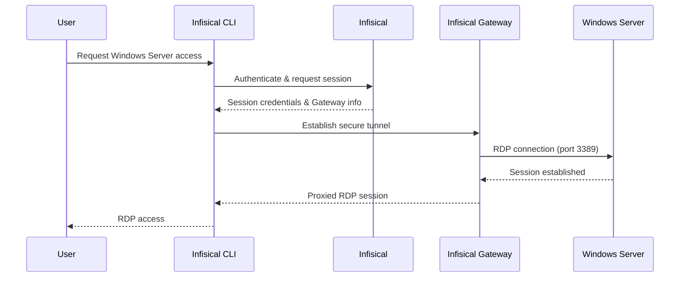

Infisical PAM supports secure, just-in-time access to Windows servers via the Remote Desktop Protocol (RDP).
This allows your team to access Windows servers without sharing long-lived credentials, while maintaining a complete audit trail of who accessed what and when.

## How It Works

Windows Server access in Infisical PAM uses an Infisical Gateway to securely proxy RDP connections to your Windows server. When a user requests access, Infisical establishes a secure tunnel through the Gateway, enabling access without exposing your server directly.

### Key Concepts

1. **Gateway**: An Infisical Gateway deployed in your network that can reach the Windows server. The Gateway handles secure communication between users and your server.

2. **RDP Protocol**: Infisical connects to your Windows server using the Remote Desktop Protocol (RDP) on the configured port (default: 3389).

3. **Credential Validation via SMB**: When creating or updating accounts, Infisical validates credentials by connecting to the Windows server's SMB service (port 445). This ensures credentials are correct before they are stored.

4. **Account Types**: Windows accounts can be categorized as either **User** accounts or **Service** accounts, allowing you to organize and manage different types of access.

## Prerequisites

Before configuring Windows Server access in Infisical PAM, you need:

1. **Infisical Gateway** - A Gateway deployed in your network with access to the Windows server
2. **RDP Enabled** - Remote Desktop must be enabled on the Windows server (port 3389 by default)
3. **SMB Enabled** - SMB (Server Message Block) must be accessible for credential validation (port 445)
4. **Windows Credentials** - A username and password for a Windows account on the server

<Warning>
  **SMB Required**: Infisical validates account credentials using SMB (Server Message Block) on port 445. SMB is enabled by default on Windows servers. Ensure port 445 is accessible from the Gateway and not blocked by a firewall.
</Warning>

<Warning>
  **Gateway Required**: Windows Server access requires an Infisical Gateway to be deployed and registered with your Infisical instance. The Gateway must have network connectivity to your Windows server on both the RDP port (default: 3389) and SMB port (445).
</Warning>

## Create the PAM Resource

The PAM Resource represents the Windows server you want to manage access to.

<Steps>
  <Step title="Ensure Gateway is Running">
    Before creating the resource, ensure you have an Infisical Gateway running and registered with your Infisical instance. The Gateway must have network access to your Windows server.
  </Step>

  <Step title="Create the Resource in Infisical">
    1. Navigate to your PAM project and go to the **Resources** tab
    2. Click **Add Resource** and select **Windows Server**
    3. Fill in the connection details:

    <ParamField path="Name" type="string" required>
      A friendly name for this resource (e.g., `production-windows`, `dev-server`)
    </ParamField>

    <ParamField path="Gateway" type="string" required>
      Select the Gateway that has network access to this Windows server
    </ParamField>

    <ParamField path="Hostname" type="string" required>
      The hostname or IP address of the Windows server (e.g., `192.168.1.100` or `server.internal.example.com`)
    </ParamField>

    <ParamField path="Port" type="number" required>
      The RDP port (default: `3389`)
    </ParamField>

    Clicking **Create Resource** will trigger a connection test from the selected Gateway to your Windows server. Infisical verifies that the server is reachable and responds to RDP connection requests.
  </Step>
</Steps>

## Create PAM Accounts

A PAM Account represents a specific Windows user account on the server. You can create multiple accounts per resource with different permission levels.

<Steps>
  <Step title="Navigate to the Resource">
    After creating the resource, click into it to open the resource detail view. Select the **Accounts** tab on the right.
  </Step>

  <Step title="Add Account">
    Click **Add Account**.
  </Step>

  <Step title="Fill in Account Details">
    Fill in the account details:

    <ParamField path="Name" type="string" required>
      A friendly name for this account (e.g., `admin-account`, `deploy-user`)
    </ParamField>

    <ParamField path="Account Type" type="string" required>
      Select the type of Windows account:
      - **User Account** - A standard Windows user account
      - **Service Account** - A Windows service account
    </ParamField>

    <ParamField path="Username" type="string" required>
      The Windows username on the server
    </ParamField>

    <ParamField path="Password" type="string" required>
      The Windows password for this user
    </ParamField>

    <Note>
      When creating the account, Infisical will validate the credentials by connecting to the server via SMB (port 445).
    </Note>
  </Step>
</Steps>
