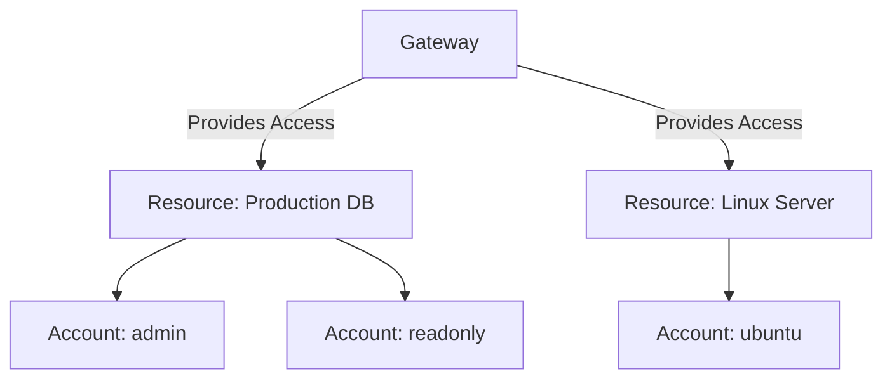

Infisical Privileged Access Management (PAM) provides a centralized way to manage and secure access to your critical infrastructure. It allows you to enforce fine-grained, policy-based controls over resources like databases, servers, and more, ensuring that only authorized users can access sensitive systems, and only when they need to.

## The PAM Workflow

At its core, Infisical PAM is designed to decouple **user identity** from **infrastructure credentials**. Instead of sharing static passwords or SSH keys, users authenticate with their SSO identity, and Infisical handles the rest.

Here is how a typical access lifecycle looks:

1.  **Discovery**: A user logs into Infisical and sees a catalog of resources (databases, servers) and accounts they are allowed to access.
2.  **Connection**: The user selects a resource and an account (e.g., "Production DB" as `read_only`). They initiate the connection via the Infisical CLI.
3.  **Credential Injection**: Infisical validates the request. If allowed, it establishes a secure tunnel and automatically injects the credentials for the target account. **The user never sees the underlying password or key.**
4.  **Monitoring**: The session is established. All traffic is intercepted, logged, and recorded for audit purposes.

## Core Concepts

To successfully implement Infisical PAM, it is essential to understand the relationship between the following components:

<CardGroup cols={3}>
  <Card title="Gateway" icon="server" href="/documentation/platform/gateways/overview">
    A lightweight service deployed in your network that acts as a secure bridge to your private infrastructure.
  </Card>
  <Card title="Resource" icon="database" href="/documentation/platform/pam/getting-started/resources">
    The specific target you are protecting (e.g., a PostgreSQL database or an Ubuntu server).
  </Card>
  <Card title="Account" icon="user-lock" href="/documentation/platform/pam/getting-started/accounts">
    The specific identity on the Resource that the user is trying to access. One Resource can have multiple Accounts.
  </Card>
</CardGroup>

### Relationship Model

The hierarchy is structured as follows:

1.  **Gateway**: Deployed once per network/VPC. It provides connectivity to all resources in that environment.
2.  **Resource**: Configured within Infisical. It points to a specific IP/Host accessible by the Gateway.
3.  **Account**: Defined under a Resource. Users request access to a specific *Account* on a *Resource*.

## Network Architecture

Infisical PAM uses a secure proxy-based architecture to connect users to resources without direct network exposure.

When a user accesses a resource, their connection is routed securely through a Relay to your self-hosted Gateway, which then connects to the target resource. This ensures zero-trust access without exposing your infrastructure to the public internet.

For a deep dive into the technical architecture and security model, see [Architecture](/documentation/platform/pam/architecture).

## Getting Started

Ready to set up Infisical PAM? Follow our step-by-step guide to deploy a gateway, define resources, and grant your team secure access to critical infrastructure.

<Card title="Setup Guide" icon="rocket" href="/documentation/platform/pam/getting-started/setup">
  Learn how to deploy a gateway, create resources, add accounts, and connect to your infrastructure.
</Card>

## Supported Resources

Infisical PAM supports a variety of resource types:

<CardGroup cols={2}>
  <Card title="SSH Servers" icon="terminal" href="/documentation/platform/pam/getting-started/resources/ssh">
    Secure access to Linux servers via SSH with session recording.
  </Card>
  <Card title="Kubernetes" icon="dharmachakra" href="/documentation/platform/pam/getting-started/resources/kubernetes">
    Manage access to Kubernetes clusters.
  </Card>
  <Card title="AWS IAM" icon="aws" href="/documentation/platform/pam/getting-started/resources/aws-iam">
    Broker access to AWS resources via IAM credentials.
  </Card>
  <Card title="Redis" icon="database" href="/documentation/platform/pam/getting-started/resources/redis">
    Secure access to Redis databases.
  </Card>
</CardGroup>

## Core Capabilities

- **[Auditing](/documentation/platform/pam/product-reference/auditing)**: Track and review a comprehensive log of all user actions and system events.
- **[Session Recording](/documentation/platform/pam/product-reference/session-recording)**: Record and playback user sessions for security reviews, compliance, and troubleshooting.
- **[Automated Credential Rotation](/documentation/platform/pam/product-reference/credential-rotation)**: Automatically rotate credentials for supported resources to minimize the risk of compromised credentials.
