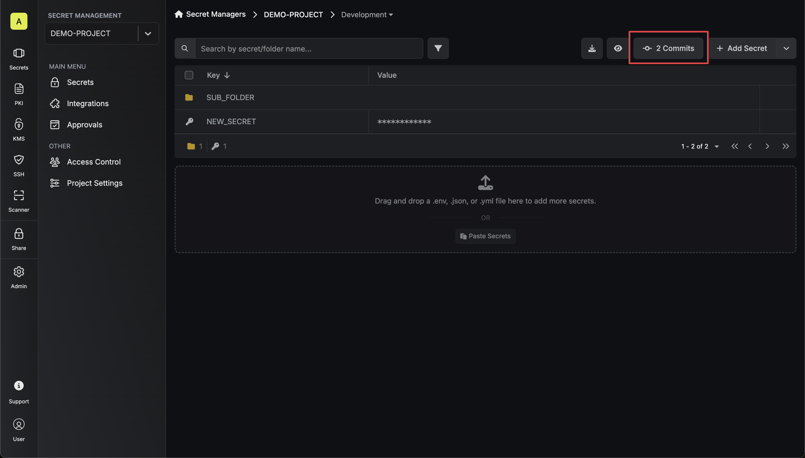
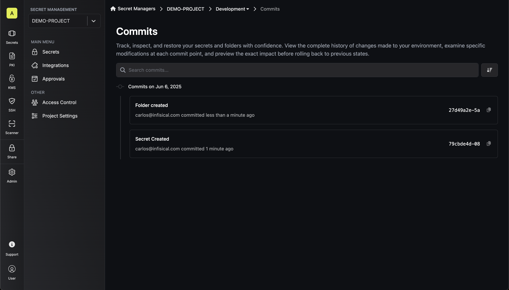
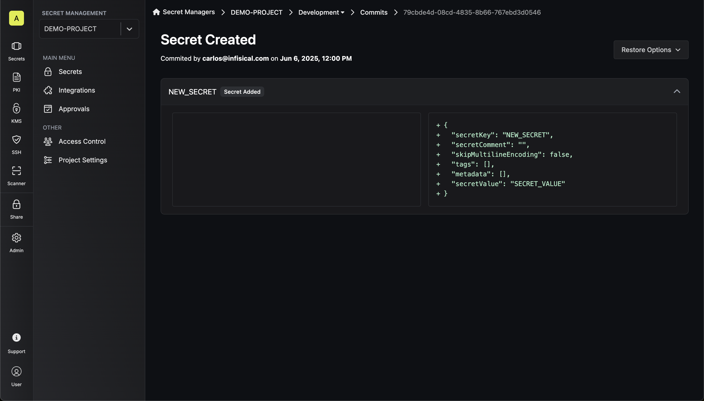
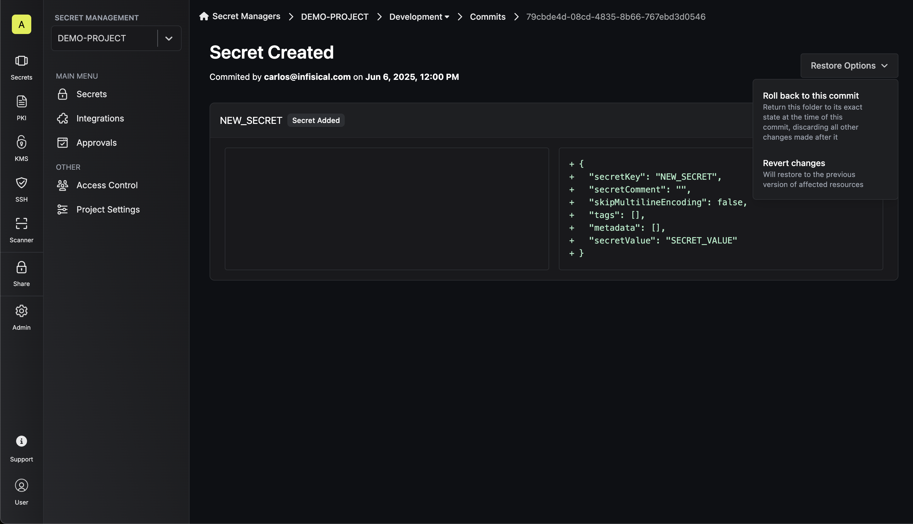
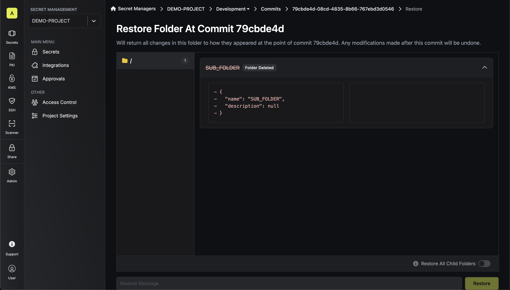
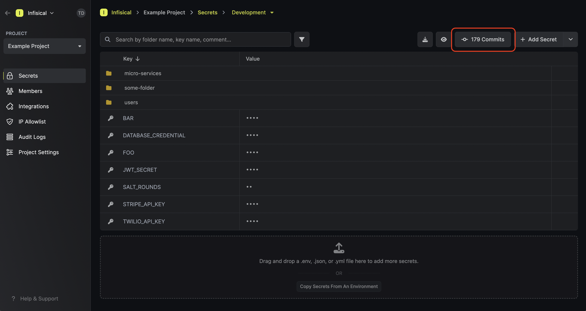
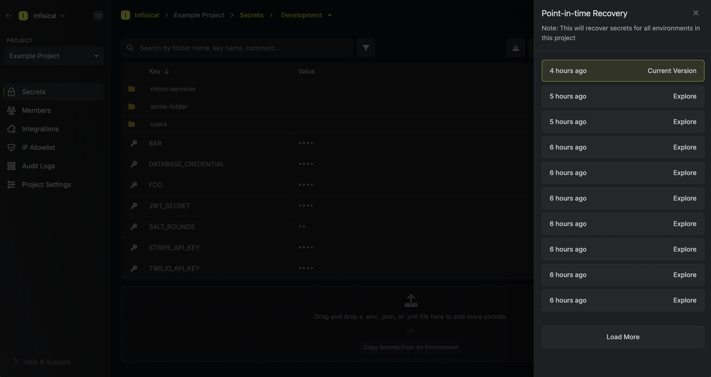
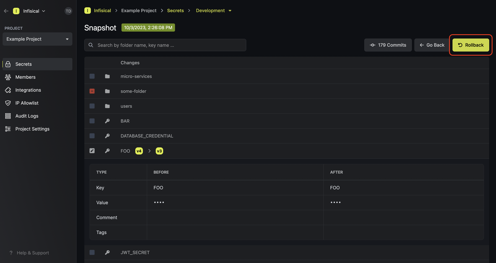

<Info>
  Point-in-Time Recovery is a paid feature. If you're using Infisical Cloud,
  then it is available under the **Pro Tier**. If you're self-hosting Infisical,
  then you should contact sales@infisical.com to purchase an enterprise license
  to use it.
</Info>

Infisical's point-in-time recovery functionality allows secrets to be rolled back to any point in time for any given [folder](./folder) or [environment](/documentation/platform/project#project-environments).

<Tabs>
  <Tab title="Commits Interface">
    ## Understanding Commits

    Similar to Git, a commit in Infisical represents a snapshot of changes made to your project's resources at a specific point in time. Each commit is scoped to an environment and [folder](./folder) within it. Unlike the legacy snapshot system, the new commits interface provides granular tracking of individual changes, allowing you to see exactly what was modified, added, or removed in each commit.

    ### Accessing Commits

    From your secrets management interface, you can access the commits functionality by clicking the **Commits Button**. This button is located in the top-right area of your secrets view and shows the number of commits for the current folder (e.g., "4 Commits").

    

    ### Commits List View

    The commits page displays a comprehensive chronological history of all changes made to your environment and folders:

    

    - **Chronological Sorting**: Commits are grouped by date
    - **Commit Information**: Each commit shows:
      - Commit message
      - Author information
      - Relative timestamp
      - Unique commit hash identifier
    - **Search Functionality**: Use the search bar to quickly find specific commits
    - **Sorting Options**: Sort commits by various criteria using the sort controls

    ### Detailed Commit Inspection

    Clicking on any commit from the list opens a detailed view showing the list of changes made in that commit.

    

    #### Change Categories

    The commit changes details can be grouped into the following categories:

    **Folder Changes**
    - Shows folder additions, modifications, or deletions
    - Displays the folder properties changes in JSON format, including:
      - Folder name
      - Folder description

    **Secret Changes**
    - Lists all secrets that were added, updated, or removed
    - Shows the complete secret configuration including:
      - Secret key and value
      - Comments, tags  and metadata
      - Encoding settings (e.g., skipMultilineEncoding)
    - Values are displayed with appropriate masking for security

    **Visual Indicators**
    - Green "+" indicators show additions
    - Red "-" indicators show deletions
    - Modified content shows both old and new states

    ### Restoration Options

    Each commit provides two distinct restoration methods accessible via the **Restore Options** dropdown:

    

    #### Revert changes
    This option provides surgical precision for undoing specific modifications:

    - **Granular Control**: Reverts only the specific changes introduced in that individual commit
    - **Selective Restoration**: Preserves all other changes made after the commit
    - **Targeted Undo**: Perfect for reversing a specific problematic change without affecting other work
    - **Minimal Impact**: Only affects the resources that were modified in that particular commit
    - **Use Case**: Ideal when you want to undo a specific change while keeping all other modifications intact

    #### Roll back to this commit
    This option performs a complete restoration to the selected point in time:

    

    - **Complete State Restoration**: Returns the entire folder to its exact state at the time of this commit
    - **Restore All Child Folders**: If enabled, it'll also restore all nested folders to their exact state at the time of this commit.
    - **Destructive Operation**: Discards ALL changes made after the selected commit
    - **New Commit Creation**: Creates a new commit representing this rollback operation
    - **Use Case**: Ideal when you want to completely undo a series of changes and return to a known good state

    **Warning**: This operation will undo all modifications made after the selected commit, which may include multiple secrets and configuration changes.

  </Tab>
  <Tab title="Legacy Snapshots (Deprecated)">
    <Warning>
      The snapshots interface is deprecated and will be removed in a future version. Please use the new Commits interface for more granular point-in-time recovery operations.
    </Warning>

    ## Snapshots

    Similar to Git, a commit (also known as snapshot) in Infisical is the state of your project's secrets at a specific point in time scoped to
    an environment and [folder](./folder) within it.

    To view a list of snapshots for the current folder, press the **Commits** button.

    

    This opens up a sidebar from which you can select to view a particular snapshot:

    

    ## Rolling back

    After pressing on a snapshot from the sidebar, you can view it and roll back the state
    of the folder to that point in time by pressing the **Rollback** button.

    

    Rolling back secrets to a past snapshot creates a snapshot at the top of the stack and updates secret versions.

    <Note>
    Rollbacks are localized to not affect other folders within the same environment. This means each [folder](./folder) maintains its own independent history of changes, offering precise and isolated control over rollback actions.
    Put differently, every [folder](./folder) possesses a distinct and separate timeline, providing granular control when managing your secrets.
    </Note>

  </Tab>
</Tabs>
