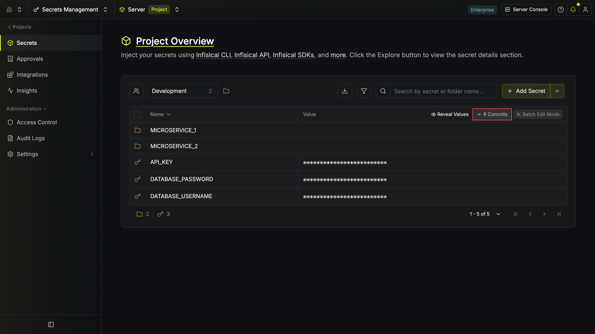
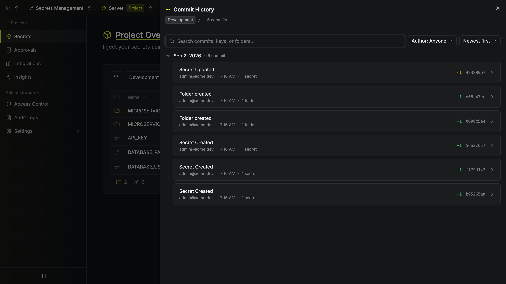
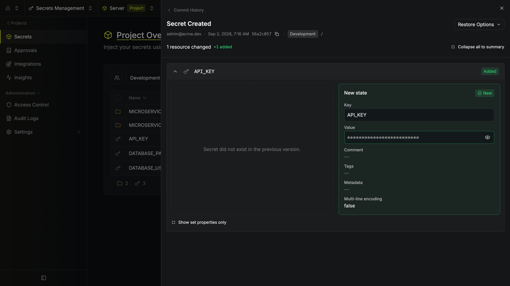
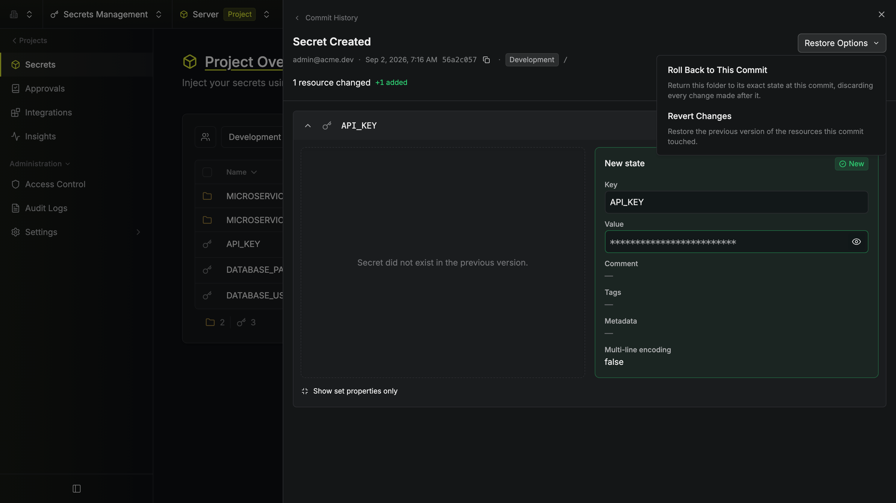
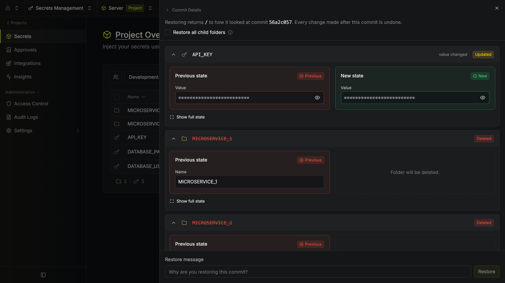

<Info>
  Point-in-Time Recovery is a paid feature. If you're using Infisical Cloud,
  then it's available under the **Pro Tier**. If you're self-hosting Infisical,
  then you should contact sales@infisical.com to purchase an enterprise license
  to use it.
</Info>

Infisical's point-in-time recovery functionality allows secrets to be rolled back to any point in time for any given [folder](./folder) or [environment](/documentation/platform/project#project-environments).

The short video below walks through secret versioning and point-in-time recovery, covering how Infisical keeps a history of every secret change and how to roll back to a previous state.

 

  <iframe
    src="https://www.youtube.com/embed/tWVQcx4XiAA"
    title="YouTube video player"
    style={{ position: "absolute", top: 0, left: 0, width: "100%", height: "100%", border: 0 }}
    allow="accelerometer; autoplay; clipboard-write; encrypted-media; gyroscope; picture-in-picture; web-share"
    allowfullscreen
  ></iframe>

 

## Understanding commits

Similar to Git, a commit in Infisical represents a snapshot of changes made to your project's resources at a specific point in time. Each commit is scoped to an environment and [folder](./folder) within it. Unlike the legacy snapshot system, the new commits interface provides granular tracking of individual changes, allowing you to see exactly what was modified, added, or removed in each commit.

### Accessing commits

From your secrets management interface, you can access the commits functionality by selecting the **Commits** button. This button sits at the right of the secrets table header and shows the number of commits for the current folder (e.g., **6 Commits**).

### Commits list view

The commit history panel displays a comprehensive chronological history of all changes made to your environment and folders:

- **Chronological sorting**: Commits are grouped by date
- **Commit information**: Each commit shows:
  - Commit message
  - Author information
  - Timestamp
  - Unique commit hash identifier
  - How many resources the commit added, updated, or deleted
- **Search**: Use the search bar to find a commit by message, secret key, or folder name
- **Filter and sort**: Narrow the list to a single author with **Author**, and switch between oldest and newest first with the sort control

### Detailed commit inspection

Selecting any commit from the list opens a detailed view showing the list of changes made in that commit.

#### Change categories

The commit changes details can be grouped into the following categories:

**Folder changes**
- Shows folder additions, modifications, or deletions
- Displays the folder properties that changed, including:
  - Folder name
  - Folder description

**Secret changes**
- Lists all secrets that were added, updated, or removed
- Shows the complete secret configuration including:
  - Secret key and value
  - Comments, tags, and metadata
  - Multi-line encoding
- Values are displayed with appropriate masking for security

**Visual indicators**
- Each resource carries an **Added**, **Updated**, or **Deleted** badge
- The previous state sits in a red panel on the left and the new state in a green panel on the right
- Select **Expand all to full state** to see every property rather than only the ones that changed

### Restoration options

Each commit provides two distinct restoration methods accessible via the **Restore Options** dropdown:

#### Revert changes
This option provides surgical precision for undoing specific modifications:

- **Granular Control**: Reverts only the specific changes introduced in that individual commit
- **Selective Restoration**: Preserves all other changes made after the commit
- **Targeted Undo**: Perfect for reversing a specific problematic change without affecting other work
- **Minimal Impact**: Only affects the resources that were modified in that particular commit
- **Use Case**: Ideal when you want to undo a specific change while keeping all other modifications intact

#### Roll back to this commit
This option performs a complete restoration to the selected point in time:

- **Complete State Restoration**: Returns the entire folder to its exact state at the time of this commit
- **Restore all child folders**: If enabled, it'll also restore all nested folders to their exact state at the time of this commit.
- **Destructive Operation**: Discards ALL changes made after the selected commit
- **New Commit Creation**: Creates a new commit representing this rollback operation
- **Use Case**: Ideal when you want to completely undo a series of changes and return to a known good state

**Warning**: This operation will undo all modifications made after the selected commit, which may include multiple secrets and configuration changes.
