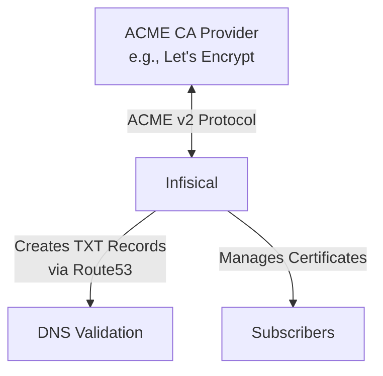

## Concept

The Infisical ACME integration allows you to connect with ACME (Automatic Certificate Management Environment) Certificate Authorities to automatically issue and manage publicly trusted TLS certificates for your [subscribers](/documentation/platform/pki/subscribers). This integration enables you to leverage established public CA infrastructure like Let's Encrypt while centralizing your certificate management within Infisical.

ACME is a protocol that automates the process of certificate issuance and renewal through domain validation challenges. The integration is perfect for obtaining trusted X.509 certificates for public-facing services and is capable of automatically renewing certificates as needed.

<div align="center">



</div>

As part of the workflow, you configure DNS provider credentials, register an ACME CA provider with Infisical, and create subscribers to represent the certificates you wish to issue. Each issued certificate is automatically managed through its lifecycle, including renewal before expiration.

We recommend reading about [ACME protocol](https://tools.ietf.org/html/rfc8555) and [DNS-01 challenges](https://letsencrypt.org/docs/challenge-types/#dns-01-challenge) for a fuller understanding of the underlying technology.

## Workflow

A typical workflow for using Infisical with ACME Certificate Authorities consists of the following steps:

1. Setting up AWS Route53 credentials with appropriate DNS permissions.
2. Creating an AWS connection in Infisical to store the Route53 credentials.
3. Registering an ACME Certificate Authority (like Let's Encrypt) with Infisical.
4. Creating subscribers that use the ACME CA as their issuing authority.
5. Managing certificate lifecycle events such as issuance, renewal, and revocation through Infisical.

## Understanding ACME DNS-01 Challenge

The DNS-01 challenge is the method used by ACME CA providers to verify that you control a domain before issuing a certificate. Here's how Infisical handles this process:

1. **Challenge Request**: When you request a certificate, the ACME provider (like Let's Encrypt) issues a challenge token.

2. **DNS Record Creation**: Infisical creates a TXT record at `_acme-challenge.<YOUR_DOMAIN>` with a value derived from the challenge token.

3. **DNS Propagation**: The TXT record must propagate through the DNS system (usually takes a few minutes, depending on TTL settings).

4. **Validation**: The ACME provider checks for the existence of this TXT record to verify domain control.

5. **Cleanup**: After validation completes successfully, Infisical automatically removes the TXT record from your DNS.

This automated process eliminates the need for manual intervention in domain validation, streamlining certificate issuance.

## Guide

In the following steps, we explore how to set up ACME Certificate Authority integration with Infisical using Let's Encrypt as an example.

<Steps>
    <Step title="Set Up AWS Connection with Required Permissions">
        Before proceeding with the ACME CA registration, you need to set up an AWS connection with the appropriate permissions for DNS validation:

        1. Navigate to your Organization Settings > App Connections and create a new AWS connection.

        2. Ensure your AWS connection has the following minimum permissions for Route53 DNS validation:

        ```json
        {
          "Version": "2012-10-17",
          "Statement": [
            {
              "Effect": "Allow",
              "Action": "route53:GetChange",
              "Resource": "arn:aws:route53:::change/*"
            },
            {
              "Effect": "Allow",
              "Action": "route53:ListHostedZonesByName",
              "Resource": "*"
            },
            {
              "Effect": "Allow",
              "Action": [
                "route53:ListResourceRecordSets"
              ],
              "Resource": [
                "arn:aws:route53:::hostedzone/YOUR_HOSTED_ZONE_ID"
              ]
            },
            {
              "Effect": "Allow",
              "Action": [
                "route53:ChangeResourceRecordSets"
              ],
              "Resource": [
                "arn:aws:route53:::hostedzone/YOUR_HOSTED_ZONE_ID"
              ],
              "Condition": {
                "ForAllValues:StringEquals": {
                  "route53:ChangeResourceRecordSetsRecordTypes": [
                    "TXT"
                  ]
                }
              }
            }
          ]
        }
        ```

        Replace `YOUR_HOSTED_ZONE_ID` with your actual Route53 hosted zone ID.

        For detailed instructions on setting up an AWS connection, see the [AWS Connection](/integrations/app-connections/aws) documentation.
    </Step>
    <Step title="Register ACME Certificate Authority">
        <Tabs>
          <Tab title="Infisical UI">
            <Steps>
                <Step title="Create ACME CA">
                    To register an ACME CA, head to your Project > Internal PKI > Certificate Authorities and press the **+** button in the External Certificate Authorities section.

                    

                    Fill out the details for the ACME CA registration:

                    

                    Here's guidance on each field:

                    - **Type**: Select "ACME" as the External CA type.
                    - **Name**: Enter a name for the ACME CA (e.g., "lets-encrypt-production").
                    - **DNS App Connection**: Select from available DNS app connections or configure a new one. This connection provides Infisical with the credentials needed to create and remove DNS records for ACME validation.
                    - **Hosted Zone ID**: Enter your Route53 hosted zone ID (e.g., Z04044I124N1GOOMCOYX1) for the domain(s) you'll be requesting certificates for.
                    - **Directory URL**: Enter the ACME v2 directory URL for your chosen CA provider (e.g., `https://acme-v02.api.letsencrypt.org/directory` for Let's Encrypt).
                    - **Account Email**: Email address to associate with your ACME account. This email will receive important notifications about your certificates.
                    - **Enable Direct Issuance**: Toggle on to allow direct certificate issuance without requiring subscribers.

                    Finally, press **Create** to register the ACME CA with Infisical.
                </Step>
                <Step title="Verify ACME CA Registration">
                    Once registered, your ACME CA will appear in the External Certificate Authorities section.

                    

                    From here, you can:
                    
                    - View the status of the ACME CA registration
                    - Edit the configuration settings
                    - Disable or re-enable the ACME CA
                    - Delete the ACME CA registration if no longer needed

                    You can now use this ACME CA to issue certificates for your subscribers.
                </Step>
            </Steps>
          </Tab>
          <Tab title="API">
            To register an ACME CA with Infisical using the API, make a request to the Create External CA endpoint:
            
            ### Sample request
            
            ```bash Request
            curl 'https://app.infisical.com/api/v1/pki/ca/acme' \
              -H 'Authorization: Bearer <your-access-token>' \
              -H 'Content-Type: application/json' \
              --data-raw '{
                "projectId": "0fccb6ee-1381-4ff1-8d5f-0cb93c6cc4d6",
                "name": "lets-encrypt-production",
                "type": "acme",
                "status": "active",
                "enableDirectIssuance": true,
                "configuration": {
                  "dnsAppConnection": {
                    "id": "1e5f8c0d-09d2-492c-9b28-469acd8e841b",
                    "name": "acme-dns-test-connection"
                  },
                  "dnsProviderConfig": {
                    "provider": "route53",
                    "hostedZoneId": "Z040441124N1GOOMCQYX1"
                  },
                  "directoryUrl": "https://acme-v02.api.letsencrypt.org/directory",
                  "accountEmail": "admin@example.com",
                  "dnsAppConnectionId": "1e5f8c0d-09d2-492c-9b28-469acd8e841b"
                }
              }'
            ```
            
            ### Sample response
            
            ```bash Response
            {
                "id": "c48b701e-a20c-4a9a-8119-68f54e5fbb05",
                "name": "lets-encrypt-production",
                "type": "acme",
                "status": "active",
                "projectId": "0fccb6ee-1381-4ff1-8d5f-0cb93c6cc4d6",
                "enableDirectIssuance": true,
                "configuration": {
                    "accountEmail": "admin@example.com",
                    "directoryUrl": "https://acme-v02.api.letsencrypt.org/directory",
                    "dnsAppConnection": {
                    "id": "1e5f8c0d-09d2-492c-9b28-469acd8e841b",
                    "name": "acme-dns-test-connection"
                    },
                    "dnsAppConnectionId": "1e5f8c0d-09d2-492c-9b28-469acd8e841b",
                    "dnsProviderConfig": {
                    "provider": "route53",
                    "hostedZoneId": "Z040441124N1GOOMCQYX1"
                    }
                }
            }
            ```
          </Tab>
        </Tabs>
    </Step>
    <Step title="Create Subscriber for ACME CA">
        Next, create a subscriber that uses your ACME CA for certificate issuance. Navigate to your Project > Subscribers and create a new subscriber.

        Configure the subscriber with:
        - **Issuing CA**: Select your registered ACME CA
        - **Common Name**: The domain for which you want to issue certificates (e.g., `example.com`)
        - **Alternative Names**: Additional domains to include in the certificate

        Check out the [Subscribers](/documentation/platform/pki/subscribers) page for detailed instructions on creating and managing subscribers.
    </Step>
    <Step title="Issue Certificate">
        Once your subscriber is configured, you can issue certificates either through the Infisical UI or programmatically via the API.

        When you request a certificate:
        1. Infisical generates a key pair for the certificate
        2. Sends a Certificate Signing Request (CSR) to the ACME CA
        3. Receives a DNS-01 challenge from the ACME provider
        4. Creates a TXT record in Route53 to satisfy the challenge
        5. Notifies the ACME provider that the challenge is ready for validation
        6. Once validated, the ACME provider issues the certificate
        7. Infisical stores and manages the certificate for your subscriber

        The certificate will be automatically renewed before expiration according to your subscriber configuration.
    </Step>
    <Step title="Use Certificate in Your Applications">
        The issued certificate and private key are now available through Infisical and can be:
        
        - Downloaded directly from the Infisical UI
        - Retrieved via the Infisical API for programmatic access using the [latest certificate bundle endpoint](/api-reference/endpoints/pki/subscribers/get-latest-cert-bundle)
    </Step>
</Steps>

## Example: Let's Encrypt Integration

Let's Encrypt is a free, automated, and open Certificate Authority that provides domain-validated SSL/TLS certificates. Here's how the integration works with Infisical:

### Production Environment
- **Directory URL**: `https://acme-v02.api.letsencrypt.org/directory`
- **Rate Limits**: 50 certificates per registered domain per week
- **Certificate Validity**: 90 days with automatic renewal
- **Trusted By**: All major browsers and operating systems

### Staging Environment (for testing)
- **Directory URL**: `https://acme-staging-v02.api.letsencrypt.org/directory`
- **Rate Limits**: Much higher limits for testing
- **Certificate Validity**: 90 days (not trusted by browsers)
- **Use Case**: Testing your ACME integration without hitting production rate limits

<Note>
  Always test your ACME integration using Let's Encrypt's staging environment first. This allows you to verify your DNS configuration and certificate issuance process without consuming your production rate limits.
</Note>

## FAQ

<AccordionGroup>
  <Accordion title="What DNS validation methods are supported?">
    Currently, Infisical supports DNS-01 validation through AWS Route53. The DNS-01 challenge method is preferred for ACME integrations because it:
    
    - Works with wildcard certificates
    - Doesn't require your servers to be publicly accessible
    - Can be fully automated without manual intervention
    
    Support for additional DNS providers is planned for future releases.
  </Accordion>
  <Accordion title="Can I use wildcard certificates with ACME CAs?">
    Yes! ACME CAs like Let's Encrypt support wildcard certificates (e.g., `*.example.com`) when using DNS-01 validation. Simply specify the wildcard domain in your subscriber configuration.
    
    Note that wildcard certificates still require DNS-01 validation - HTTP-01 validation cannot be used for wildcard certificates.
  </Accordion>
  <Accordion title="How long are ACME certificates valid?">
    Most ACME providers issue certificates with 90-day validity periods. This shorter validity period is designed to:
    
    - Encourage automation of certificate management
    - Reduce the impact of compromised certificates
    - Ensure systems stay up-to-date with certificate management practices
    
    When configured, Infisical automatically handles certificate renewal for subscribers.
  </Accordion>
  <Accordion title="Can I use multiple ACME providers?">
    Yes! You can register multiple ACME CAs in the same project:
    
    - Different providers for different domains or use cases
    - Staging and production environments for the same provider
    - Backup providers for redundancy
    
    Each subscriber can be configured to use a specific ACME CA based on your requirements.
  </Accordion>
</AccordionGroup>