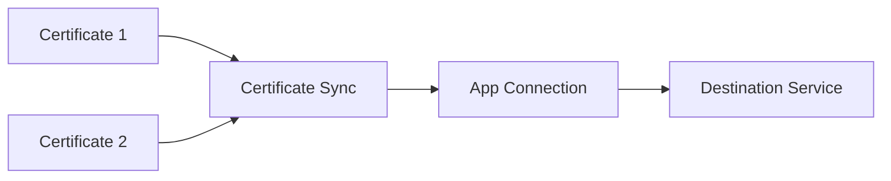

Push certificates from your Application to external services automatically. When paired with auto-renewal, renewed certificates are synced to their destinations — keeping your infrastructure current without manual intervention.

<Info>
  Certificate Syncs are configured per Application. Select which certificates to sync, then configure the destination.
</Info>

## How It Works

1. **Select certificates** to sync from your Application
2. **Configure a destination** using an [App Connection](/integrations/app-connections/overview)
3. **Certificates are pushed** to the destination automatically
4. **Renewals sync automatically** when using server-side auto-renewal

<Note>
  Only certificates managed by Infisical are affected during sync operations. Certificates created directly in the destination service remain untouched.
</Note>

## Supported Destinations

<CardGroup cols={2}>
  <Card title="AWS Certificate Manager" icon="aws" href="/documentation/platform/pki/applications/certificate-syncs/aws-certificate-manager">
    Import certificates into ACM for use with AWS services.
  </Card>
  <Card title="AWS Elastic Load Balancer" icon="aws" href="/documentation/platform/pki/applications/certificate-syncs/aws-elastic-load-balancer">
    Deploy certificates directly to ALB/NLB listeners.
  </Card>
  <Card title="AWS Secrets Manager" icon="aws" href="/documentation/platform/pki/applications/certificate-syncs/aws-secrets-manager">
    Store certificates as secrets for application retrieval.
  </Card>
  <Card title="Azure Key Vault" icon="microsoft" href="/documentation/platform/pki/applications/certificate-syncs/azure-key-vault">
    Import certificates into Azure Key Vault.
  </Card>
  <Card title="Cloudflare" icon="cloudflare" href="/documentation/platform/pki/applications/certificate-syncs/cloudflare-custom-certificate">
    Deploy custom SSL certificates to Cloudflare zones.
  </Card>
  <Card title="Chef Infra" icon="utensils" href="/documentation/platform/pki/applications/certificate-syncs/chef">
    Distribute certificates via Chef data bags.
  </Card>
  <Card title="NetScaler" icon="server" href="/documentation/platform/pki/applications/certificate-syncs/netscaler">
    Deploy certificates to Citrix NetScaler ADC.
  </Card>
</CardGroup>

<Note>
  Need a destination that isn't listed? Contact support@infisical.com to request it.
</Note>

## Creating a Certificate Sync

<Steps>
  <Step title="Create an App Connection">
    If you haven't already, create an [App Connection](/integrations/app-connections/overview) for your destination service. This provides the credentials needed to push certificates.
  </Step>
  <Step title="Configure the sync">
    In your Application, go to **Certificate Syncs** and click **Create Sync**.
    
    Configure:
    - **Destination**: Select the App Connection and target endpoint
    - **Certificates**: Choose which certificates to sync
    - **Options**: Configure sync behavior (see below)
  </Step>
  <Step title="Certificates are synced">
    Selected certificates are immediately pushed to the destination. Future renewals sync automatically.
  </Step>
</Steps>

## Sync Options

| Option | Description |
|--------|-------------|
| **Remove on expiry** | Automatically remove expired certificates from the destination |
| **Include Root CA** | Include the root CA certificate in the chain |
| **Certificate naming** | Control how certificate names are generated in the destination |

<Info>
  Some destination services don't support automatic removal of expired certificates.
</Info>

### Certificate Naming

By default, certificates are named `Infisical-{certificateId}`. You can customize this with a naming schema.

**Schema placeholders:**
- `{{certificateId}}` — The unique certificate identifier (required)

**Examples:**
- `myapp-{{certificateId}}` → `myapp-abc123def456`
- `ssl/{{certificateId}}` → `ssl/abc123def456`

**Rules:**
- Must include exactly one `{{certificateId}}` placeholder
- Only alphanumeric characters, dashes, underscores, and slashes allowed
- Matching certificates will be managed by Infisical during sync operations

## With Auto-Renewal

Certificate Syncs work seamlessly with [server-driven auto-renewal](/documentation/platform/pki/applications/certificates#server-driven-certificate-renewal):

1. Certificate approaches expiration
2. Infisical automatically renews the certificate
3. Renewed certificate is automatically pushed to all configured sync destinations

This creates a fully automated certificate lifecycle — no manual intervention required.

<Warning>
  Changes made directly to Infisical-managed certificates in the destination service may be overwritten by future syncs.
</Warning>

## What's Next?

<CardGroup cols={2}>
  <Card title="AWS Certificate Manager" icon="aws" href="/documentation/platform/pki/applications/certificate-syncs/aws-certificate-manager">
    Import certificates into ACM for AWS services.
  </Card>
  <Card title="Azure Key Vault" icon="microsoft" href="/documentation/platform/pki/applications/certificate-syncs/azure-key-vault">
    Store certificates in Azure Key Vault.
  </Card>
  <Card title="Alerting" icon="bell" href="/documentation/platform/pki/applications/alerting/overview">
    Get notified about certificate lifecycle events.
  </Card>
  <Card title="Managing Certificates" icon="list" href="/documentation/platform/pki/applications/certificates">
    View and manage certificates in your Application.
  </Card>
</CardGroup>
