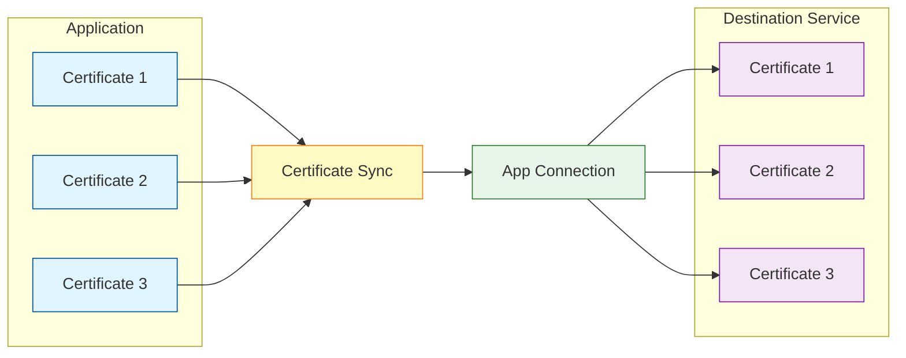

Push certificates from your Application to external services automatically. When paired with auto-renewal, renewed certificates are synced to their destinations — keeping your infrastructure current without manual intervention.

<Info>
  Certificate Syncs are configured per Application. Select which certificates to sync, then configure the destination.
</Info>

## How it works


```mermaid
flowchart LR
    subgraph Application
        C1[Certificate 1]
        C2[Certificate 2]
        C3[Certificate 3]
    end
    
    S[Certificate Sync]
    AC[App Connection]
    
    subgraph Destination["Destination Service"]
        D1[Certificate 1]
        D2[Certificate 2]
        D3[Certificate 3]
    end
    
    C1 --> S
    C2 --> S
    C3 --> S
    S --> AC
    AC --> D1
    AC --> D2
    AC --> D3
    
    style C1 fill:#e1f5fe,stroke:#01579b
    style C2 fill:#e1f5fe,stroke:#01579b
    style C3 fill:#e1f5fe,stroke:#01579b
    style S fill:#fff9c4,stroke:#f57f17
    style AC fill:#e8f5e9,stroke:#2e7d32
    style D1 fill:#f3e5f5,stroke:#7b1fa2
    style D2 fill:#f3e5f5,stroke:#7b1fa2
    style D3 fill:#f3e5f5,stroke:#7b1fa2
```

1. **Select certificates** to sync from your Application
2. **Configure a destination** using an [App Connection](/integrations/app-connections/overview)
3. **Certificates are pushed** to the destination automatically
4. **Renewals sync automatically** when using server-side auto-renewal

<Note>
  Only certificates managed by Infisical are affected during sync operations. Certificates created directly in the destination service remain untouched.
</Note>

## Supported destinations

<CardGroup cols={2}>
  <Card title="AWS Certificate Manager" icon="aws" href="/documentation/platform/pki/applications/certificate-syncs/aws-certificate-manager">
    Import certificates into ACM for use with AWS services.
  </Card>
  <Card title="AWS Elastic Load Balancer" icon="aws" href="/documentation/platform/pki/applications/certificate-syncs/aws-elastic-load-balancer">
    Deploy certificates directly to ALB/NLB listeners.
  </Card>
  <Card title="AWS Secrets Manager" icon="aws" href="/documentation/platform/pki/applications/certificate-syncs/aws-secrets-manager">
    Store certificates as secrets for application retrieval.
  </Card>
  <Card title="Azure Key Vault" icon="microsoft" href="/documentation/platform/pki/applications/certificate-syncs/azure-key-vault">
    Import certificates into Azure Key Vault.
  </Card>
  <Card title="GCP Certificate Manager" icon="google" href="/documentation/platform/pki/applications/certificate-syncs/gcp-certificate-manager">
    Upload certificates for Google Cloud load balancers.
  </Card>
  <Card title="Cloudflare" icon="cloudflare" href="/documentation/platform/pki/applications/certificate-syncs/cloudflare-custom-certificate">
    Deploy custom SSL certificates to Cloudflare zones.
  </Card>
  <Card title="Chef Infra" icon="utensils" href="/documentation/platform/pki/applications/certificate-syncs/chef">
    Distribute certificates via Chef data bags.
  </Card>
  <Card title="NetScaler" icon="server" href="/documentation/platform/pki/applications/certificate-syncs/netscaler">
    Deploy certificates to Citrix NetScaler ADC.
  </Card>
  <Card title="Kemp LoadMaster" icon="scale-balanced" href="/documentation/platform/pki/applications/certificate-syncs/kemp-loadmaster">
    Deploy certificates to Progress Kemp LoadMaster.
  </Card>
  <Card title="F5 BIG-IP" icon="server" href="/documentation/platform/pki/applications/certificate-syncs/f5-big-ip">
    Deploy certificates to F5 BIG-IP appliances and SSL profiles.
  </Card>
  <Card title="Linux Server" icon="linux" href="/documentation/platform/pki/applications/certificate-syncs/linux-server">
    Deploy certificates to Linux servers over SSH.
  </Card>
  <Card title="Windows Server" icon="windows" href="/documentation/platform/pki/applications/certificate-syncs/windows-server">
    Deploy certificates to Windows servers over WinRM.
  </Card>
  <Card title="Nutanix Prism Central" icon="server" href="/documentation/platform/pki/applications/certificate-syncs/nutanix-prism-central">
    Update SSL certificates on Nutanix clusters.
  </Card>
</CardGroup>

<Note>
  Need a destination that isn't listed? Contact support@infisical.com to request it.
</Note>

## Creating a certificate sync

<Steps>
  <Step title="Create an App Connection">
    If you haven't already, create an [App Connection](/integrations/app-connections/overview) for your destination service. This provides the credentials needed to push certificates.
  </Step>
  <Step title="Configure the sync">
    In your Application, go to the **Certificate Syncs** tab and select **Create Sync**.
    
    Configure:
    - **Destination**: Select the App Connection and target endpoint
    - **Certificates**: Add filters describing the certificates this sync holds. A sync with no filters holds nothing
    - **Options**: Configure sync behavior (see below)
  </Step>
  <Step title="Certificates are synced">
    Selected certificates are immediately pushed to the destination. Future renewals sync automatically.
  </Step>
</Steps>

## Certificate filters

A sync holds whichever of the Application's certificates match its filters. Filters describe the certificates rather than naming them, so every certificate issued into the Application afterwards is attached automatically.

Filters live on the **Certificates** step of the sync, under the **Add Filter** menu. Three are available, and they can be combined:

| Filter | Matches |
|--------|---------|
| **Certificate Order** | Every certificate belonging to the selected orders |
| **Certificate profile** | Certificates issued from any of the selected profiles |
| **Metadata** | Certificates carrying every key and value pair listed |

Each filter matches exactly, with no wildcards or patterns, and a certificate has to match **every** filter you set. Adding a filter always narrows the sync, never widens it. So `profile = Prod TLS Edge` plus `metadata tier = prod` holds only the certificates that are both.

A sync with no filters holds nothing, so a new sync stays empty until you describe what it should take. To sync the whole Application, set a filter that matches all of it, such as **Certificate profile** listing every profile in the Application. Setting a filter to an empty list also matches nothing.

### Syncs with a certificate limit

Four things limit how many certificates a sync can hold:

- **The destination itself.** Nutanix Prism Central replaces one cluster certificate, so it holds one.
- **A GCP Certificate Manager sync bound to a certificate map.** It holds four.
- **A name schema with no placeholder.** Every certificate needs a distinct name at the destination, so keep `{{certificateId}}` or `{{shortCertificateId}}` in the schema to hold more than one.
- **A health check or post-sync command naming one certificate.** `{{certificatePath}}` and `{{commonName}}` each resolve to a single certificate. Use `{{certificateFiles}}` or `{{certificateDirectory}}` in a command that has to cover every certificate in the run.

A limited sync takes **Certificate Order** and nothing else, naming at most as many orders as it can hold. **Certificate profile** and **Metadata** match every certificate issued into the Application, so they're rejected, on their own and alongside an order filter. A sync with no filters is accepted, since it holds nothing.

### Orders and renewals

A certificate id belongs to one certificate, and renewing it produces a new id. An order groups a certificate with every renewal of it, so naming an order keeps matching after a renewal. That is why syncs filter on orders rather than certificate ids.

At any moment an order matches exactly one certificate: its newest active one. A renewal therefore replaces its predecessor at the destination rather than joining it. Each certificate's order id is on its detail page, and the picker lets you choose an order by any certificate in it.

### Metadata pairs

Enter a key on its own to match any certificate carrying that key, whatever its value. Enter a key and a value to match that exact pair. A certificate has to carry every pair listed, so each pair narrows the filter further.

### Attaching and detaching one certificate

`POST` and `DELETE` on `/api/v1/cert-manager/syncs/:pkiSyncId/certificates` take certificate ids, resolve each to the order it belongs to, and add or remove that order in the **Certificate Order** filter. `infisical_certificate_sync_certificate` uses this in Terraform, so a client that names a certificate still follows its renewals.

The same resolution applies to the `certificateIds` field on sync creation.

Both work only on a sync whose **Certificate Order** filter is its only filter. On a sync that also filters by profile or metadata, or on one with no filters, they're rejected, because rewriting the order list would narrow the sync and detach everything else. Edit the filters instead.

### When certificates are attached and detached

One certificate is checked against the Application's syncs whenever it is:

- Issued through any enrollment method, including the API, ACME, EST, and SCEP
- Imported into the Application
- Renewed, either manually or by auto-renewal
- Updated with new metadata
- Assigned to the Application after being issued outside one
- Deleted

Editing a sync's filters re-checks every certificate in the Application instead. Certificates that now match are attached, and certificates that no longer match are detached.

Only active certificates are attached. Expired, revoked, and superseded certificates are skipped, so a renewal replaces its predecessor at the destination rather than joining it.

### Detaching can delete at the destination

A certificate that leaves a sync is deleted from the destination when **Allow to remove certificates from destination** is enabled, whether it left because it was deleted, because it stopped being active, or because a filter changed.

That makes a filter edit destructive. A load balancer serving a certificate loses it the moment that certificate stops matching. Before saving, Infisical lists the certificates a filter change would detach and asks you to confirm. Terraform prints the same list as a warning at plan. The API applies the change with no prompt, so call the [preview endpoint](#previewing-a-filter-change) first.

### Previewing a filter change

`POST /api/v1/cert-manager/syncs/certificates/preview` reports what a set of filters matches and changes nothing. Name the sync you intend to save them to:

```bash
curl -X POST "https://app.infisical.com/api/v1/cert-manager/syncs/certificates/preview" \
  -H "Authorization: Bearer $TOKEN" \
  -H "Content-Type: application/json" \
  -d '{"pkiSyncId": "<sync-id>", "filters": {"profileIds": ["<profile-id>"]}}'
```

The response carries `matchedCount` and `certificates` for what the filters match, `hasMoreMatches` when they match more than a sync can hold, and `toUnlink` with `willRemoveFromDestination` for what the sync would lose. To try filters out before the sync exists, send `applicationId` instead of `pkiSyncId`: nothing can be detached yet, so `toUnlink` comes back empty.

<Note>
  - A sync can hold up to 500 certificates.
  - One filter can name at most 500 certificate orders, 20 certificate profiles, or 20 metadata pairs.
</Note>

## Sync options

| Option | Description |
|--------|-------------|
| **Allow to remove certificates from destination** | Delete a certificate from the destination once it leaves this sync |
| **Include Root CA** | Include the root CA certificate in the chain |
| **Certificate naming** | Customize how certificates are named in the destination via the Certificate Name Schema (default: `Infisical-{{certificateId}}`) |

<Note>
  Some destinations don't support automatic removal of expired certificates. Certificates managed by Infisical may be overwritten if modified directly in the destination.
</Note>

## Certificate name schema

The **Certificate Name Schema** controls the name each certificate is given in the destination. It's a template that supports the following placeholders, which are resolved per certificate at sync time:

<Note>
  - `{{certificateId}}` - The unique ID of the certificate (32 characters). **Required** (or `{{shortCertificateId}}`) so that each synced certificate resolves to a unique, stable name.
  - `{{shortCertificateId}}` - A shorter (22-character) form of the certificate ID. Use it in place of `{{certificateId}}` when the destination's name limit is tight (e.g. NetScaler). It guarantees the same per-certificate uniqueness.
  - `{{commonName}}` - The certificate's common name (its FQDN), e.g. `app.example.com`.
  - `{{profileId}}` - The certificate profile ID. Falls back to the certificate ID when the certificate has no profile.
  - `{{applicationId}}` - The ID of the application the sync belongs to.
  - `{{applicationName}}` - The name of the application the sync belongs to.
</Note>

For example, `myapp-{{commonName}}-{{certificateId}}` produces a name like `myapp-app.example.com-1a2b3c...`.

Each destination enforces its own character and length rules for resource names:

- **Characters**: `{{commonName}}` and `{{applicationName}}` are sanitized to the destination's allowed character set. For destinations that don't allow dots (e.g. Azure Key Vault, Chef), `app.example.com` becomes `app-example-com`; destinations that allow dots (e.g. NetScaler, F5 BIG-IP) keep it as-is.
- **Length**: schemas that would compile to a name longer than the destination's limit are rejected when you save the sync. Full UUID placeholders (`{{certificateId}}`, `{{profileId}}`, `{{applicationId}}`) each count as 32 characters; `{{shortCertificateId}}` counts as 22. For tight limits, prefer `{{shortCertificateId}}`.

Keep `{{certificateId}}` or `{{shortCertificateId}}` in the schema to guarantee a unique, stable name per certificate.

## What's next?

<CardGroup cols={2}>
  <Card title="AWS Certificate Manager" icon="aws" href="/documentation/platform/pki/applications/certificate-syncs/aws-certificate-manager">
    Import certificates into ACM for AWS services.
  </Card>
  <Card title="Azure Key Vault" icon="microsoft" href="/documentation/platform/pki/applications/certificate-syncs/azure-key-vault">
    Store certificates in Azure Key Vault.
  </Card>
  <Card title="Alerting" icon="bell" href="/documentation/platform/pki/applications/alerting/overview">
    Get notified about certificate lifecycle events.
  </Card>
  <Card title="Managing Certificates" icon="list" href="/documentation/platform/pki/applications/certificates">
    View and manage certificates in your Application.
  </Card>
</CardGroup>
