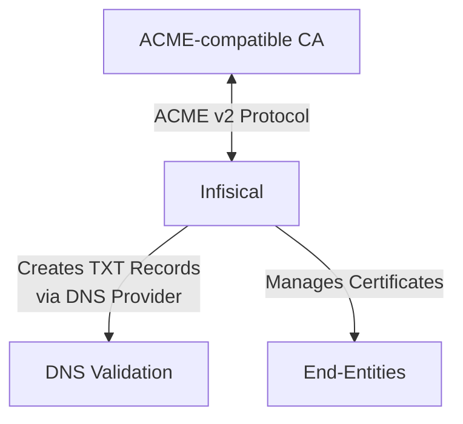

## Concept

Infisical can connect to any upstream ACME-compatible CA (e.g. Lets's Encrypt, DigiCert, etc.) supporting the [ACME protocol](https://en.wikipedia.org/wiki/Automatic_Certificate_Management_Environment) to issue certificates back to your end-entities. This integration uses the [DNS-01 challenge](https://letsencrypt.org/docs/challenge-types/#dns-01-challenge) method as part of the ACME domain validation challenge workflow for a requested certificate.

The upstream ACME-compatible CA integration lets you connect Infisical to providers by specifying
their **ACME Directory URL** such as:

- [Let's Encrypt](/documentation/platform/pki/ca/lets-encrypt): `https://acme-v02.api.letsencrypt.org/directory`.
- [DigiCert](/documentation/platform/pki/ca/digicert): `https://acme.digicert.com/v2/acme/directory`.
- Google GTS: `https://dv.acme-v02.api.pki.goog/directory`.
- Buypass: `https://api.buypass.com/acme/directory`.
- ZeroSSL: `https://acme.zerossl.com/v2/DV90`.
- SSL.com: `https://acme.ssl.com/sslcom-dv-rsa`.

When Infisical requests a certificate from an ACME-compatible CA, it creates a TXT record at `_acme-challenge.{your-domain}` in your configured DNS provider (e.g. Route53, Cloudflare, etc.); this TXT record contains the challenge token issued by the ACME-compatible CA to validate domain control for the requested certificate.
The ACME provider checks for the existence of this TXT record to verify domain control before issuing the certificate back to Infisical.

After validation completes successfully, Infisical automatically removes the TXT record from your DNS provider.

<div align="center">



</div>

We recommend reading about [ACME protocol](https://tools.ietf.org/html/rfc8555) and [DNS-01 challenges](https://letsencrypt.org/docs/challenge-types/#dns-01-challenge) for a fuller understanding of the underlying workflow.

## Workflow

A typical workflow for using Infisical with an external ACME-compatible CA consists of the following steps:

1. Setting up your DNS provider (e.g. Route53, Cloudflare, etc.) with appropriate DNS permissions.
2. Creating an [App Connection](/integrations/app-connections/overview) in Infisical to store credentials for Infisical to connect to your DNS provider and create/remove DNS records as part of the DNS-01 challenge.
3. Registering an [External CA](/documentation/platform/pki/ca/external-ca) in Infisical with the ACME type and inputting required configuration including the **ACME Directory URL** of the upstream ACME-compatible CA and the **App Connection** for your DNS provider.

Once this is complete, you can create a [certificate profile](/documentation/platform/pki/certificates/profiles) linked to the External CA proceed to request a certificate against it.

## Guide to Connecting Infisical to an ACME-compatible CA

In the following steps, we explore how to connect Infisical to an ACME-compatible CA.

<Steps>
    <Step title="Create an App Connection to your DNS provider">
        Before registering an ACME-compatible CA with Infisical, you need to set up an [App Connection](/integrations/app-connections/overview) with the appropriate permissions for Infisical to perform the DNS-01 challenge with your DNS provider.
        
        If you don’t see a specific DNS provider listed below or need a dedicated one, please reach out to sales@infisical.com and we’ll help get that enabled for you.

        <Tabs>
            <Tab title="Route53">
                1. Navigate to your Certificate Management Project > App Connections and create a new AWS connection.

                2. Ensure your AWS connection has the following minimum permissions for Route53 DNS validation:

                ```json
                {
                  "Version": "2012-10-17",
                  "Statement": [
                    {
                      "Effect": "Allow",
                      "Action": "route53:GetChange",
                      "Resource": "arn:aws:route53:::change/*"
                    },
                    {
                      "Effect": "Allow",
                      "Action": "route53:ListHostedZonesByName",
                      "Resource": "*"
                    },
                    {
                      "Effect": "Allow",
                      "Action": [
                        "route53:ListResourceRecordSets"
                      ],
                      "Resource": [
                        "arn:aws:route53:::hostedzone/YOUR_HOSTED_ZONE_ID"
                      ]
                    },
                    {
                      "Effect": "Allow",
                      "Action": [
                        "route53:ChangeResourceRecordSets"
                      ],
                      "Resource": [
                        "arn:aws:route53:::hostedzone/YOUR_HOSTED_ZONE_ID"
                      ],
                      "Condition": {
                        "ForAllValues:StringEquals": {
                          "route53:ChangeResourceRecordSetsRecordTypes": [
                            "TXT"
                          ]
                        }
                      }
                    }
                  ]
                }
                ```

                Replace `YOUR_HOSTED_ZONE_ID` with your actual Route53 hosted zone ID.

                For detailed instructions on setting up an AWS connection, see the [AWS Connection](/integrations/app-connections/aws) documentation.
            </Tab>
            <Tab title="Cloudflare">
                1. Navigate to your Certificate Management Project > App Connections and create a new Cloudflare connection.

                2. Ensure your Cloudflare token has the following minimum permissions for DNS validation:

                ```
                Account:Account Settings:Read
                Zone:DNS:Edit
                ```

                For detailed instructions on setting up a Cloudflare connection, see the [Cloudflare Connection](/integrations/app-connections/cloudflare) documentation.
            </Tab>
        </Tabs>
    </Step>
    <Step title="Register an ACME-compatible CA">
        <Tabs>
          <Tab title="Infisical UI">
              To register an ACME-compatible CA, head to your Certificate Management Project > Certificate Authorities > External Certificate Authorities and press **Create CA**.

              

              Here, set the **CA Type** to **ACME** and fill out details for it.

              

              Here's some guidance for each field:

              - Name: A slug-friendly name for the ACME-compatible CA such as `lets-encrypt-production`.
              - DNS App Connection: The App Connection from Step 1 used for Infisical to connect to your DNS provider and create/remove DNS records as part of the DNS-01 challenge in ACME.
              - Zone / Zone ID: Enter the Zone / Zone ID for the domain(s) you'll be requesting certificates for.
              - Directory URL: Enter the **ACME Directory URL** for your desired upstream ACME-compatible CA such as `https://acme-v02.api.letsencrypt.org/directory` for Let's Encrypt.
              - Account Email: The email address to associate with your ACME account. This email will receive important notifications about your certificates.
              - EAB Key Identifier (KID): (Optional) The Key Identifier (KID) provided by your ACME CA for External Account Binding (EAB). This is required by some ACME providers (e.g., ZeroSSL, DigiCert) to link your ACME account to an external account you've pre-registered with them.
              - EAB HMAC Key: (Optional) The HMAC Key provided by your ACME CA for External Account Binding (EAB). This key is used in conjunction with the KID to prove ownership of the external account during ACME account registration.

              Finally, press **Create** to register the ACME-compatible CA with Infisical.

              Great! You’ve successfully registered an external ACME-compatible CA with Infisical. Now check out the [Certificates](/documentation/platform/pki/certificates/overview) section to learn more about how to issue X.509 certificates using the ACME-compatible CA.
          </Tab>
          <Tab title="API">
            To register an ACME CA with Infisical using the API, make a request to the [Create External CA](https://infisical.com/docs/api-reference/endpoints/certificate-authorities/acme/create) endpoint:

            ### Sample request

            ```bash Request
            curl 'https://app.infisical.com/api/v1/cert-manager/ca/acme' \
              -H 'Authorization: Bearer <your-access-token>' \
              -H 'Content-Type: application/json' \
              --data-raw '{
                "projectId": "0fccb6ee-1381-4ff1-8d5f-0cb93c6cc4d6",
                "name": "lets-encrypt-production",
                "type": "acme",
                "status": "active",
                "enableDirectIssuance": true,
                "configuration": {
                  "dnsAppConnection": {
                    "id": "1e5f8c0d-09d2-492c-9b28-469acd8e841b",
                    "name": "acme-dns-test-connection"
                  },
                  "dnsProviderConfig": {
                    "provider": "route53",
                    "hostedZoneId": "Z040441124N1GOOMCQYX1"
                  },
                  "directoryUrl": "https://acme-v02.api.letsencrypt.org/directory",
                  "accountEmail": "admin@example.com",
                  "dnsAppConnectionId": "1e5f8c0d-09d2-492c-9b28-469acd8e841b"
                }
              }'
            ```

            ### Sample response

            ```bash Response
            {
                "id": "c48b701e-a20c-4a9a-8119-68f54e5fbb05",
                "name": "lets-encrypt-production",
                "type": "acme",
                "status": "active",
                "projectId": "0fccb6ee-1381-4ff1-8d5f-0cb93c6cc4d6",
                "enableDirectIssuance": true,
                "configuration": {
                    "accountEmail": "admin@example.com",
                    "directoryUrl": "https://acme-v02.api.letsencrypt.org/directory",
                    "dnsAppConnection": {
                    "id": "1e5f8c0d-09d2-492c-9b28-469acd8e841b",
                    "name": "acme-dns-test-connection"
                    },
                    "dnsAppConnectionId": "1e5f8c0d-09d2-492c-9b28-469acd8e841b",
                    "dnsProviderConfig": {
                    "provider": "route53",
                    "hostedZoneId": "Z040441124N1GOOMCQYX1"
                    }
                }
            }
            ```
          </Tab>
        </Tabs>
    </Step>

</Steps>

## FAQ

<AccordionGroup>
  <Accordion title="What DNS validation methods are supported?">
    Currently, Infisical supports DNS-01 validation through AWS Route53 or Cloudflare. The DNS-01 challenge method is preferred for ACME integrations because it:

    - Works with wildcard certificates
    - Doesn't require your servers to be publicly accessible
    - Can be fully automated without manual intervention

    Support for additional DNS providers is planned for future releases.

  </Accordion>
  <Accordion title="Can I use wildcard certificates with ACME CAs?">
    Yes! ACME CAs like Let's Encrypt support wildcard certificates (e.g., `*.example.com`) when using DNS-01 validation. Simply specify the wildcard domain in your subscriber configuration.

    Note that wildcard certificates still require DNS-01 validation - HTTP-01 validation cannot be used for wildcard certificates.

  </Accordion>
  <Accordion title="How long are ACME certificates valid?">
    Most ACME providers issue certificates with 90-day validity periods. This shorter validity period is designed to:

    - Encourage automation of certificate management
    - Reduce the impact of compromised certificates
    - Ensure systems stay up-to-date with certificate management practices

  </Accordion>
  <Accordion title="Can I use multiple ACME providers?">
    Yes. You can register multiple ACME CAs in the same project.
  </Accordion>
</AccordionGroup>
