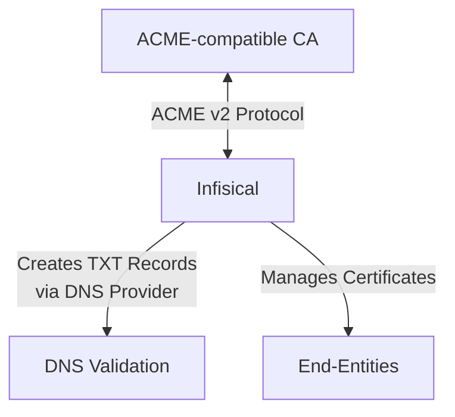

## Concept

Infisical can connect to any upstream ACME-compatible CA (e.g. Lets's Encrypt, DigiCert, etc.) supporting the [ACME protocol](https://en.wikipedia.org/wiki/Automatic_Certificate_Management_Environment) to issue certificates back to your end-entities. This integration uses the [DNS-01 challenge](https://letsencrypt.org/docs/challenge-types/#dns-01-challenge) method as part of the ACME domain validation challenge workflow for a requested certificate.

The upstream ACME-compatible CA integration lets you connect Infisical to providers by specifying
their **ACME Directory URL** such as:

- [Let's Encrypt](/documentation/platform/pki/ca/lets-encrypt): `https://acme-v02.api.letsencrypt.org/directory`.
- [DigiCert](/documentation/platform/pki/ca/digicert): `https://acme.digicert.com/v2/acme/directory`.
- Google GTS: `https://dv.acme-v02.api.pki.goog/directory`.
- Buypass: `https://api.buypass.com/acme/directory`.
- ZeroSSL: `https://acme.zerossl.com/v2/DV90`.
- SSL.com: `https://acme.ssl.com/sslcom-dv-rsa`.

When Infisical requests a certificate from an ACME-compatible CA, it creates a TXT record at `_acme-challenge.{your-domain}` in your configured DNS provider (e.g. Route53, Cloudflare, Azure DNS, DNS Made Easy, etc.); this TXT record contains the challenge token issued by the ACME-compatible CA to validate domain control for the requested certificate.
The ACME provider checks for the existence of this TXT record to verify domain control before issuing the certificate back to Infisical.

After validation completes successfully, Infisical automatically removes the TXT record from your DNS provider.

<div align="center">


```mermaid
graph TD
    A[ACME-compatible CA] <-->|ACME v2 Protocol| B[Infisical]
    B -->|Creates TXT Records<br>via DNS Provider| C[DNS Validation]
    B -->|Manages Certificates| D[End-Entities]
```

</div>

We recommend reading about [ACME protocol](https://tools.ietf.org/html/rfc8555) and [DNS-01 challenges](https://letsencrypt.org/docs/challenge-types/#dns-01-challenge) for a fuller understanding of the underlying workflow.

## Workflow

A typical workflow for using Infisical with an external ACME-compatible CA consists of the following steps:

1. Setting up your DNS provider (e.g. Route53, Cloudflare, etc.) with appropriate DNS permissions.
2. Creating an [App Connection](/integrations/app-connections/overview) in Infisical to store credentials for Infisical to connect to your DNS provider and create/remove DNS records as part of the DNS-01 challenge.
3. Registering an [External CA](/documentation/platform/pki/ca/external-ca) in Infisical with the ACME type and inputting required configuration including the **ACME Directory URL** of the upstream ACME-compatible CA and the **App Connection** for your DNS provider.

Once this is complete, you can create a [certificate profile](/documentation/platform/pki/settings/profiles) linked to the External CA and proceed to request a certificate against it.

## Guide to Connecting Infisical to an ACME-compatible CA

In the following steps, we explore how to connect Infisical to an ACME-compatible CA.

<Steps>
    <Step title="Create an App Connection to your DNS provider">
        Before registering an ACME-compatible CA with Infisical, you need to set up an [App Connection](/integrations/app-connections/overview) with the appropriate permissions for Infisical to perform the DNS-01 challenge with your DNS provider.
        
        If you don’t see a specific DNS provider listed below or need a dedicated one, please reach out to sales@infisical.com and we’ll help get that enabled for you.

        <Tabs>
            <Tab title="Route53">
                1. In **Certificate Manager**, go to **Settings → App Connections** and create a new AWS connection.

                2. Ensure your AWS connection has the following minimum permissions for Route53 DNS validation:

                ```json
                {
                  "Version": "2012-10-17",
                  "Statement": [
                    {
                      "Effect": "Allow",
                      "Action": "route53:GetChange",
                      "Resource": "arn:aws:route53:::change/*"
                    },
                    {
                      "Effect": "Allow",
                      "Action": "route53:ListHostedZonesByName",
                      "Resource": "*"
                    },
                    {
                      "Effect": "Allow",
                      "Action": [
                        "route53:ListResourceRecordSets"
                      ],
                      "Resource": [
                        "arn:aws:route53:::hostedzone/YOUR_HOSTED_ZONE_ID"
                      ]
                    },
                    {
                      "Effect": "Allow",
                      "Action": [
                        "route53:ChangeResourceRecordSets"
                      ],
                      "Resource": [
                        "arn:aws:route53:::hostedzone/YOUR_HOSTED_ZONE_ID"
                      ],
                      "Condition": {
                        "ForAllValues:StringEquals": {
                          "route53:ChangeResourceRecordSetsRecordTypes": [
                            "TXT"
                          ]
                        }
                      }
                    }
                  ]
                }
                ```

                Replace `YOUR_HOSTED_ZONE_ID` with your actual Route53 hosted zone ID.

                For detailed instructions on setting up an AWS connection, see the [AWS Connection](/integrations/app-connections/aws) documentation.
            </Tab>
            <Tab title="Cloudflare">
                1. In **Certificate Manager**, go to **Settings → App Connections** and create a new Cloudflare connection.

                2. Ensure your Cloudflare token has the following minimum permissions for DNS validation:

                ```
                Account:Account Settings:Read
                Zone:DNS:Edit
                ```

                For detailed instructions on setting up a Cloudflare connection, see the [Cloudflare Connection](/integrations/app-connections/cloudflare) documentation.
            </Tab>
            <Tab title="Azure DNS">
                1. In **Certificate Manager**, go to **Settings → App Connections** and create a new Azure DNS connection.

                2. Ensure your Azure Service Principal has the **DNS Zone Contributor** role assigned on the DNS Zone you want to use for validation.

                For detailed instructions on setting up an Azure DNS connection, see the [Azure DNS Connection](/integrations/app-connections/azure-dns) documentation.
            </Tab>
            <Tab title="DNS Made Easy">
                In **Certificate Manager**, go to **Settings → App Connections** and create a new DNS Made Easy connection.

                For detailed instructions on setting up a DNS Made Easy connection, see the [DNS Made Easy Connection](/integrations/app-connections/dns-made-easy) documentation.
            </Tab>
        </Tabs>
    </Step>
    <Step title="Register an ACME-compatible CA">
        <Tabs>
          <Tab title="Infisical UI">
              To register an ACME-compatible CA, in **Certificate Manager** go to **Certificate Authorities**, scroll to External Certificate Authorities, and click **Create CA**.

              Set the **CA Type** to **ACME** and fill out the following fields:

              - Name: A slug-friendly name for the ACME-compatible CA such as `lets-encrypt-production`.
              - DNS App Connection: The App Connection from Step 1 used for Infisical to connect to your DNS provider and create/remove DNS records as part of the DNS-01 challenge in ACME.
              - Zone / Zone ID: Enter the Zone / Zone ID for the domain(s) you'll be requesting certificates for.
              - Directory URL: Enter the **ACME Directory URL** for your desired upstream ACME-compatible CA such as `https://acme-v02.api.letsencrypt.org/directory` for Let's Encrypt.
              - Account Email: The email address to associate with your ACME account. This email will receive important notifications about your certificates.
              - EAB Key Identifier (KID): (Optional) The Key Identifier (KID) provided by your ACME CA for External Account Binding (EAB). This is required by some ACME providers (e.g., ZeroSSL, DigiCert) to link your ACME account to an external account you've pre-registered with them.
              - EAB HMAC Key: (Optional) The HMAC Key provided by your ACME CA for External Account Binding (EAB). This key is used in conjunction with the KID to prove ownership of the external account during ACME account registration.

              Finally, press **Create** to register the ACME-compatible CA with Infisical.
          </Tab>
          <Tab title="API">
            To register an ACME CA with Infisical using the API, make a request to the [Create External CA](https://infisical.com/docs/api-reference/endpoints/certificate-authorities/acme/create) endpoint:

            ### Sample request

            ```bash Request
            curl 'https://app.infisical.com/api/v1/cert-manager/ca/acme' \
              -H 'Authorization: Bearer <your-access-token>' \
              -H 'Content-Type: application/json' \
              --data-raw '{
                "name": "lets-encrypt-production",
                "type": "acme",
                "status": "active",
                "enableDirectIssuance": true,
                "configuration": {
                  "dnsAppConnection": {
                    "id": "1e5f8c0d-09d2-492c-9b28-469acd8e841b",
                    "name": "acme-dns-test-connection"
                  },
                  "dnsProviderConfig": {
                    "provider": "route53",
                    "hostedZoneId": "Z040441124N1GOOMCQYX1"
                  },
                  "directoryUrl": "https://acme-v02.api.letsencrypt.org/directory",
                  "accountEmail": "admin@example.com",
                  "dnsAppConnectionId": "1e5f8c0d-09d2-492c-9b28-469acd8e841b"
                }
              }'
            ```

            ### Sample response

            ```bash Response
            {
                "id": "c48b701e-a20c-4a9a-8119-68f54e5fbb05",
                "name": "lets-encrypt-production",
                "type": "acme",
                "status": "active",
                "enableDirectIssuance": true,
                "configuration": {
                    "accountEmail": "admin@example.com",
                    "directoryUrl": "https://acme-v02.api.letsencrypt.org/directory",
                    "dnsAppConnection": {
                    "id": "1e5f8c0d-09d2-492c-9b28-469acd8e841b",
                    "name": "acme-dns-test-connection"
                    },
                    "dnsAppConnectionId": "1e5f8c0d-09d2-492c-9b28-469acd8e841b",
                    "dnsProviderConfig": {
                    "provider": "route53",
                    "hostedZoneId": "Z040441124N1GOOMCQYX1"
                    }
                }
            }
            ```
          </Tab>
        </Tabs>
    </Step>

</Steps>

## FAQ

<AccordionGroup>
  <Accordion title="What DNS validation methods are supported?">
    Currently, Infisical supports DNS-01 validation through AWS Route53, Cloudflare, Azure DNS, and DNS Made Easy. The DNS-01 challenge method is preferred for ACME integrations because it:

    - Works with wildcard certificates
    - Doesn't require your servers to be publicly accessible
    - Can be fully automated without manual intervention

  </Accordion>
  <Accordion title="Can I use wildcard certificates with ACME CAs?">
    Yes! ACME CAs like Let's Encrypt support wildcard certificates (e.g., `*.example.com`) when using DNS-01 validation. Simply specify the wildcard domain when requesting the certificate.

    Note that wildcard certificates still require DNS-01 validation - HTTP-01 validation cannot be used for wildcard certificates.

  </Accordion>
  <Accordion title="How long are ACME certificates valid?">
    Most ACME providers issue certificates with 90-day validity periods. This shorter validity period is designed to:

    - Encourage automation of certificate management
    - Reduce the impact of compromised certificates
    - Ensure systems stay up-to-date with certificate management practices

  </Accordion>
  <Accordion title="Can I use multiple ACME providers?">
    Yes. You can register multiple ACME CAs in Certificate Manager.
  </Accordion>
  <Accordion title="How do I use DNS CNAME delegation for ACME challenges?">
    CNAME delegation lets you redirect ACME DNS-01 challenge records to a separate DNS zone. Instead of granting Infisical write access to your main domain zone, you point `_acme-challenge` via a CNAME to a dedicated zone where Infisical creates the TXT records.

    **How it works:** If you have a CNAME record pointing `_acme-challenge.example.com` to another domain (e.g., `_acme-challenge.ssl.example.com`), configure Infisical to manage the target zone. During validation, the ACME CA queries `_acme-challenge.example.com`, follows the CNAME, and finds the TXT record at the delegated location.

    **To set up CNAME delegation:**

    1. **Create a CNAME record** in your domain's DNS that points `_acme-challenge.{your-domain}` to a target in the zone configured with Infisical.
    2. **Register the ACME CA** in Infisical with the **hosted zone ID** of the target zone.

    Infisical automatically resolves the CNAME, creates the TXT record at the target, waits for DNS propagation, and cleans up after validation.

    **Example — delegating across DNS providers:**

    If your primary domain `example.com` is in Cloudflare but you want Infisical to use Route53 for challenges:

    1. Create a dedicated Route53 hosted zone for `acme.example.com`.
    2. Add a CNAME in Cloudflare: `_acme-challenge.example.com` → `_acme-challenge.acme.example.com`.
    3. Create an AWS App Connection in Infisical with Route53 permissions for the `acme.example.com` zone.
    4. Register your ACME CA using the Route53 hosted zone ID.

    This way, Infisical never needs access to your Cloudflare account — it only writes to the dedicated Route53 zone.

    **Common use cases:**
    - **Least-privilege access:** Grant write access only to a dedicated subdomain zone.
    - **Cross-provider setups:** Keep domain DNS on one provider while using another for challenges.
    - **Centralized management:** Point CNAMEs from multiple domains to a single zone.
  </Accordion>
</AccordionGroup>

## What's Next

Now that your ACME-compatible CA is configured, set up the infrastructure to issue certificates:

<CardGroup cols={2}>
  <Card title="Certificate Profiles" icon="file-certificate" href="/documentation/platform/pki/settings/profiles">
    Create a profile that references your ACME CA.
  </Card>
  <Card title="Applications" icon="grid-2" href="/documentation/platform/pki/applications/overview">
    Create an Application, attach a profile, and configure enrollment.
  </Card>
  <Card title="Enrollment Methods" icon="arrow-right-to-arc" href="/documentation/platform/pki/applications/enrollment-methods/overview">
    Choose how certificates are requested — API, ACME, EST, or SCEP.
  </Card>
  <Card title="Quick Start" icon="rocket" href="/documentation/platform/pki/quick-starts/issue-first-certificate">
    Issue your first certificate end-to-end.
  </Card>
</CardGroup>
