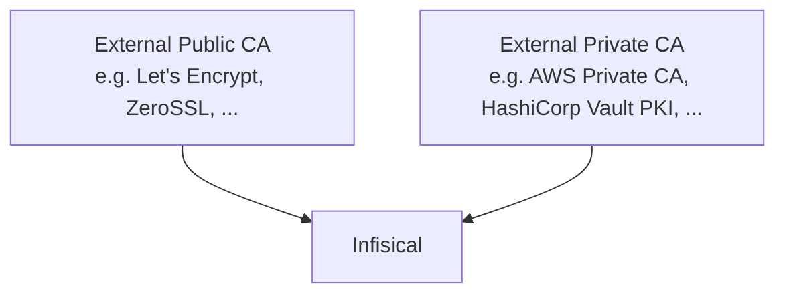

## Concept

Infisical lets you integrate with External Certificate Authorities (CAs), allowing you to use existing PKI infrastructure or connect to public CAs to issue certificates for your end-entities.

As shown above, these CAs commonly fall under two categories:

- External Private CAs: CAs like AWS Private CA, HashiCorp Vault PKI, Azure ADCS, etc. that are privately owned and are used to issue certificates for internal services; these are often either cloud-hosted private CAs or on-prem / enterprise CAs.
- External Public CAs: CAs like Let's Encrypt, DigiCert, GlobalSign, etc. that are publicly trusted and are used to issue certificates for public-facing services.

Note that Infisical can act as an _ACME client_, allowing you to integrate upstream with any [ACME-compatible CA](/documentation/platform/pki/ca/acme-ca) to automate certificate issuance and renewal.

## Workflow

A typical workflow for integrating an External CA with Infisical consists of choosing the desired External CA type
and specifying the configuration or connection details necessary to connect to the CA.

The specific steps and requirements vary depending on the External CA type you choose to integrate.

## Supported External CA Types

Infisical currently supports the following External CA types out of the box:

- [ACME CA](/documentation/platform/pki/ca/acme-ca): An ACME-compatible CA that supports the ACME protocol, such as Let's Encrypt, ZeroSSL, Buypass, Digicert, etc.
- [Azure ADCS](/documentation/platform/pki/ca/azure-adcs): A Microsoft Active Directory Certificate Services (ADCS) that supports the ADCS protocol, such as AWS Private CA, Azure ADCS, etc.

If you don’t see a specific external CA listed here or need a dedicated integration guide, please reach out to sales@infisical.com and we’ll help you set up the integration for your external CA.

## FAQ

<AccordionGroup>
  <Accordion title="Can I use both Private CAs and External CAs in the same project?">
    Yes. You can have both Private and External CAs in the same project.
  </Accordion>
</AccordionGroup>
