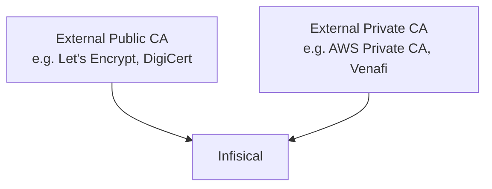

Integrate with External Certificate Authorities (CAs) to use existing PKI infrastructure or connect to public CAs for certificate issuance.

<Info>
  This page is for product admins setting up PKI infrastructure. Teams issuing certificates should see [Applications](/documentation/platform/pki/applications/overview).
</Info>

```mermaid
graph TD
    A1[External Public CA<br>e.g. Let's Encrypt, DigiCert] --> Infisical
    A2[External Private CA<br>e.g. AWS Private CA, Venafi] --> Infisical
```

## Types of External CAs

| Type | Examples | Use Case |
|------|----------|----------|
| **External Public CAs** | Let's Encrypt, DigiCert, Sectigo | Public-facing services with browser trust |
| **External Private CAs** | AWS Private CA, Venafi, Azure ADCS | Internal services, cloud-hosted or on-prem |

Infisical can act as an ACME client, allowing integration with any [ACME-compatible CA](/documentation/platform/pki/ca/acme-ca).

## Supported External CAs

### Public CAs

<CardGroup cols={2}>
  <Card title="ACME CA (Generic)" icon="robot" href="/documentation/platform/pki/ca/acme-ca">
    Connect to any ACME-compatible CA (Let's Encrypt, ZeroSSL, Buypass, etc.)
  </Card>
  <Card title="Let's Encrypt" icon="lock" href="/documentation/platform/pki/ca/lets-encrypt">
    Free, automated certificates for public domains.
  </Card>
  <Card title="AWS ACM Public CA" icon="aws" href="/documentation/platform/pki/ca/aws-acm-public-ca">
    Publicly trusted certificates via AWS Certificate Manager.
  </Card>
  <Card title="DigiCert" icon="shield-halved" href="/documentation/platform/pki/ca/digicert">
    Enterprise certificates via DigiCert CertCentral.
  </Card>
  <Card title="DigiCert Direct" icon="shield-halved" href="/documentation/platform/pki/ca/digicert-direct">
    Direct integration with DigiCert infrastructure.
  </Card>
  <Card title="Sectigo" icon="certificate" href="/documentation/platform/pki/ca/sectigo">
    Enterprise certificates via Sectigo Certificate Manager.
  </Card>
</CardGroup>

### Private CAs

<CardGroup cols={2}>
  <Card title="AWS Private CA" icon="aws" href="/documentation/platform/pki/ca/aws-pca">
    Cloud-native private certificate management via AWS PCA.
  </Card>
  <Card title="Azure ADCS (Web Enrollment)" icon="microsoft" href="/documentation/platform/pki/ca/azure-adcs">
    Microsoft AD CS via the web enrollment pages over HTTPS.
  </Card>
  <Card title="ADCS (Native)" icon="microsoft" href="/documentation/platform/pki/ca/adcs">
    Microsoft AD CS over MS-WCCE through an Infisical Gateway.
  </Card>
  <Card title="Venafi TLS Protect Cloud" icon="cloud" href="/documentation/platform/pki/ca/venafi">
    Venafi's cloud-based certificate management platform.
  </Card>
  <Card title="Venafi TPP" icon="server" href="/documentation/platform/pki/ca/venafi-tpp">
    Venafi Trust Protection Platform (on-premises).
  </Card>
</CardGroup>

<Note>
  Don't see your CA? Contact sales@infisical.com and we'll help you set up the integration.
</Note>

## FAQ

<AccordionGroup>
  <Accordion title="Can I use both Internal CAs and External CAs together?">
    Yes. You can have both Internal and External CAs in the same Certificate Manager.
  </Accordion>
</AccordionGroup>

## What's Next?

<CardGroup cols={2}>
  <Card title="Internal CA" icon="building-columns" href="/documentation/platform/pki/ca/private-ca">
    Create your own private CA hierarchy.
  </Card>
  <Card title="Certificate Policies" icon="file-contract" href="/documentation/platform/pki/settings/policies">
    Define constraints for certificates.
  </Card>
  <Card title="Certificate Profiles" icon="id-card" href="/documentation/platform/pki/settings/profiles">
    Create profiles that link CAs with policies.
  </Card>
  <Card title="Applications" icon="grid-2" href="/documentation/platform/pki/applications/overview">
    Issue certificates through Applications.
  </Card>
</CardGroup>
