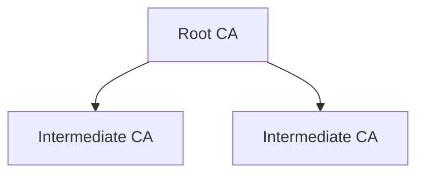

## Concept

Infisical lets you build your Internal PKI through a Private Certificate Authority (CA) hierarchy, enabling you to issue and manage digital certificates for your end-entities.

<div align="center">



</div>

## Workflow

A typical workflow for setting up a Private CA hierarchy consists of the following steps:

1. Configuring an Infisical root CA with details like name, validity period, and path length — This step is optional if you wish to use an external root CA with Infisical only serving the intermediate CAs.
2. Configuring and chaining intermediate CA(s) with details like name, validity period, path length, and imported certificate to your Root CA.
3. Managing the CA lifecycle events such as CA succession.
4. Optionally, using an Infisical CA to sign certificate signing requests (CSRs) from external intermediate CAs whose private keys are managed outside of Infisical.

<Note>
  Note that this workflow can be executed via the Infisical UI or manually such
  as via API. If manually executing the workflow, you may have to create a
  Certificate Signing Request (CSR) for the intermediate CA, create an
  intermediate certificate using the root CA private key and CSR, and import the
  intermediate certificate back to the intermediate CA as part of Step 2.
</Note>

## Guide to Creating a CA Hierarchy

In the following steps, we explore how to create a simple Private CA hierarchy
consisting of an (optional) root CA and an intermediate CA.

<Tabs>
  <Tab title="Infisical UI">
<Steps>
    <Step title="Creating a root CA">
        If you wish to use an external root CA, you can skip this step and head to step 2 to create an intermediate CA.
    
        To create a root CA, head to your Certificate Management Project > Certificate Authorities > Internal Certificate Authorities and press **Create CA**.

        

        Here, set the **CA Type** to **Root** and fill out details for the root CA.

        

        Here's some guidance for each field:

        - Valid Until: The date until which the CA is valid in the date time string format specified [here](https://developer.mozilla.org/en-US/docs/Web/JavaScript/Reference/Global_Objects/Date#date_time_string_format). For example, the following formats would be valid: `YYYY`, `YYYY-MM`, `YYYY-MM-DD`, `YYYY-MM-DDTHH:mm:ss.sssZ`.
        - Path Length: The maximum number of intermediate CAs that can be chained to this CA. A path of `-1` implies no limit; a path of `0` implies no intermediate CAs can be chained.
        - Key Algorithm: The type of public key algorithm and size, in bits, of the key pair that the CA creates when it issues a certificate. Supported key algorithms are `RSA 2048`, `RSA 4096`, `ECDSA P-256`, and `ECDSA P-384` with the default being `RSA 2048`.
        - Name: A slug-friendly name for the CA.
        - Organization (O): The organization name.
        - Country (C): The country code.
        - State or Province Name: The state or province.
        - Locality Name: The city or locality.
        - Common Name: The name of the CA.

        <Note>
            The Organization, Country, State or Province Name, Locality Name, and Common Name make up the **Distinguished Name (DN)** or **subject** of the CA.
            At least one of these fields must be filled out.
        </Note>
    </Step>
    <Step title="Creating an intermediate CA">
        2.1. To create an intermediate CA, press **Create CA** again but this time specifying the **CA Type** to be **Intermediate**. Fill out the details for the intermediate CA.

        

        2.2. Next, press the **Install Certificate** option on the intermediate CA from step 1.1.

        

        2.3a. If you created a root CA in step 1, select **Infisical CA** for the **Parent CA Type** field.

        Next, set the **Parent CA** to the root CA created in step 1 and configure the intended **Valid Until** and **Path Length** fields on the intermediate CA; feel free to use the prefilled values.

        

        Here's some guidance on each field:

        - Parent CA: The parent CA to which this intermediate CA will be chained. In this case, it should be the root CA created in step 1.
        - Valid Until: The date until which the CA is valid in the date time string format specified [here](https://developer.mozilla.org/en-US/docs/Web/JavaScript/Reference/Global_Objects/Date#date_time_string_format). The date must be within the validity period of the parent CA.
        - Path Length: The maximum number of intermediate CAs that can be chained to this CA. The path length must be less than the path length of the parent CA.

        Finally, press **Install** to chain the intermediate CA to the root CA; this creates a Certificate Signing Request (CSR) for the intermediate CA, creates an intermediate certificate using the root CA private key and CSR, and imports the signed certificate back to the intermediate CA.

        

        Great! You've successfully created a Private CA hierarchy with a root CA and an intermediate CA. Now check out the [Certificates section](/documentation/platform/pki/certificates/overview) to learn more about how to issue X.509 certificates using the intermediate CA.

        2.3b. If you have an external root CA, select **External CA** for the **Parent CA Type** field.

        Next, use the provided intermediate CSR to generate a certificate from your external root CA and paste the PEM-encoded certificate back into the **Certificate Body** field; the PEM-encoded external root CA certificate should be pasted under the **Certificate Chain** field.

        

        Finally, press **Install** to import the certificate and certificate chain as part of the installation step for the intermediate CA

        Great! You've successfully created a Private CA hierarchy with an intermediate CA chained to an external root CA.
        Now check out the [Certificates section](/documentation/platform/pki/certificates/overview) to learn more about how to issue X.509 certificates using the intermediate CA.

</Step>
</Steps>
  </Tab>
  <Tab title="API">
<Steps>
  <Step title="Creating a root CA">
    If you wish to use an external root CA, you can skip this step and head to step 2 to create an intermediate CA.

    To create a root CA, make an API request to the [Create CA](/api-reference/endpoints/certificate-authorities/create) API endpoint, specifying the `type` as `root`.

    ### Sample request

    ```bash Request
    curl --location --request POST 'https://app.infisical.com/api/v1/cert-manager/ca/internal' \
      --header 'Authorization: Bearer <access-token>' \
      --header 'Content-Type: application/json' \
      --data-raw '{
          "projectSlug": "<your-project-slug>",
          "type": "root",
          "commonName": "My Root CA"
      }'
    ```

    ### Sample response

    ```bash Response
    {
      ca: {
        id: "<root-ca-id>",
        type: "root",
        commonName: "My Root CA",
        ...
      }
    }
    ```

    By default, Infisical creates a root CA with the `RSA_2048` key algorithm, validity period of 10 years, with no restrictions on path length;
    you may override these defaults by specifying your own options when making the API request.

  </Step>
  <Step title="Creating an intermediate CA">
    2.1. To create an intermediate CA, make an API request to the [Create CA](/api-reference/endpoints/certificate-authorities/create) API endpoint, specifying the `type` as `intermediate`.
    
    ### Sample request
    
    ```bash Request
    curl --location --request POST 'https://app.infisical.com/api/v1/cert-manager/ca/internal' \
      --header 'Authorization: Bearer <access-token>' \
      --header 'Content-Type: application/json' \
      --data-raw '{
          "projectSlug": "<your-project-slug>",
          "type": "intermediate",
          "commonName": "My Intermediate CA"
      }'
    ```
    
    ### Sample response
    
    ```bash Response
    {
      ca: {
        id: "<intermediate-ca-id>",
        type: "intermediate",
        commonName: "My Intermediate CA",
        ...
      }
    }
    ```
    
    2.2. Next, get a certificate signing request from the intermediate CA by making an API request to the [Get CSR](/api-reference/endpoints/certificate-authorities/csr) API endpoint.
    
    ### Sample request
    
    ```bash Request
    curl --location --request GET 'https://app.infisical.com/api/v1/cert-manager/ca/internal/<intermediate-ca-id>/csr' \
      --header 'Authorization: Bearer <access-token>' \
      --data-raw ''
    ```

    ### Sample response

    ```bash Response
    {
      csr: "..."
    }
    ```

    If using an external root CA, then use the CSR to generate a certificate for the intermediate CA using your external root CA and skip to step 2.4.

    2.3. Next, create an intermediate certificate by making an API request to the [Sign Intermediate](/api-reference/endpoints/certificate-authorities/sign-intermediate) API endpoint
    containing the CSR from step 2.2, referencing the root CA created in step 1.

    ### Sample request

    ```bash Request
    curl --location --request POST 'https://app.infisical.com/api/v1/cert-manager/ca/internal/<root-ca-id>/sign-intermediate' \
      --header 'Content-Type: application/json' \
      --data-raw '{
          "csr": "<csr>",
          "notAfter": "2029-06-12"
      }'
    ```

    ### Sample response

    ```bash Response
    {
      certificate: "...",
      certificateChain: "...",
      issuingCaCertificate: "...",
      serialNumber: "...",
    }
    ```

    <Note>
      The `notAfter` value must be within the validity period of the root CA that is if the root CA is valid until `2029-06-12`, the intermediate CA must be valid until a date before `2029-06-12`.
    </Note>

    2.4. Finally, import the intermediate certificate and certificate chain from step 2.3 back to the intermediate CA by making an API request to the [Import Certificate](/api-reference/endpoints/certificate-authorities/import-cert) API endpoint.

    If using an external root CA, then import the generated certificate and root CA certificate under certificate chain back into the intermediate CA.

    ### Sample request

    ```bash Request
    curl --location --request POST 'https://app.infisical.com/api/v1/cert-manager/ca/internal/<intermediate-ca-id>/import-certificate' \
      --header 'Authorization: Bearer <access-token>' \
      --header 'Content-Type: application/json' \
      --data-raw '{
          "certificate": "<certificate>",
          "certificateChain": "<certificate-chain>"
      }'
    ```

    ### Sample response

    ```bash Response
    {
      message: "Successfully imported certificate to CA",
      caId: "..."
    }
    ```

    Great! You’ve successfully created a Private CA hierarchy with a root CA and an intermediate CA. Now check out the [Subscribers](/documentation/platform/pki/subscribers) page to learn more about how to issue X.509 certificates using the intermediate CA.

  </Step>
</Steps>
  </Tab>
</Tabs>

## Guide to Signing an External Intermediate CA's CSR

If you have an intermediate CA running outside of Infisical (e.g., on-prem) and want to sign its certificate using an Infisical CA, you can use the **Sign Intermediate** action. This is useful for multi-instance CA setups where the intermediate CA's private key must remain on-prem — you generate a CSR from your external intermediate CA, provide it to Infisical, and receive a signed certificate to import back into your on-prem CA.

<Note>
  This is different from the **Install Certificate** flow used when creating a CA hierarchy above.
  **Install Certificate** is used to chain an Infisical-managed intermediate CA to a parent CA.
  **Sign Intermediate** is used to sign a CSR from an external intermediate CA whose private key
  is not managed by Infisical.
</Note>

<Tabs>
  <Tab title="Infisical UI">
<Steps>
    <Step title="Signing an external intermediate CA's CSR">
        To sign an external intermediate CA's CSR, head to your Certificate Management Project > Certificate Authorities > Internal Certificate Authorities.

        Locate the CA you want to use as the signing (parent) CA, click the **...** (actions) menu on the CA row and select **Sign Intermediate**.

        

        You can also access this option from the CA's detail page by selecting **Sign Intermediate** from the options dropdown.

        

        <Note>
          The **Sign Intermediate** option is only available for CAs that are **Active** and have a
          **Max Path Length** that is not `0` (i.e., the CA is permitted to sign subordinate CA certificates).
        </Note>

        In the **Sign Intermediate CA Certificate** modal, fill out the details for the intermediate certificate.

        

        Here's some guidance on each field:

        - Certificate Signing Request (CSR): The PEM-encoded CSR from your external intermediate CA. This typically starts with `-----BEGIN CERTIFICATE REQUEST-----`.
        - Valid From: The start date for the certificate validity period (e.g., `2025-01-01`). Leave empty to default to the current date and time.
        - Valid Until: The end date for the certificate validity period (e.g., `2029-06-12`). This must be in the future and within the validity period of the signing CA.
        - Max Path Length: The maximum number of intermediate CAs that can be chained below this certificate. For example, a value of `0` means the signed intermediate CA can only issue end-entity certificates and cannot sign further subordinate CAs. A value of `1` allows one additional level of intermediate CAs below it. Leave empty to omit the constraint entirely. Note that this value must be less than the signing CA's own max path length.

        Press **Sign** to sign the CSR.

        

        Once signed, the modal displays the signed certificate, certificate chain, and issuing CA certificate. You can use the **Copy** and **Download** buttons to retrieve each certificate.

        Take the signed certificate and certificate chain and import them into your external intermediate CA.

        Great! You've successfully signed an external intermediate CA's CSR using your Infisical CA. The external intermediate CA is now chained to your Infisical root of trust and can issue end-entity certificates accordingly.
    </Step>
</Steps>
  </Tab>
  <Tab title="API">
    To sign an external intermediate CA's CSR via API, make an API request to the [Sign Intermediate](/api-reference/endpoints/certificate-authorities/internal/sign-intermediate) API endpoint, providing the CSR and validity parameters.

    ### Sample request

    ```bash Request
    curl --location --request POST 'https://app.infisical.com/api/v1/cert-manager/ca/internal/<signing-ca-id>/sign-intermediate' \
      --header 'Authorization: Bearer <access-token>' \
      --header 'Content-Type: application/json' \
      --data-raw '{
          "csr": "-----BEGIN CERTIFICATE REQUEST-----\n...\n-----END CERTIFICATE REQUEST-----",
          "notAfter": "2029-06-12"
      }'
    ```

    ### Sample response

    ```bash Response
    {
      certificate: "...",
      certificateChain: "...",
      issuingCaCertificate: "...",
      serialNumber: "...",
    }
    ```

    <Note>
      The `notAfter` value must be within the validity period of the signing CA.
      The optional `notBefore` field defaults to the current time if omitted.
      The optional `maxPathLength` field controls the path length constraint on the signed certificate.
    </Note>

    Import the returned `certificate` and `certificateChain` into your external intermediate CA to complete the chain of trust.
  </Tab>
</Tabs>

## Guide to CA Renewal

In the following steps, we explore how to renew a CA certificate.

<Note>
  If renewing an intermediate CA chained to an Infisical CA, then Infisical will
  automate the process of generating a new certificate for the intermediate CA for you.

If renewing an intermediate CA chained to an external parent CA, you'll be
required to generate a new certificate from the external parent CA and manually import
the certificate back to the intermediate CA.

</Note>

<Tabs>
  <Tab title="Infisical UI">
    Head to the CA Page of the CA you wish you renew and press **Renew CA** on
    the left side.  Input a new **Valid Until**
    date to be used for the renewed CA certificate and press **Renew** to renew
    the CA. 
    <Note>
      The new **Valid Until** date must be within the validity period of the
      parent CA.
    </Note>
  </Tab>
  <Tab title="API">
  
  To renew a CA certificate, make an API request to the [Renew CA](/api-reference/endpoints/certificate-authorities/renew) API endpoint, specifying the new `notAfter` date for the CA.

    ### Sample request

    ```bash Request
    curl --location --request POST 'https://app.infisical.com/api/v1/cert-manager/ca/internal/<ca-id>/renew' \
      --header 'Authorization: Bearer <access-token>' \
      --header 'Content-Type: application/json' \
      --data-raw '{
          "type": "existing",
          "notAfter": "2029-06-12"
      }'
    ```

    ### Sample response

    ```bash Response
    {
      certificate: "...",
      certificateChain: "...",
      serialNumber: "..."
    }
    ```

  </Tab>
</Tabs>

## FAQ

<AccordionGroup>
  <Accordion title="What key algorithms are supported as part of private key generation and certificate signing?">
    Infisical supports `RSA 2048`, `RSA 4096`, `ECDSA P-256`, `ECDSA P-384` key
    algorithms specified at the time of creating a CA.
  </Accordion>
  <Accordion title="Does Infisical support CA renewal via new key pair">
    At the moment, Infisical only supports CA renewal via same key pair. We
    anticipate supporting CA renewal via new key pair in the coming month.
  </Accordion>
  <Accordion title="Does Infisical support chaining an Intermediate CA to an external CA?">
    Yes. You may obtain a CSR from the Intermediate CA and use it to generate a
    certificate from your external CA. The certificate, along with the external
    CA certificate chain, can be imported back to the Intermediate CA as part of
    the CA installation step.
  </Accordion>
  <Accordion title="What is the difference between 'Install Certificate' and 'Sign Intermediate'?">
    **Install Certificate** is used when creating a CA hierarchy within Infisical. It chains an
    Infisical-managed intermediate CA to a parent CA.

    **Sign Intermediate** is used when you have an external (e.g., on-prem) intermediate CA whose
    private key is not managed by Infisical. You provide the CSR from that external CA, and Infisical
    signs it using one of your Infisical CAs. You then take the signed certificate back to your
    external CA. This is useful for multi-instance setups where the intermediate CA's private key
    must remain outside of Infisical.
  </Accordion>
</AccordionGroup>
