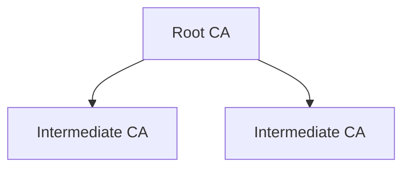

## Concept

Infisical lets you build your Internal PKI through a Private Certificate Authority (CA) hierarchy, enabling you to issue and manage digital certificates for your end-entities.

<div align="center">


```mermaid
graph TD
    A[Root CA]
    A --> B[Intermediate CA]
    A --> C[Intermediate CA]
```

</div>

## Workflow

A typical workflow for setting up a Private CA hierarchy consists of the following steps:

1. Configuring an Infisical root CA with details like name, validity period, and path length — This step is optional if you wish to use an external root CA with Infisical only serving the intermediate CAs.
2. Configuring and chaining intermediate CA(s) with details like name, validity period, path length, and imported certificate to your Root CA.
3. Managing the CA lifecycle events such as CA succession.

<Note>
  Note that this workflow can be executed via the Infisical UI or manually such
  as via API. If manually executing the workflow, you may have to create a
  Certificate Signing Request (CSR) for the intermediate CA, create an
  intermediate certificate using the root CA private key and CSR, and import the
  intermediate certificate back to the intermediate CA as part of Step 2.
</Note>

## Guide to Creating a CA Hierarchy

In the following steps, we explore how to create a simple Private CA hierarchy
consisting of an (optional) root CA and an intermediate CA.

<Tabs>
  <Tab title="Infisical UI">
<Steps>
    <Step title="Creating a root CA">
        If you wish to use an external root CA, you can skip this step and head to step 2 to create an intermediate CA.
    
        To create a root CA, head to your Certificate Management Project > Certificate Authorities > Internal Certificate Authorities and press **Create CA**.

        

        Here, set the **CA Type** to **Root** and fill out details for the root CA.

        

        Here's some guidance for each field:

        - Valid Until: The date until which the CA is valid in the date time string format specified [here](https://developer.mozilla.org/en-US/docs/Web/JavaScript/Reference/Global_Objects/Date#date_time_string_format). For example, the following formats would be valid: `YYYY`, `YYYY-MM`, `YYYY-MM-DD`, `YYYY-MM-DDTHH:mm:ss.sssZ`.
        - Path Length: The maximum number of intermediate CAs that can be chained to this CA. A path of `-1` implies no limit; a path of `0` implies no intermediate CAs can be chained.
        - Key Algorithm: The type of public key algorithm and size, in bits, of the key pair that the CA creates when it issues a certificate. Supported key algorithms are `RSA 2048`, `RSA 4096`, `ECDSA P-256`, and `ECDSA P-384` with the default being `RSA 2048`.
        - Name: A slug-friendly name for the CA.
        - Organization (O): The organization name.
        - Country (C): The country code.
        - State or Province Name: The state or province.
        - Locality Name: The city or locality.
        - Common Name: The name of the CA.

        <Note>
            The Organization, Country, State or Province Name, Locality Name, and Common Name make up the **Distinguished Name (DN)** or **subject** of the CA.
            At least one of these fields must be filled out.
        </Note>
    </Step>
    <Step title="Creating an intermediate CA">
        To create an intermediate CA, press **Create CA** again but this time specifying the **CA Type** to be **Intermediate**. Fill out the details for the intermediate CA.

        

        Next, press the **Install CA Certificate** option on the intermediate CA.

        

        You will be presented with the installation method selector. Choose how the signing certificate for this CA should be issued:

        

        <Tabs>
          <Tab title="Infisical CA">
            Select **Infisical CA** and press **Continue**. This option chains the intermediate CA to a root or intermediate CA managed by Infisical.

            Set the **Parent CA** to the root CA created in step 1 (or any other existing root or intermediate CA) and configure the intended **Valid Until** and **Path Length** fields on the intermediate CA; feel free to use the prefilled values.

            

            Here's some guidance on each field:

            - Parent CA: The parent CA to which this intermediate CA will be chained. In this case, it should be the root CA created in step 1.
            - Valid Until: The date until which the CA is valid in the date time string format specified [here](https://developer.mozilla.org/en-US/docs/Web/JavaScript/Reference/Global_Objects/Date#date_time_string_format). The date must be within the validity period of the parent CA.
            - Path Length: The maximum number of intermediate CAs that can be chained to this CA. The path length must be less than the path length of the parent CA.

            Press **Install** to chain the intermediate CA to the root CA. This creates a Certificate Signing Request (CSR) for the intermediate CA, creates an intermediate certificate using the root CA private key and CSR, and imports the signed certificate back to the intermediate CA.

            

            You've successfully created a Private CA hierarchy with a root CA and an intermediate CA. Now check out the [Certificates section](/documentation/platform/pki/certificates/overview) to learn more about how to issue X.509 certificates using the intermediate CA.
          </Tab>
          <Tab title="Manual">
            Select **Manual** and press **Continue**. This option allows you to sign the intermediate CA certificate using an external root CA that you manage outside of Infisical.

            Use the provided CSR to generate a certificate from your external root CA and paste the PEM-encoded certificate back into the **Certificate Body** field; the PEM-encoded external root CA certificate should be pasted under the **Certificate Chain** field.

            

            Press **Install** to import the certificate and certificate chain as part of the installation step for the intermediate CA.

            You've successfully created a Private CA hierarchy with an intermediate CA chained to an external root CA.
            Now check out the [Certificates section](/documentation/platform/pki/certificates/overview) to learn more about how to issue X.509 certificates using the intermediate CA.
          </Tab>
          <Tab title="External CA">
            Select **External CA (Automated)** and press **Continue**. This option connects to a third-party CA provider to handle certificate signing and renewal automatically via API.

            You will be prompted to choose a CA integration provider:

            

            Infisical currently supports the following external CA providers for signing intermediate CAs:

            - [Venafi TLS Protect Cloud](/documentation/platform/pki/ca/venafi)

            <Note>
              When using an external CA, the certificate issued by the provider **must** correspond to the CSR generated by Infisical.
              If the external CA returns a certificate that does not match the CSR (e.g., different subject or key), the installation will fail.
            </Note>

            Refer to the provider-specific documentation linked above for detailed setup and installation instructions.
          </Tab>
        </Tabs>
</Step>
</Steps>
  </Tab>
  <Tab title="API">
<Steps>
  <Step title="Creating a root CA">
    If you wish to use an external root CA, you can skip this step and head to step 2 to create an intermediate CA.

    To create a root CA, make an API request to the [Create CA](/api-reference/endpoints/certificate-authorities/internal/create) API endpoint, specifying the `type` as `root`.

    ### Sample request

    ```bash Request
    curl --location --request POST 'https://app.infisical.com/api/v1/cert-manager/ca/internal' \
      --header 'Authorization: Bearer <access-token>' \
      --header 'Content-Type: application/json' \
      --data-raw '{
          "projectSlug": "<your-project-slug>",
          "type": "root",
          "commonName": "My Root CA"
      }'
    ```

    ### Sample response

    ```bash Response
    {
      ca: {
        id: "<root-ca-id>",
        type: "root",
        commonName: "My Root CA",
        ...
      }
    }
    ```

    By default, Infisical creates a root CA with the `RSA_2048` key algorithm, validity period of 10 years, with no restrictions on path length;
    you may override these defaults by specifying your own options when making the API request.

  </Step>
  <Step title="Creating an intermediate CA">
    To create an intermediate CA, make an API request to the [Create CA](/api-reference/endpoints/certificate-authorities/internal/create) API endpoint, specifying the `type` as `intermediate`.

    ### Sample request

    ```bash Request
    curl --location --request POST ‘https://app.infisical.com/api/v1/cert-manager/ca/internal’ \
      --header ‘Authorization: Bearer <access-token>’ \
      --header ‘Content-Type: application/json’ \
      --data-raw ‘{
          "projectSlug": "<your-project-slug>",
          "type": "intermediate",
          "commonName": "My Intermediate CA"
      }’
    ```

    ### Sample response

    ```json Response
    {
      "ca": {
        "id": "<intermediate-ca-id>",
        "type": "intermediate",
        "commonName": "My Intermediate CA"
      }
    }
    ```

    Next, install a certificate for the intermediate CA using one of the following methods:

    <Tabs>
      <Tab title="Infisical CA">
        Get a CSR from the intermediate CA, sign it with the root CA, and import the certificate back.

        **Get the CSR:**

        ```bash Request
        curl --location --request GET ‘https://app.infisical.com/api/v1/cert-manager/ca/internal/<intermediate-ca-id>/csr’ \
          --header ‘Authorization: Bearer <access-token>’
        ```

        **Sign the intermediate certificate using the root CA:**

        ```bash Request
        curl --location --request POST ‘https://app.infisical.com/api/v1/cert-manager/ca/internal/<root-ca-id>/sign-intermediate’ \
          --header ‘Authorization: Bearer <access-token>’ \
          --header ‘Content-Type: application/json’ \
          --data-raw ‘{
              "csr": "<csr>",
              "notAfter": "2029-06-12"
          }’
        ```

        <Note>
          The `notAfter` value must be within the validity period of the root CA.
        </Note>

        **Import the signed certificate back to the intermediate CA:**

        ```bash Request
        curl --location --request POST ‘https://app.infisical.com/api/v1/cert-manager/ca/internal/<intermediate-ca-id>/import-certificate’ \
          --header ‘Authorization: Bearer <access-token>’ \
          --header ‘Content-Type: application/json’ \
          --data-raw ‘{
              "certificate": "<certificate>",
              "certificateChain": "<certificate-chain>"
          }’
        ```

        You’ve successfully created a Private CA hierarchy. Now check out the [Subscribers](/documentation/platform/pki/subscribers) page to learn more about issuing certificates.
      </Tab>
      <Tab title="Manual">
        Get the CSR from the intermediate CA and use it to generate a certificate from your external root CA.

        **Get the CSR:**

        ```bash Request
        curl --location --request GET ‘https://app.infisical.com/api/v1/cert-manager/ca/internal/<intermediate-ca-id>/csr’ \
          --header ‘Authorization: Bearer <access-token>’
        ```

        Use this CSR with your external root CA to generate a signed certificate. Then import the certificate and chain back:

        ```bash Request
        curl --location --request POST ‘https://app.infisical.com/api/v1/cert-manager/ca/internal/<intermediate-ca-id>/import-certificate’ \
          --header ‘Authorization: Bearer <access-token>’ \
          --header ‘Content-Type: application/json’ \
          --data-raw ‘{
              "certificate": "<certificate-from-external-ca>",
              "certificateChain": "<external-root-ca-certificate>"
          }’
        ```

        You’ve successfully chained an intermediate CA to an external root CA. Now check out the [Subscribers](/documentation/platform/pki/subscribers) page to learn more about issuing certificates.
      </Tab>
      <Tab title="External CA">
        You can use an external CA provider to automatically sign the intermediate CA certificate via API. See the provider-specific documentation for the full API workflow:

        - [Venafi TLS Protect Cloud](/documentation/platform/pki/ca/venafi)

        <Note>
          When using an external CA, the certificate issued by the provider **must** correspond to the CSR generated by Infisical.
          If the external CA returns a certificate that does not match the CSR, the installation will fail.
        </Note>
      </Tab>
    </Tabs>

  </Step>
</Steps>
  </Tab>
</Tabs>

## Guide to CA Renewal

In the following steps, we explore how to renew a CA certificate.

<Note>
  - If renewing an intermediate CA chained to an **Infisical CA**, Infisical will automate the process of generating a new certificate for you.
  - If renewing an intermediate CA signed by an **external CA provider** (e.g., Venafi), you can configure [auto-renewal](/documentation/platform/pki/ca/venafi#auto-renewal) to automate the process.
  - If renewing an intermediate CA chained to an **external parent CA via manual import**, you'll need to generate a new certificate from the external parent CA and manually import it back.
</Note>

<Tabs>
  <Tab title="Infisical UI">
    Head to the CA Page of the CA you wish you renew and press **Renew CA** on
    the left side.  Input a new **Valid Until**
    date to be used for the renewed CA certificate and press **Renew** to renew
    the CA. 
    <Note>
      The new **Valid Until** date must be within the validity period of the
      parent CA.
    </Note>
  </Tab>
  <Tab title="API">
  
  To renew a CA certificate, make an API request to the [Renew CA](/api-reference/endpoints/certificate-authorities/internal/renew) API endpoint, specifying the new `notAfter` date for the CA.

    ### Sample request

    ```bash Request
    curl --location --request POST 'https://app.infisical.com/api/v1/cert-manager/ca/internal/<ca-id>/renew' \
      --header 'Authorization: Bearer <access-token>' \
      --header 'Content-Type: application/json' \
      --data-raw '{
          "type": "existing",
          "notAfter": "2029-06-12"
      }'
    ```

    ### Sample response

    ```bash Response
    {
      certificate: "...",
      certificateChain: "...",
      serialNumber: "..."
    }
    ```

  </Tab>
</Tabs>

## FAQ

<AccordionGroup>
  <Accordion title="What key algorithms are supported as part of private key generation and certificate signing?">
    Infisical supports `RSA 2048`, `RSA 4096`, `ECDSA P-256`, `ECDSA P-384` key
    algorithms specified at the time of creating a CA.
  </Accordion>
  <Accordion title="Does Infisical support CA renewal via new key pair">
    At the moment, Infisical only supports CA renewal via same key pair. We
    anticipate supporting CA renewal via new key pair in the coming month.
  </Accordion>
  <Accordion title="Does Infisical support chaining an Intermediate CA to an external CA?">
    Yes. You can either manually obtain a CSR and import the signed certificate, or use an integrated external CA provider
    like [Venafi TLS Protect Cloud](/documentation/platform/pki/ca/venafi) to automate the signing process.
  </Accordion>
</AccordionGroup>
