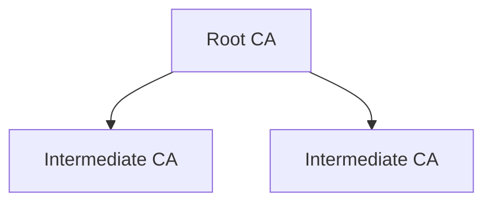

Build your Internal PKI through a Private Certificate Authority (CA) hierarchy. This allows you to issue and manage X.509 certificates for internal services without relying on external CAs.

<Info>
  This page is for product admins setting up PKI infrastructure. Teams issuing certificates should see [Applications](/documentation/platform/pki/applications/overview).
</Info>


```mermaid
graph TD
    A[Root CA]
    A --> B[Intermediate CA]
    A --> C[Intermediate CA]
```

## How It Works

1. **Create a Root CA** — Or use an existing external root CA
2. **Create Intermediate CA(s)** — Chain them to your root CA
3. **Create Certificate Profiles** — Link CAs to policies for teams to use
4. **Create Applications** — Assign profiles to Applications for teams

<Note>
  You can execute this workflow via the UI or API. For API workflows, you may need to create CSRs and import certificates manually.
</Note>

## Create a CA Hierarchy

Create a simple Private CA hierarchy with a root CA and intermediate CA.

<Tabs>
  <Tab title="Infisical UI">
<Steps>
    <Step title="Create a root CA">
        If you have an existing external root CA, skip to step 2.
    
        Go to **Certificate Manager → Certificate Authorities → Internal** and click **Create CA**.

        Set the **CA Type** to **Root** and fill out details for the root CA:


        - Valid Until: The date until which the CA is valid in the date time string format specified [here](https://developer.mozilla.org/en-US/docs/Web/JavaScript/Reference/Global_Objects/Date#date_time_string_format). For example, the following formats would be valid: `YYYY`, `YYYY-MM`, `YYYY-MM-DD`, `YYYY-MM-DDTHH:mm:ss.sssZ`.
        - Path Length: The maximum number of intermediate CAs that can be chained to this CA. A path of `-1` implies no limit; a path of `0` implies no intermediate CAs can be chained.
        - Key Algorithm: The type of public key algorithm and size, in bits, of the key pair that the CA creates when it issues a certificate. Supported key algorithms are `RSA 2048`, `RSA 4096`, `ECDSA P-256`, and `ECDSA P-384` with the default being `RSA 2048`.
        - Name: A slug-friendly name for the CA.
        - Organization (O): The organization name.
        - Country (C): The country code.
        - State or Province Name: The state or province.
        - Locality Name: The city or locality.
        - Common Name: The name of the CA.

        <Note>
            The Organization, Country, State or Province Name, Locality Name, and Common Name make up the **Distinguished Name (DN)** or **subject** of the CA.
            At least one of these fields must be filled out.
        </Note>
    </Step>
    <Step title="Creating an intermediate CA">
        To create an intermediate CA, press **Create CA** again but this time specifying the **CA Type** to be **Intermediate**. Fill out the details for the intermediate CA.

        Next, press the **Install CA Certificate** option on the intermediate CA. You will be presented with the installation method selector. Choose how the signing certificate should be issued:

        <Tabs>
          <Tab title="Infisical CA">
            Select **Infisical CA** and press **Continue**. This option chains the intermediate CA to a root or intermediate CA managed by Infisical.

            Set the **Parent CA** to the root CA created in step 1 and configure:
            - **Parent CA**: The parent CA to chain to (the root CA from step 1).
            - **Valid Until**: Must be within the validity period of the parent CA.
            - **Path Length**: Must be less than the parent CA's path length.

            Press **Install** to chain the intermediate CA to the root CA. This creates a CSR, signs it with the root CA, and imports the certificate.

            You've successfully created a Private CA hierarchy. Now check out the [Applications section](/documentation/platform/pki/applications/overview) to learn more about issuing certificates.
          </Tab>
          <Tab title="Manual">
            Select **Manual** and press **Continue**. This option allows you to sign the intermediate CA certificate using an external root CA that you manage outside of Infisical.

            Use the provided CSR to generate a certificate from your external root CA. Paste the PEM-encoded certificate into **Certificate Body** and the root CA certificate into **Certificate Chain**.

            Press **Install** to import the certificate.

            You've successfully created a Private CA hierarchy with an intermediate CA chained to an external root CA. Now check out the [Applications section](/documentation/platform/pki/applications/overview) to learn more about issuing certificates.
          </Tab>
          <Tab title="External CA">
            Select **External CA (Automated)** and press **Continue**. This option connects to a third-party CA provider to handle certificate signing and renewal automatically via API.

            Infisical currently supports the following external CA providers for signing intermediate CAs:

            - [Venafi TLS Protect Cloud](/documentation/platform/pki/ca/venafi)
            - [Azure AD CS](/documentation/platform/pki/ca/azure-adcs#signing-internal-intermediate-cas-with-ad-cs)

            <Note>
              When using an external CA, the certificate issued by the provider **must** correspond to the CSR generated by Infisical.
              If the external CA returns a certificate that does not match the CSR (e.g., different subject or key), the installation will fail.
            </Note>

            Refer to the provider-specific documentation linked above for detailed setup and installation instructions.
          </Tab>
        </Tabs>
</Step>
</Steps>
  </Tab>
  <Tab title="API">
<Steps>
  <Step title="Creating a root CA">
    If you wish to use an external root CA, you can skip this step and head to step 2 to create an intermediate CA.

    To create a root CA, make an API request to the [Create CA](/api-reference/endpoints/certificate-authorities/internal/create) API endpoint, specifying the `type` as `root`.

    ### Sample request

    ```bash Request
    curl --location --request POST 'https://app.infisical.com/api/v1/cert-manager/ca/internal' \
      --header 'Authorization: Bearer <access-token>' \
      --header 'Content-Type: application/json' \
      --data-raw '{
          "type": "root",
          "commonName": "My Root CA"
      }'
    ```

    ### Sample response

    ```bash Response
    {
      ca: {
        id: "<root-ca-id>",
        type: "root",
        commonName: "My Root CA",
        ...
      }
    }
    ```

    By default, Infisical creates a root CA with the `RSA_2048` key algorithm, validity period of 10 years, with no restrictions on path length;
    you may override these defaults by specifying your own options when making the API request.

  </Step>
  <Step title="Creating an intermediate CA">
    To create an intermediate CA, make an API request to the [Create CA](/api-reference/endpoints/certificate-authorities/internal/create) API endpoint, specifying the `type` as `intermediate`.

    ### Sample request

    ```bash Request
    curl --location --request POST ‘https://app.infisical.com/api/v1/cert-manager/ca/internal’ \
      --header ‘Authorization: Bearer <access-token>’ \
      --header ‘Content-Type: application/json’ \
      --data-raw ‘{
          "type": "intermediate",
          "commonName": "My Intermediate CA"
      }’
    ```

    ### Sample response

    ```json Response
    {
      "ca": {
        "id": "<intermediate-ca-id>",
        "type": "intermediate",
        "commonName": "My Intermediate CA"
      }
    }
    ```

    Next, install a certificate for the intermediate CA using one of the following methods:

    <Tabs>
      <Tab title="Infisical CA">
        Get a CSR from the intermediate CA, sign it with the root CA, and import the certificate back.

        **Get the CSR:**

        ```bash Request
        curl --location --request GET ‘https://app.infisical.com/api/v1/cert-manager/ca/internal/<intermediate-ca-id>/csr’ \
          --header ‘Authorization: Bearer <access-token>’
        ```

        **Sign the intermediate certificate using the root CA:**

        ```bash Request
        curl --location --request POST ‘https://app.infisical.com/api/v1/cert-manager/ca/internal/<root-ca-id>/sign-intermediate’ \
          --header ‘Authorization: Bearer <access-token>’ \
          --header ‘Content-Type: application/json’ \
          --data-raw ‘{
              "csr": "<csr>",
              "notAfter": "2029-06-12"
          }’
        ```

        <Note>
          The `notAfter` value must be within the validity period of the root CA.
        </Note>

        **Import the signed certificate back to the intermediate CA:**

        ```bash Request
        curl --location --request POST ‘https://app.infisical.com/api/v1/cert-manager/ca/internal/<intermediate-ca-id>/import-certificate’ \
          --header ‘Authorization: Bearer <access-token>’ \
          --header ‘Content-Type: application/json’ \
          --data-raw ‘{
              "certificate": "<certificate>",
              "certificateChain": "<certificate-chain>"
          }’
        ```

        You’ve successfully created a Private CA hierarchy. Now check out the [Applications](/documentation/platform/pki/applications/overview) page to learn more about issuing certificates.
      </Tab>
      <Tab title="Manual">
        Get the CSR from the intermediate CA and use it to generate a certificate from your external root CA.

        **Get the CSR:**

        ```bash Request
        curl --location --request GET ‘https://app.infisical.com/api/v1/cert-manager/ca/internal/<intermediate-ca-id>/csr’ \
          --header ‘Authorization: Bearer <access-token>’
        ```

        Use this CSR with your external root CA to generate a signed certificate. Then import the certificate and chain back:

        ```bash Request
        curl --location --request POST ‘https://app.infisical.com/api/v1/cert-manager/ca/internal/<intermediate-ca-id>/import-certificate’ \
          --header ‘Authorization: Bearer <access-token>’ \
          --header ‘Content-Type: application/json’ \
          --data-raw ‘{
              "certificate": "<certificate-from-external-ca>",
              "certificateChain": "<external-root-ca-certificate>"
          }’
        ```

        You’ve successfully chained an intermediate CA to an external root CA. Now check out the [Applications](/documentation/platform/pki/applications/overview) page to learn more about issuing certificates.
      </Tab>
      <Tab title="External CA">
        You can use an external CA provider to automatically sign the intermediate CA certificate via API. See the provider-specific documentation for the full API workflow:

        - [Venafi TLS Protect Cloud](/documentation/platform/pki/ca/venafi)
        - [Azure AD CS](/documentation/platform/pki/ca/azure-adcs#signing-internal-intermediate-cas-with-ad-cs)

        <Note>
          When using an external CA, the certificate issued by the provider **must** correspond to the CSR generated by Infisical.
          If the external CA returns a certificate that does not match the CSR, the installation will fail.
        </Note>
      </Tab>
    </Tabs>

  </Step>
</Steps>
  </Tab>
</Tabs>

## FAQ

<AccordionGroup>
  <Accordion title="What key algorithms are supported?">
    Infisical supports `RSA 2048`, `RSA 4096`, `ECDSA P-256`, `ECDSA P-384` key algorithms specified at the time of creating a CA.
  </Accordion>
  <Accordion title="Does Infisical support chaining an Intermediate CA to an external CA?">
    Yes. You can either manually obtain a CSR and import the signed certificate, or use an integrated external CA provider like [Venafi TLS Protect Cloud](/documentation/platform/pki/ca/venafi) or [Azure AD CS](/documentation/platform/pki/ca/azure-adcs#signing-internal-intermediate-cas-with-ad-cs) to automate the signing process.
  </Accordion>
</AccordionGroup>

## What's Next?

<CardGroup cols={2}>
  <Card title="CA Renewal" icon="arrows-rotate" href="/documentation/platform/pki/ca/ca-renewal">
    Renew your CA certificates before they expire.
  </Card>
  <Card title="CRL Distribution Points" icon="list" href="/documentation/platform/pki/ca/crl-distribution">
    Configure CRL mirrors for high availability.
  </Card>
</CardGroup>

<CardGroup cols={2}>
  <Card title="Certificate Profiles" icon="file-certificate" href="/documentation/platform/pki/settings/profiles">
    Link your CA to a policy and create reusable profiles.
  </Card>
  <Card title="Applications" icon="grid-2" href="/documentation/platform/pki/applications/overview">
    Set up Applications to issue certificates.
  </Card>
</CardGroup>
