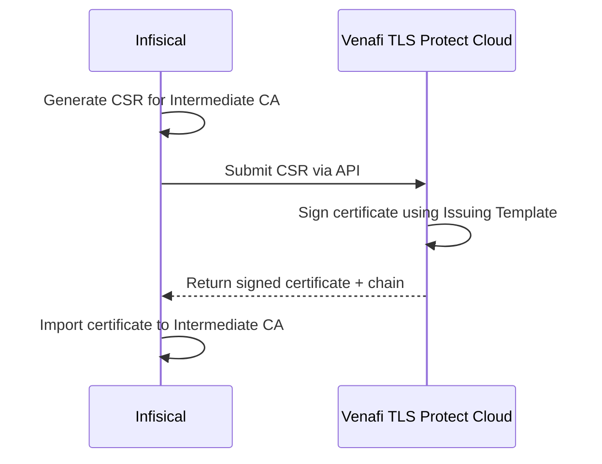

## Concept

Infisical can use Venafi TLS Protect Cloud as an external Certificate Authority to sign your internal intermediate CAs. This allows you to leverage Venafi's cloud-based PKI infrastructure while managing your CA hierarchy within Infisical.

The flow works as follows:

<div align="center">



</div>

1. Infisical generates a Certificate Signing Request (CSR) for the intermediate CA.
2. The CSR is submitted to Venafi TLS Protect Cloud via the configured Application and Issuing Template.
3. Venafi signs the certificate and returns it along with the certificate chain.
4. Infisical imports the signed certificate back into the intermediate CA.

<Warning>
  The certificate issued by Venafi **must** correspond to the CSR generated by Infisical.
  If the Issuing Template in Venafi is misconfigured and produces a certificate that does not match the CSR
  (e.g., different subject, different key), the installation will fail.

  Ensure your Venafi Issuing Template is configured to honor the CSR's subject fields and key.
</Warning>

## Prerequisites

- A [Venafi Connection](/integrations/app-connections/venafi) configured in your organization
- A Venafi Application with an Issuing Template that supports CA certificate issuance
- An intermediate CA created in Infisical (not yet installed)

## Guide to Installing an Intermediate CA via Venafi

<Tabs>
  <Tab title="Infisical UI">
    <Steps>
      <Step title="Create an Intermediate CA">
        If you haven't already, head to your Certificate Management Project > Certificate Authorities > Internal Certificate Authorities and press **Create CA**.

        Set the **CA Type** to **Intermediate** and fill out the details for the intermediate CA (Common Name, Organization, Key Algorithm, etc.).
      </Step>
      <Step title="Open the Install Certificate Modal">
        Press the **Install Certificate** option on the intermediate CA you just created. Select **External CA (Automated)** and press **Continue**.

        
      </Step>
      <Step title="Select Venafi TLS Protect Cloud">
        Choose **Venafi TLS Protect Cloud** as the CA integration provider and press **Continue**.

        
      </Step>
      <Step title="Configure the Venafi Signing Details">
        Fill out the following fields:

        

        - **Venafi Connection**: Select the Venafi Connection to use for signing.
        - **Application**: Select the Venafi Application that contains the Issuing Template for CA certificate issuance.
        - **Issuing Template**: Select the Issuing Template within the Application that will be used to sign the intermediate CA certificate.
        - **Validity Period (Days)**: The number of days the certificate should be valid. This is optional and depends on your Issuing Template configuration.
        - **Path Length**: The maximum number of intermediate CAs that can be chained below this CA. Use `-1` for no limit, or `0` to prevent further chaining.
      </Step>
      <Step title="Install the Certificate">
        Press **Install** to submit the CSR to Venafi and import the signed certificate.

        <Note>
          The installation is processed asynchronously. After clicking Install, the certificate request is queued
          and you will see the CA status update once the certificate has been signed and imported.
        </Note>
      </Step>
    </Steps>
  </Tab>
  <Tab title="API">
    <Steps>
      <Step title="Create an Intermediate CA">
        If you haven't already, create an intermediate CA by making an API request to the [Create CA](/api-reference/endpoints/certificate-authorities/create) API endpoint.

        ### Sample request

        ```bash Request
        curl --location --request POST 'https://app.infisical.com/api/v1/cert-manager/ca/internal' \
          --header 'Authorization: Bearer <access-token>' \
          --header 'Content-Type: application/json' \
          --data-raw '{
              "projectSlug": "<your-project-slug>",
              "type": "intermediate",
              "commonName": "My Intermediate CA"
          }'
        ```

        ### Sample response

        ```json Response
        {
          "ca": {
            "id": "<intermediate-ca-id>",
            "type": "intermediate",
            "commonName": "My Intermediate CA"
          }
        }
        ```
      </Step>
      <Step title="Create a Venafi Signing Configuration">
        Create a signing configuration for the intermediate CA that points to your Venafi Connection and Application.

        ### Sample request

        ```bash Request
        curl --location --request POST 'https://app.infisical.com/api/v1/cert-manager/ca/internal/<intermediate-ca-id>/signing-config' \
          --header 'Authorization: Bearer <access-token>' \
          --header 'Content-Type: application/json' \
          --data-raw '{
              "type": "venafi",
              "appConnectionId": "<venafi-connection-id>",
              "destinationConfig": {
                  "applicationId": "<venafi-application-id>",
                  "issuingTemplateId": "<venafi-issuing-template-id>",
                  "validityPeriod": 365
              }
          }'
        ```

        ### Sample response

        ```json Response
        {
          "signingConfig": {
            "id": "...",
            "caId": "<intermediate-ca-id>",
            "type": "venafi",
            "appConnectionId": "<venafi-connection-id>",
            "destinationConfig": {
              "applicationId": "<venafi-application-id>",
              "issuingTemplateId": "<venafi-issuing-template-id>",
              "validityPeriod": 365
            }
          }
        }
        ```

        <Note>
          - `type` must be `"venafi"`
          - `appConnectionId` is the ID of your Venafi Connection
          - `destinationConfig.applicationId` is the ID of the Venafi Application
          - `destinationConfig.issuingTemplateId` is the ID of the Issuing Template
          - `destinationConfig.validityPeriod` is optional, specified in days
        </Note>
      </Step>
      <Step title="Install the Certificate via Venafi">
        Trigger the certificate installation by submitting the CSR to Venafi.

        ### Sample request

        ```bash Request
        curl --location --request POST 'https://app.infisical.com/api/v1/cert-manager/ca/internal/<intermediate-ca-id>/install-certificate-venafi' \
          --header 'Authorization: Bearer <access-token>' \
          --header 'Content-Type: application/json' \
          --data-raw '{
              "maxPathLength": -1
          }'
        ```

        ### Sample response

        ```json Response
        {
          "message": "Successfully queued certificate installation via Venafi",
          "caId": "<intermediate-ca-id>"
        }
        ```

        <Note>
          The installation is processed asynchronously. The response returns HTTP 202 (Accepted) to indicate the request has been queued.
          Poll the CA details endpoint to check when the certificate has been installed.
        </Note>
      </Step>
    </Steps>
  </Tab>
</Tabs>

## Auto-Renewal

Infisical supports automatic renewal of intermediate CA certificates signed by Venafi. When enabled, Infisical will automatically submit a new CSR to Venafi and import the renewed certificate before the current one expires.

<Tabs>
  <Tab title="Infisical UI">
    Navigate to the CA details page of your Venafi-signed intermediate CA. Click the **edit** (pencil) icon in the Details section to open the renewal settings.

    

    Toggle **Auto-Renewal** on and set the **Days Before Expiry** to configure when the renewal should be triggered.

    
  </Tab>
  <Tab title="API">
    ### Enable Auto-Renewal

    ```bash Request
    curl --location --request PATCH 'https://app.infisical.com/api/v1/cert-manager/ca/internal/<intermediate-ca-id>/auto-renewal' \
      --header 'Authorization: Bearer <access-token>' \
      --header 'Content-Type: application/json' \
      --data-raw '{
          "autoRenewalEnabled": true,
          "autoRenewalDaysBeforeExpiry": 30
      }'
    ```

    ### Sample response

    ```json Response
    {
      "autoRenewalEnabled": true,
      "autoRenewalDaysBeforeExpiry": 30,
      "lastRenewalStatus": null,
      "lastRenewalMessage": null,
      "lastRenewalAt": null
    }
    ```

    <Note>
      - `autoRenewalDaysBeforeExpiry` must be between 1 and 365 days
      - Auto-renewal is only available for CAs with an external signing configuration (e.g., Venafi)
      - The renewal status can be checked via the GET auto-renewal endpoint
    </Note>
  </Tab>
</Tabs>

## Manual Renewal

You can also manually trigger a renewal for a Venafi-signed intermediate CA at any time.

<Tabs>
  <Tab title="Infisical UI">
    Navigate to the CA details page and press the **Renew CA** button.

    

    The renewal modal will confirm that this CA is configured to use Venafi TLS Protect Cloud for signing. Press **Renew via Venafi** to submit a new CSR to Venafi and install the renewed certificate.

    
  </Tab>
  <Tab title="API">
    To manually renew a Venafi-signed CA, make an API request to the [Renew CA](/api-reference/endpoints/certificate-authorities/internal/renew) API endpoint.

    ```bash Request
    curl --location --request POST 'https://app.infisical.com/api/v1/cert-manager/ca/internal/<intermediate-ca-id>/renew' \
      --header 'Authorization: Bearer <access-token>' \
      --header 'Content-Type: application/json' \
      --data-raw '{
          "type": "existing"
      }'
    ```

    For Venafi-signed CAs, Infisical will automatically submit the CSR to Venafi and import the renewed certificate.
  </Tab>
</Tabs>

## Signing Configuration Management

You can view and update the signing configuration for a Venafi-signed CA at any time:

- **GET** `/:caId/signing-config` — Retrieve the current signing configuration
- **PATCH** `/:caId/signing-config` — Update the Venafi connection, application, issuing template, or validity period

Updating the signing configuration does not affect the currently installed certificate. Changes take effect on the next installation or renewal.

## FAQ

<AccordionGroup>
  <Accordion title="What happens if Venafi issues a certificate that doesn't match the CSR?">
    The installation will fail. Infisical validates that the returned certificate matches the CSR's public key.
    Check your Venafi Issuing Template configuration to ensure it honors the CSR's subject fields and key algorithm.
  </Accordion>
  <Accordion title="Can I switch from Venafi signing to Infisical CA signing?">
    Yes. You can update the signing configuration to change the type. Create a new signing configuration with `type: "internal"` and specify the parent CA.
    Then renew or reinstall the intermediate CA certificate.
  </Accordion>
  <Accordion title="What Venafi regions are supported?">
    Infisical supports the following Venafi TLS Protect Cloud regions: US, EU, AU, UK, SG, and CA.
    Select the region that matches your Venafi instance when creating the connection.
  </Accordion>
  <Accordion title="Is the certificate installation synchronous or asynchronous?">
    The installation is asynchronous. When you trigger the installation, the request is queued and processed in the background.
    The API returns HTTP 202 (Accepted) immediately. You can monitor the CA status to check when the certificate has been installed.
  </Accordion>
</AccordionGroup>
