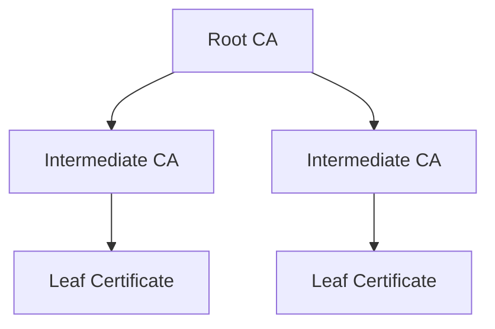

## Concept

Assuming that you've created a Private CA hierarchy with a root CA and an intermediate CA, you can now issue/revoke X.509 certificates using the intermediate CA.

<div align="center">



</div>

## Workflow

The typical workflow for managing certificates consists of the following steps:

1. Issuing a certificate under an intermediate CA with details like name and validity period.
2. Managing certificate lifecycle events such as certificate renewal and revocation. As part of the certificate revocation flow,
   you can also query for a Certificate Revocation List [CRL](https://en.wikipedia.org/wiki/Certificate_revocation_list), a time-stamped, signed
   data structure issued by a CA containing a list of revoked certificates to check if a certificate has been revoked.

<Note>
  Note that this workflow can be executed via the Infisical UI or manually such
  as via API.
</Note>

## Guide to Issuing Certificates

In the following steps, we explore how to issue a X.509 certificate under a CA.

<Tabs>
  <Tab title="Infisical UI">

<Steps>
  <Step title="Creating a certificate">
    To create a certificate, head to your Project > Internal PKI > Certificates and press **Create Certificate**.

    

    Here, set the **CA** to the CA you want to issue the certificate under and fill out details for the certificate.

    

    Here's some guidance on each field:

    - Issuing CA: The CA under which to issue the certificate.
    - Friendly Name: A friendly name for the certificate; this is only for display and defaults to the common name of the certificate if left empty.
    - Common Name (CN): The (common) name for the certificate like `service.acme.com`.
    - Alternative Names (SANs): A comma-delimited list of Subject Alternative Names (SANs) for the certificate; these can be host names or email addresses like `app1.acme.com, app2.acme.com`.
    - TTL: The lifetime of the certificate in seconds.

  </Step>
  <Step title="Copying the certificate details">
    Once you have created the certificate from step 1, you'll be presented with the certificate details including the **Certificate Body**, **Certificate Chain**, and **Private Key**.
    
    
    
    <Note>
        Make sure to download and store the **Private Key** in a secure location as it will only be displayed once at the time of certificate issuance.
        The **Certificate Body** and **Certificate Chain** will remain accessible and can be copied at any time.
    </Note>
  </Step>
</Steps>
  </Tab>
  <Tab title="API">
    To create a certificate, make an API request to the [Issue Certificate](/api-reference/endpoints/certificates/issue-cert) API endpoint,
    specifying the issuing CA.
    
    ### Sample request

    ```bash Request
    curl --location --request POST 'https://app.infisical.com/api/v1/pki/ca/<ca-id>/issue-certificate' \
      --header 'Content-Type: application/json' \
      --data-raw '{
          "commonName": "My Certificate",
          "ttl": "1y",
      }'
    ```

    ### Sample response

    ```bash Response
    {
      certificate: "...",
      certificateChain: "...",
      issuingCaCertificate: "...",
      privateKey: "...",
      serialNumber: "..."
    }
    ```

    <Note>
      Make sure to store the `privateKey` as it is only returned once here at the time of certificate issuance. The `certificate` and `certificateChain` will remain accessible and can be retrieved at any time.
    </Note>

    If you have an external private key, you can also create a certificate by making an API request containing a pem-encoded CSR (Certificate Signing Request) to the [Sign Certificate](/api-reference/endpoints/certificates/sign-cert) API endpoint, specifying the issuing CA.

     ### Sample request

    ```bash Request
    curl --location --request POST 'https://app.infisical.com/api/v1/pki/ca/<ca-id>/sign-certificate' \
      --header 'Content-Type: application/json' \
      --data-raw '{
          "csr": "...",
          "ttl": "1y",
      }'
    ```

    ### Sample response

    ```bash Response
    {
      certificate: "...",
      certificateChain: "...",
      issuingCaCertificate: "...",
      privateKey: "...",
      serialNumber: "..."
    }
    ```

  </Tab>
</Tabs>

## Guide to Revoking Certificates

In the following steps, we explore how to revoke a X.509 certificate under a CA and obtain a Certificate Revocation List (CRL) for a CA.

<Tabs>
  <Tab title="Infisical UI">
<Steps>
  <Step title="Revoking a Certificate">
    Assuming that you've issued a certificate under a CA, you can revoke it by
    selecting the **Revoke Certificate** option for it and specifying the reason
    for revocation.

    

    

  </Step>
  <Step title="Obtaining a CRL">
    In order to check the revocation status of a certificate, you can check it
    against the CRL of a CA by selecting the **View CRL** option under the
    issuing CA and downloading the CRL file.

    

    

    To verify a certificate against the
    downloaded CRL with OpenSSL, you can use the following command:

```bash
openssl verify -crl_check -CAfile chain.pem -CRLfile crl.pem cert.pem
```

  </Step>
</Steps>
  </Tab>
  <Tab title="API">
    <Steps>
      <Step title="Revoking a certificate">
        Assuming that you've issued a certificate under a CA, you can revoke it by making an API request to the [Revoke Certificate](/api-reference/endpoints/certificate-authorities/revoke) API endpoint,
        specifying the serial number of the certificate and the reason for revocation.
        
        ### Sample request

        ```bash Request
        curl --location --request POST 'https://app.infisical.com/api/v1/pki/certificates/<cert-serial-number>/revoke' \
          --header 'Authorization: Bearer <access-token>' \
          --header 'Content-Type: application/json' \
          --data-raw '{
              "revocationReason": "UNSPECIFIED"
          }'
        ```

        ### Sample response

        ```bash Response
        {
          message: "Successfully revoked certificate",
          serialNumber: "...",
          revokedAt: "..."
        }
        ```
      </Step>
      <Step title="Obtaining a CRL">
        In order to check the revocation status of a certificate, you can check it against the CRL of the issuing CA.
        To obtain the CRL of the CA, make an API request to the [Get CRL](/api-reference/endpoints/certificate-authorities/crl) API endpoint.

        ### Sample request

        ```bash Request
        curl --location --request GET 'https://app.infisical.com/api/v1/pki/ca/<ca-id>/crl' \
          --header 'Authorization: Bearer <access-token>'
        ```

        ### Sample response

        ```bash Response
        {
          crl: "..."
        }
        ```

        To verify a certificate against the CRL with OpenSSL, you can use the following command:

        ```bash
        openssl verify -crl_check -CAfile chain.pem -CRLfile crl.pem cert.pem
        ```
      </Step>
    </Steps>

  </Tab>
</Tabs>

## FAQ

<AccordionGroup>
  <Accordion title="What is the workflow for renewing a certificate?">
    To renew a certificate, you have to issue a new certificate from the same CA
    with the same common name as the old certificate. The original certificate
    will continue to be valid through its original TTL unless explicitly
    revoked.
  </Accordion>
</AccordionGroup>
