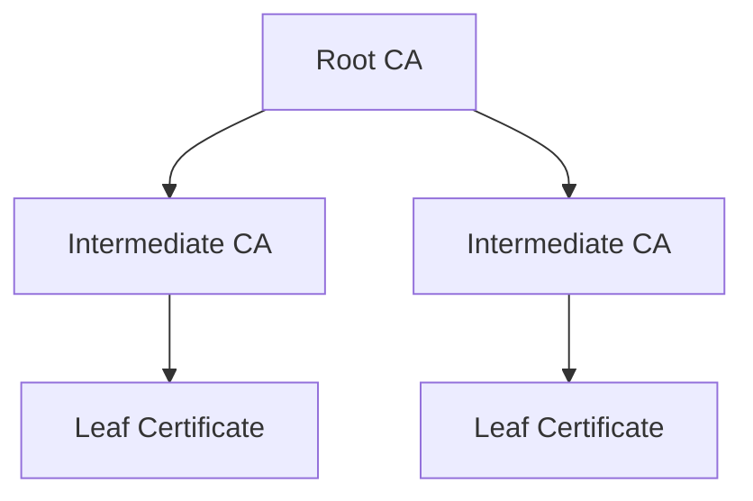

## Concept

Assuming that you've created a Private CA hierarchy with a root CA and an intermediate CA, you can now issue/revoke X.509 certificates using the intermediate CA.

<div align="center">



</div>

## Workflow

The typical workflow for managing certificates consists of the following steps:

1. Issuing a certificate under an intermediate CA with details like name and validity period. As part of certificate issuance, you can either issue a certificate directly from a CA or do it via a certificate template.
2. Managing certificate lifecycle events such as certificate renewal and revocation. As part of the certificate revocation flow,
   you can also query for a Certificate Revocation List [CRL](https://en.wikipedia.org/wiki/Certificate_revocation_list), a time-stamped, signed
   data structure issued by a CA containing a list of revoked certificates to check if a certificate has been revoked.

<Note>
  Note that this workflow can be executed via the Infisical UI or manually such
  as via API.
</Note>

## Guide to Issuing Certificates

In the following steps, we explore how to issue a X.509 certificate under a CA.

<Tabs>
  <Tab title="Infisical UI">

<Steps>
  <Step title="Creating a certificate template">
    A certificate template is a set of policies for certificates issued under that template; each template is bound to a specific CA and can also be bound to a certificate collection for alerting such that any certificate issued under the template is automatically added to the collection.
    
    With certificate templates, you can specify, for example, that issued certificates must have a common name (CN) adhering to a specific format like `.*.acme.com` or perhaps that the max TTL cannot be more than 1 year.
    
    Head to your Project > Certificate Authorities > Your Issuing CA and create a certificate template.
    
    
    
    Here's some guidance on each field:
    
    - Template Name: A name for the certificate template.
    - Issuing CA: The Certificate Authority (CA) that will issue certificates based on this template.
    - Certificate Collection (Optional): The certificate collection that certificates should be added to when issued under the template.
    - Common Name (CN): A regular expression used to validate the common name in certificate requests.
    - Alternative Names (SANs): A regular expression used to validate subject alternative names in certificate requests.
    - TTL: The maximum Time-to-Live (TTL) for certificates issued using this template.
    - Key Usage: The key usage constraint or default value for certificates issued using this template.
    - Extended Key Usage: The extended key usage constraint or default value for certificates issued using this template.
  </Step>
  <Step title="Creating a certificate">
    To create a certificate, head to your Project > Internal PKI > Certificates and press **Issue** under the Certificates section.

    

    Here, set the **Certificate Template** to the template from step 1 and fill out the rest of the details for the certificate to be issued.

    

    Here's some guidance on each field:

    - Friendly Name: A friendly name for the certificate; this is only for display and defaults to the common name of the certificate if left empty.
    - Common Name (CN): The common name for the certificate like `service.acme.com`.
    - Alternative Names (SANs): A comma-delimited list of Subject Alternative Names (SANs) for the certificate; these can be hostnames or email addresses like `app1.acme.com, app2.acme.com`.
    - TTL: The lifetime of the certificate in seconds.
    - Key Usage: The key usage extension of the certificate.
    - Extended Key Usage: The extended key usage extension of the certificate.

    <Note>
      Note that Infisical PKI supports issuing certificates without certificate templates as well. If this is desired, then you can set the **Certificate Template** field to **None**
      and specify the **Issuing CA** and optional **Certificate Collection** fields; the rest of the fields for the issued certificate remain the same.

      That said, we recommend using certificate templates to enforce policies and attach expiration monitoring on issued certificates.
    </Note>

  </Step>
  <Step title="Copying the certificate details">
    Once you have created the certificate from step 1, you'll be presented with the certificate details including the **Certificate Body**, **Certificate Chain**, and **Private Key**.
    
    
    
    <Note>
        Make sure to download and store the **Private Key** in a secure location as it will only be displayed once at the time of certificate issuance.
        The **Certificate Body** and **Certificate Chain** will remain accessible and can be copied at any time.
    </Note>
  </Step>
</Steps>
  </Tab>
  <Tab title="API">

<Steps>
  <Step title="Creating a certificate template">
    A certificate template is a set of policies for certificates issued under that template; each template is bound to a specific CA and can also be bound to a certificate collection for alerting such that any certificate issued under the template is automatically added to the collection.

    With certificate templates, you can specify, for example, that issued certificates must have a common name (CN) adhering to a specific format like .*.acme.com or perhaps that the max TTL cannot be more than 1 year.

    To create a certificate template, make an API request to the [Create Certificate Template](/api-reference/endpoints/certificate-templates-v2/create) API endpoint, specifying the issuing CA.

    ### Sample request

    ```bash Request
    curl --request POST \
      --url https://us.infisical.com/api/v2/certificate-templates \
      --header 'Content-Type: application/json' \
      --data '{
      "projectId": "<string>",
      "name": "<string>",
      "description": "<string>",
      "subject": [
        {
          "type": "common_name",
          "allowed": [
            "*.infisical.com"
          ]
        }
      ],
      "sans": [
        {
          "type": "dns_name",
          "allowed": [
            "*.sample.com"
          ]
        }
      ],
      "keyUsages": {
        "allowed": [
          "digital_signature"
        ]
      },
      "extendedKeyUsages": {
        "allowed": [
          "client_auth"
        ]
      },
      "algorithms": {
        "signature": [
          "SHA256-RSA"
        ],
        "keyAlgorithm": [
          "RSA-2048"
        ]
      },
      "validity": {
        "max": "365d"
      }
    }'
    ```

    ### Sample response

    ```bash Response
    {
      "certificateTemplate": {
        "id": "3c90c3cc-0d44-4b50-8888-8dd25736052a",
        "projectId": "3c90c3cc-0d44-4b50-8888-8dd25736052a",
        "name": "<string>",
        "description": "<string>",
          "subject": [
            {
              "type": "common_name",
              "allowed": [
                "*.infisical.com"
              ]
            }
          ],
        "sans": [
          {
            "type": "dns_name",
            "allowed": [
              "*.sample.com"
            ]
          }
        ],
        "keyUsages": {
          "allowed": [
            "digital_signature"
          ]
        },
        "extendedKeyUsages": {
          "allowed": [
            "client_auth"
          ]
        },
        "algorithms": {
          "signature": [
            "SHA256-RSA"
          ],
          "keyAlgorithm": [
            "RSA-2048"
          ]
        },
        "validity": {
          "max": "365d"
        },
        "createdAt": "2023-11-07T05:31:56Z",
        "updatedAt": "2023-11-07T05:31:56Z"
      }
    }
    ```

  </Step>
  <Step title="Creating a certificate">
    To create a certificate under the certificate template, make an API request to the [Issue Certificate](/api-reference/endpoints/certificates/issue-certificate) API endpoint,
    specifying the issuing CA.
    
    ### Sample request

    ```bash Request
    curl --location --request POST 'https://app.infisical.com/api/v1/cert-manager/certificates/issue-certificate' \
      --header 'Content-Type: application/json' \
      --data-raw '{
          "profileId": "<profile-id>",
          "commonName": "service.acme.com",
          "ttl": "1y",
          "signatureAlgorithm": "RSA-SHA256",
          "keyAlgorithm": "RSA_2048"
      }'
    ```

    ### Sample response

    ```bash Response
    {
      certificate: "...",
      certificateChain: "...",
      issuingCaCertificate: "...",
      privateKey: "...",
      serialNumber: "..."
    }
    ```

    <Note>
      Note that Infisical PKI supports issuing certificates without certificate templates as well. If this is desired, then you can set the **Certificate Template** field to **None**
      and specify the **Issuing CA** and optional **Certificate Collection** fields; the rest of the fields for the issued certificate remain the same.

      That said, we recommend using certificate templates to enforce policies and attach expiration monitoring on issued certificates.
    </Note>

    <Note>
      Make sure to store the `privateKey` as it is only returned once here at the time of certificate issuance. The `certificate` and `certificateChain` will remain accessible and can be retrieved at any time.
    </Note>

    If you have an external private key, you can also create a certificate by making an API request containing a pem-encoded CSR (Certificate Signing Request) to the [Sign Certificate](/api-reference/endpoints/certificates/sign-certificate) API endpoint, specifying the issuing CA.

     ### Sample request

    ```bash Request
    curl --location --request POST 'https://app.infisical.com/api/v1/cert-manager/certificates/sign-certificate' \
      --header 'Content-Type: application/json' \
      --data-raw '{
          "certificateTemplateId": "<certificate-template-id>",
          "csr": "...",
          "ttl": "1y",
      }'
    ```

    ### Sample response

    ```bash Response
    {
      certificate: "...",
      certificateChain: "...",
      issuingCaCertificate: "...",
      privateKey: "...",
      serialNumber: "..."
    }
    ```

  </Step>
</Steps>
  </Tab>
</Tabs>

## Guide to Revoking Certificates

In the following steps, we explore how to revoke a X.509 certificate under a CA and obtain a Certificate Revocation List (CRL) for a CA.

<Tabs>
  <Tab title="Infisical UI">
<Steps>
  <Step title="Revoking a Certificate">
    Assuming that you've issued a certificate under a CA, you can revoke it by
    selecting the **Revoke Certificate** option for it and specifying the reason
    for revocation.

    

    

  </Step>
  <Step title="Obtaining a CRL">
    In order to check the revocation status of a certificate, you can check it
    against the CRL of a CA by heading to its Issuing CA and downloading the CRL.

    

    To verify a certificate against the
    downloaded CRL with OpenSSL, you can use the following command:

```bash
openssl verify -crl_check -CAfile chain.pem -CRLfile crl.pem cert.pem
```

Note that you can also obtain the CRL from the certificate itself by
referencing the CRL distribution point extension on the certificate.

To check a certificate against the CRL distribution point specified within it with OpenSSL, you can use the following command:

```bash
openssl verify -verbose -crl_check -crl_download -CAfile chain.pem cert.pem
```

  </Step>
</Steps>
  </Tab>
  <Tab title="API">
    <Steps>
      <Step title="Revoking a certificate">
        Assuming that you've issued a certificate under a CA, you can revoke it by making an API request to the [Revoke Certificate](/api-reference/endpoints/certificates/revoke) API endpoint,
        specifying the serial number of the certificate and the reason for revocation.
        
        ### Sample request

        ```bash Request
        curl --location --request POST 'https://app.infisical.com/api/v1/cert-manager/certificates/<cert-id>/revoke' \
          --header 'Authorization: Bearer <access-token>' \
          --header 'Content-Type: application/json' \
          --data-raw '{
              "revocationReason": "UNSPECIFIED"
          }'
        ```

        ### Sample response

        ```bash Response
        {
          message: "Successfully revoked certificate",
          serialNumber: "...",
          revokedAt: "..."
        }
        ```
      </Step>
      <Step title="Obtaining a CRL">
        In order to check the revocation status of a certificate, you can check it against the CRL of the issuing CA.
        To obtain the CRLs of the CA, make an API request to the [List CRLs](/api-reference/endpoints/certificate-authorities/crl) API endpoint.

        ### Sample request

        ```bash Request
        curl --location --request GET 'https://app.infisical.com/api/v1/cert-manager/ca/internal/<ca-id>/crls' \
          --header 'Authorization: Bearer <access-token>'
        ```

        ### Sample response

        ```bash Response
        [
          {
            id: "...",
            crl: "..."
          },
          ...
        ]
        ```

        To verify a certificate against the CRL with OpenSSL, you can use the following command:

        ```bash
        openssl verify -crl_check -CAfile chain.pem -CRLfile crl.pem cert.pem
        ```
      </Step>
    </Steps>

  </Tab>
</Tabs>

## FAQ

<AccordionGroup>
  <Accordion title="What is the workflow for renewing a certificate?">
    To renew a certificate, you have to issue a new certificate from the same CA
    with the same common name as the old certificate. The original certificate
    will continue to be valid through its original TTL unless explicitly
    revoked.
  </Accordion>
</AccordionGroup>
