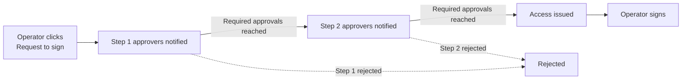

A [Signer](/documentation/platform/pki/code-signing/signers) with an approval policy makes signing a two-party operation: someone asks, someone else says yes, and the request becomes an **active access window** with limits on how much and how long. This page covers everything that happens inside a Signer's **Approvals** tab.

Concretely, approvals govern three things:

1. **The policy:** who has to approve, in what order, and how strict the per-access limits are.
2. **The path to access:** either an Administrator *pre-approves* an access window for a specific member, or an Operator *requests* one and approvers sign off.
3. **The active access record:** once approved, it's the row in the Approvals table with its own expiry, signature count, and revoke button.

<Info>
  Signers without an approval policy don't use this flow. Members with sign rights sign directly and you'll still see a full audit trail under the Signer's **Activity** tab.
</Info>

## When you want an approval policy

<CardGroup cols={2}>
  <Card title="Production releases" icon="rocket">
    Two security leads must sign off before a release artifact is signed.
  </Card>
  <Card title="Separation of duties" icon="users-line">
    Developers request to sign; managers approve. Audit shows both actors.
  </Card>
  <Card title="Compliance" icon="clipboard-check">
    SOC 2, PCI-DSS, or internal SDLC frameworks that require documented approval.
  </Card>
  <Card title="Bounded CI access" icon="timer">
    Pre-approve a CI identity for "10 signings within the next hour" instead of standing access.
  </Card>
</CardGroup>

## How an approval flow works

Each step runs in order. Once the last step's required approvals are reached, Infisical issues an **active access record** bounded by the policy's per-approval limits. The Operator can then sign through the [PKCS#11 module](/documentation/platform/pki/code-signing/pkcs11-module) or the [Sign API](/api-reference/endpoints/code-signing/signers/sign).

Administrators can also [pre-approve signing](#pre-approve-signing) directly when the approval flow isn't a fit, for example during an incident response where waiting on approvers would block recovery.

## Configure the approval policy

Open the Signer's **Approvals** tab and click the pencil icon on the **Approval Policy** panel. The editor is a 2-step sheet.

<Steps>
  <Step title="Approvers">
    Define one or more approval steps. To turn the policy off entirely, delete every step. The Signer reverts to direct signing.

    For each step:

    | Field | Description |
    |-------|-------------|
    | **Step name** | Optional label like *Security Team Review* or *Manager Sign-off*. Visible to approvers in their queue. |
    | **Approvers** | Eligible users **or groups** for this step. They must already be members of the Signer (any role). Group approvers let anyone in the group approve. Auditors can be members but cannot be approvers. |
    | **Required approvals** | The number of **distinct** approvers that must approve before the step is complete. |

    Add more steps to run multiple sign-offs in sequence. For example: *Step 1 Team Lead Review* (1 approval), then *Step 2 Security* (2 approvals).

    **Required-approval validation:**
    - A step must have at least one approver.
    - **Required approvals** must be ≥ 1.
  </Step>

  <Step title="Approval limits">
    Per-approval caps that apply to every access record this policy issues:

    | Field | Description |
    |-------|-------------|
    | **Signatures per approval** | How many signing operations one approval is good for. Leave empty for unlimited. Set to **1** for "approve once per artifact". |
    | **Signing window** | How long the access record is valid after approval. Options: No limit, 1h, 8h, 24h, 7d, 30d. |

    You can combine both. For example: `maxSignings=10` with `signing window=1h` issues access good for at most 10 sign calls within one hour of approval, whichever comes first.

  </Step>
</Steps>

Press **Save policy**. The new policy applies to **new** requests; existing active access keeps its original terms until it expires or is revoked.

## Access lifecycle

Every approved request becomes an **active access record**. On the Approvals tab it's a row in the Requests table with its own status, expiry, and signature counter.

### Statuses you'll see

| Status | Meaning |
|--------|---------|
| **Pending** | Approval workflow is in progress. Waiting on the current step's approvers. |
| **Active** | All steps approved, access issued, still within window and signatures remaining. |
| **Expired** | Window has passed, or the signature count was exhausted. |
| **Revoked** | An Administrator revoked the access (or the requester cancelled the request). |
| **Rejected** | An approver rejected one of the steps. |

## Approval paths

There are two ways someone gets active access on a Signer: Administrators **pre-approve signing** directly for someone else, or members open a **request to sign** that runs through the approval policy.

<Tabs>
  <Tab title="Pre-approve signing">
    An Administrator gives a specific member access up-front. **No approval workflow runs.** The access is created **Active** immediately and the recipient can sign right away.

    <Steps>
      <Step title="Click Pre-approve signing">
        From the Signer's **Approvals** tab, click **Pre-approve signing**.
      </Step>
      <Step title="Pick the recipient">
        Select the user or machine identity that should receive access. The list includes every Signer member except Auditors (including users reachable via a group).
      </Step>
      <Step title="Set the access terms">
        | Field | Description |
        |-------|-------------|
        | **Justification** | Short note recorded on the access record for audit. Required. |
        | **Signatures allowed** | How many sign operations the access permits. Capped at the policy's **Signatures per approval**. Leave empty to fall back to the policy ceiling. |
        | **When access begins** | Defaults to "now". |
        | **When access expires** | Capped at the policy's **Signing window**. Leave empty to fall back to the policy ceiling. |

        <Note>
          Per-access values cannot exceed the policy ceilings. Requesting `maxSignings=10` against a policy that allows 3 returns a 400 with a clear message. Omitting a field that the policy caps simply clamps to the ceiling, never silently unlimited.
        </Note>
      </Step>
      <Step title="Issue the access">
        Press **Pre-approve**. The recipient can sign immediately.
      </Step>
    </Steps>

    Typical use: pre-approving a CI machine identity for "10 signings within the next hour" right before a release pipeline runs.
  </Tab>

  <Tab title="Request to sign">
    An Operator submits a request for themselves. Approvers must sign off before the access becomes Active.

    <Steps>
      <Step title="Click Request to sign">
        From the Signer's **Approvals** tab, click **Request to sign**. (Hidden if the Signer has no policy, if you don't have sign permission, or if you already have active access.)
      </Step>
      <Step title="Justify the request">
        Provide a short reason: *"Signing release v2.4.0"*, *"Hotfix for #4823"*. The justification appears to approvers and is recorded on the eventual access record.
      </Step>
      <Step title="Specify what you need">
        | Field | Description |
        |-------|-------------|
        | **Signatures requested** | How many sign operations you need. Capped at the policy's **Signatures per approval**. Leave empty to fall back to the policy ceiling. |
        | **When access begins** | When the access window should start once approvals complete. Defaults to "now". |
        | **When access expires** | When the access window should end. Capped at the policy's **Signing window**. Leave empty to fall back to the policy ceiling. |

        <Note>
          Per-access values cannot exceed the policy ceilings. Requesting `maxSignings=10` against a policy that allows 3 returns a 400 with a clear message. Omitting a field that the policy caps simply clamps to the ceiling, never silently unlimited.
        </Note>
      </Step>
      <Step title="Submit">
        Press **Submit**. The first step's approvers are notified. Each step advances when its required approvals are reached. When the last step completes, the access record is automatically created with the terms you requested (clamped to policy caps).
      </Step>
    </Steps>

    Typical use: a developer requesting access to sign a release, with the release manager (or a group) approving before the access goes Active.
  </Tab>
</Tabs>

## Approving or rejecting

If you're an eligible approver for the **current** step of a pending request, an **Approve** or **Reject** action is visible on the request row.

<Steps>
  <Step title="Open the request">
    Click the row on the Signer's **Approvals** tab. Full details: requester, recipient, justification, requested signings, requested window, and which step is currently pending.
  </Step>
  <Step title="Review">
    Verify who's asking, for how many signings, for how long, and why.
  </Step>
  <Step title="Decide">
    - **Approve** counts toward the current step's required approvals. When the last step's count is reached, the access record is created.
    - **Reject** terminates the workflow. No access is created. The requester can submit a new request.
  </Step>
</Steps>

<Note>
  You can never approve your own signing request, even if you are listed as an approver for the current step. Administrators also cannot pre-approve signing for themselves. These rules are always enforced and cannot be disabled.
</Note>

## Revoking access

Administrators can revoke an active access record (or cancel a pending request) at any time. Hover the row on the Approvals tab; an **X** icon appears. Confirm in the dialog and:

- **Pending request** cancels the workflow. No approver can act on it after that.
- **Active access** is immediately revoked. Subsequent sign calls return 403 with a clear message.

In-flight sign calls already in progress complete normally; revocation is checked at request entry, not mid-operation. The row stays visible in **Revoked** status so the audit trail is preserved.

## FAQ

<AccordionGroup>
  <Accordion title="I approved a request but nothing happened.">
    The policy has more than one step and yours wasn't the final step. Open the request to see which step is currently pending; the access record is issued only after the last step's required approvals are reached.
  </Accordion>
  <Accordion title="I'm an Operator but I don't see Request to sign.">
    Three possibilities:
    1. The Signer has no approval policy, so signing is direct and no request is needed.
    2. You already have active access. Sign directly under it.
    3. You don't have sign permission. Check that your role on this Signer is Operator or Administrator (not Auditor).
  </Accordion>
  <Accordion title="Can a CI identity bypass approval?">
    Have an Administrator pre-approve access for that identity in advance with appropriate per-approval limits. The CI identity then signs under the access record directly without going through the review workflow.
  </Accordion>
  <Accordion title="Can I extend active access?">
    No. Access records are immutable once issued. If you need more time or more signatures, submit a new request (or have an Admin pre-approve a new one) and revoke the old one if you want to be tidy.
  </Accordion>
  <Accordion title="What's the difference between Expired and Revoked?">
    **Expired** is automatic: the window ended or the signature count was reached. **Revoked** is explicit: an Administrator (or the requester via cancel) ended the access before its natural expiry. Either way, signing under it is no longer possible. The status difference shows up in the audit log.
  </Accordion>
  <Accordion title="What happens to a pending request when I edit the policy?">
    Pending requests run under the policy that was active when they were submitted. Edits affect only new requests. To force a refresh, revoke the pending request and have the requester submit again.
  </Accordion>
</AccordionGroup>

## What's next

<CardGroup cols={2}>
  <Card title="Signers" icon="pen-nib" href="/documentation/platform/pki/code-signing/signers">
    Manage the Signer itself: members, certificate, lifecycle.
  </Card>
  <Card title="PKCS#11 Module" icon="plug" href="/documentation/platform/pki/code-signing/pkcs11-module#automatic-signing-access-requests">
    Have the module auto-open signing requests on denied calls.
  </Card>
</CardGroup>
