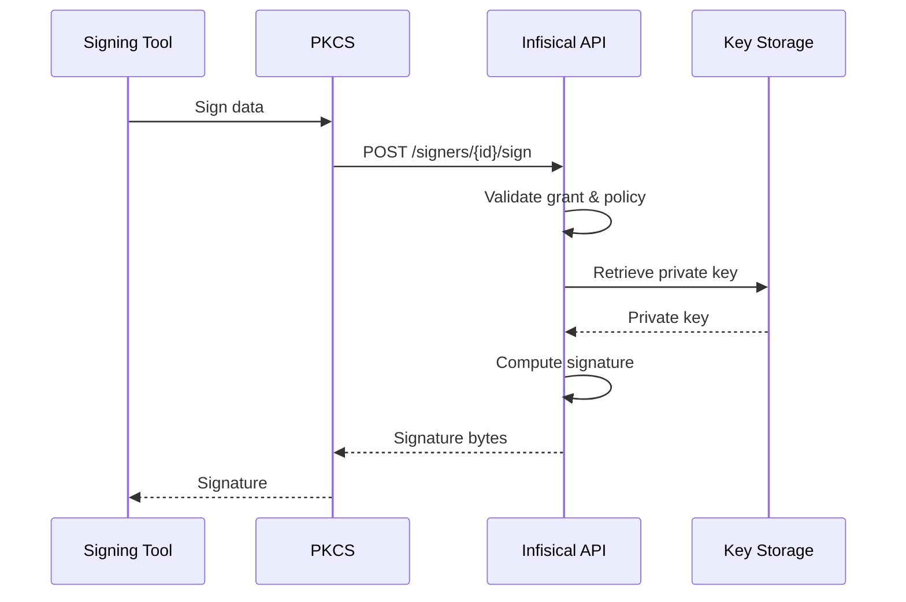

In Infisical, Code Signing lets you digitally sign software artifacts (JARs, binaries, container images, and more) while keeping private keys secure on the server. Instead of distributing signing keys to developer workstations or CI pipelines, signing operations are performed centrally through Infisical with full audit trails and approval controls.

## How It Works

1. A **Signer** is created and bound to a certificate with the `codeSigning` extended key usage.
2. An **Approval Policy** governs who can use the signer and under what conditions.
3. Users or machine identities **request signing access** through the approval workflow.
4. Once approved, the caller receives a **grant** that authorizes signing operations.
5. The signing tool (e.g., jarsigner) calls the Infisical API, either directly or through the [PKCS#11 module](/documentation/platform/pki/code-signing/pkcs11-module), and the signature is computed server-side.
6. Every signing operation is recorded as an immutable **audit entry** on the signer.

## Core Concepts

### Signers

A [signer](/documentation/platform/pki/code-signing/signers) is a named code-signing identity bound to a certificate. It represents a signing capability within a project. Signers hold no private key material locally. All cryptographic operations happen on the Infisical server.

### Approval Policies

[Approval policies](/documentation/platform/pki/code-signing/approvals) define the rules that must be satisfied before signing can occur. Infisical supports three approval modes:

- **Manual**: Each approval grants exactly one signing operation.
- **Time Window**: Approval grants signing access for a defined time period.
- **N-Signings**: Approval grants a fixed number of signing operations.

### Signing Operations

Every call to sign data, whether it succeeds, fails, or is denied, is recorded as a signing operation. This provides a complete audit trail of who signed what, when, and using which grant.

### PKCS#11 Module

The Infisical [PKCS#11 module](/documentation/platform/pki/code-signing/pkcs11-module) implements the PKCS#11 v2.40 standard, allowing standard signing tools to use Infisical signers without code changes. The module supports RSA (PKCS#1 v1.5 and PSS) and ECDSA signing mechanisms.

## Getting Started

<CardGroup cols={2}>
  <Card title="Create a Signer" href="/documentation/platform/pki/code-signing/signers">
    Set up a code-signing identity and bind it to a certificate.
  </Card>
  <Card title="Configure Approvals" href="/documentation/platform/pki/code-signing/approvals">
    Define approval policies to control who can sign and when.
  </Card>
</CardGroup>
