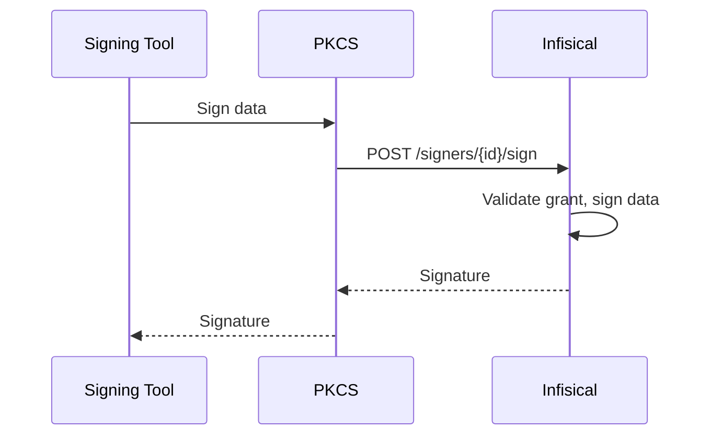

Digitally sign software artifacts (JARs, binaries, container images, and more) while keeping private keys secure on the server. Instead of distributing signing keys to developer workstations or CI pipelines, signing operations are performed centrally through Infisical with full audit trails and approval controls.

<Info>
  Code Signing uses **Signers** as the organizing concept, similar to how [Applications](/documentation/platform/pki/applications/overview) work for certificates. Product Admins create Signers and assign team members (Guests) who can then request signing access.
</Info>

## How It Works

1. A **Signer** is created and bound to a certificate with the `codeSigning` extended key usage.
2. Optionally, a **Signing Policy** is attached to govern who can use the signer and under what conditions. Without a policy, authorized users and identities can sign immediately.
3. When a policy is configured, users or machine identities **request signing access** through the signing workflow. Once approved, the caller receives a **grant** that authorizes signing operations.
4. The signing tool (e.g., jarsigner) calls the Infisical API, either directly or through the [PKCS#11 module](/documentation/platform/pki/code-signing/pkcs11-module), and the signature is computed server-side.
5. Every signing operation is recorded as an immutable **audit entry** on the signer.

## Core Concepts

### Signers

A [signer](/documentation/platform/pki/code-signing/signers) is a named code-signer bound to a certificate. It represents a signing capability within a project. Private keys are stored securely on the Infisical server and never leave it. All cryptographic operations are performed server-side.

### Signing Policies

[Signing policies](/documentation/platform/pki/code-signing/signing-policies) optionally define the rules that must be satisfied before signing can occur. Policies support constraints that can be combined:

- **Max Window Duration**: Limits how long a signing grant remains valid.
- **Max Signings**: Limits the total number of signing operations a grant allows.

### Signing Operations

Every call to sign data, whether it succeeds, fails, or is denied, is recorded as a signing operation. This provides a complete audit trail of who signed what, when, and using which grant.

### PKCS#11 Module

The Infisical [PKCS#11 module](/documentation/platform/pki/code-signing/pkcs11-module) implements the PKCS#11 v2.40 standard, allowing standard signing tools to use Infisical signers without code changes. The module supports RSA (PKCS#1 v1.5 and PSS) and ECDSA signing mechanisms.

## Getting Started

<CardGroup cols={2}>
  <Card title="Create a Signer" icon="pen-nib" href="/documentation/platform/pki/code-signing/signers">
    Set up a code-signer and bind it to a certificate.
  </Card>
  <Card title="Configure Signing Policies" icon="file-contract" href="/documentation/platform/pki/code-signing/signing-policies">
    Define rules for who can sign and when.
  </Card>
  <Card title="PKCS#11 Module" icon="plug" href="/documentation/platform/pki/code-signing/pkcs11-module">
    Use standard signing tools with Infisical.
  </Card>
  <Card title="Signing Requests" icon="paper-plane" href="/documentation/platform/pki/code-signing/signing-requests">
    Request signing access when policies are configured.
  </Card>
</CardGroup>

## What's Next?

If you're new to Code Signing, start by [creating a Signer](/documentation/platform/pki/code-signing/signers). If you need approval workflows, set up a [Signing Policy](/documentation/platform/pki/code-signing/signing-policies) first.

For integration guides with specific tools, see:

<CardGroup cols={3}>
  <Card title="Cosign" icon="docker" href="/documentation/platform/pki/code-signing/guides/pkcs11-cosign">
    Sign container images
  </Card>
  <Card title="jarsigner" icon="java" href="/documentation/platform/pki/code-signing/guides/pkcs11-jarsigner">
    Sign Java JARs
  </Card>
  <Card title="GPG" icon="key" href="/documentation/platform/pki/code-signing/guides/pkcs11-gpg">
    Sign with GPG
  </Card>
</CardGroup>
