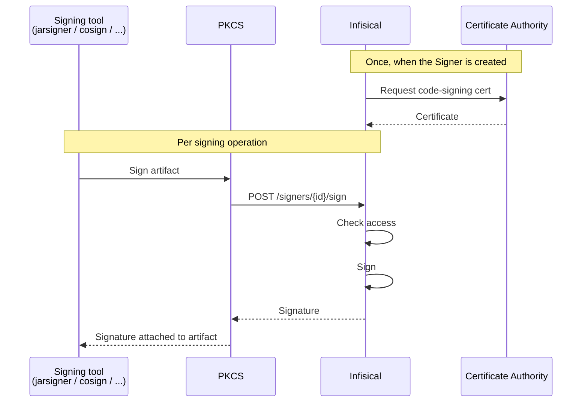

Code Signing is where teams digitally sign software (JARs, container images, Windows installers, Android APKs, Linux packages, scripts). Within Code Signing, you can:

- **Sign artifacts** through any tool that supports PKCS#11, with native Windows `signtool`, or directly via the [Sign API](/api-reference/endpoints/code-signing/signers/sign)
- **Require approvals** before signatures are produced, with per-approval limits on count and time
- **Manage who can sign** with per-Signer roles for users, machine identities, and groups
- **Track every signing operation** in a full audit trail

Each **Signer** represents a single signing identity, like `mobile-app-prod`, `firmware-release`, or `ci-staging-builds`. Product Admins create Signers, attach a code-signing certificate, and assign team members. Teams then operate independently within their assigned Signers.

## What's in a Signer?

<CardGroup cols={2}>
  <Card title="Certificate" icon="certificate">
    The X.509 code-signing certificate the Signer uses, backed by an internal or external CA.
  </Card>
  <Card title="Members" icon="users">
    Team members with Administrator, Operator, or Auditor roles on this Signer.
  </Card>
  <Card title="Approval policy" icon="check-double">
    Optional review workflow before signatures are produced.
  </Card>
  <Card title="Activity" icon="clock-rotate-left">
    Audit trail of every successful, failed, and denied signing operation.
  </Card>
</CardGroup>

## How a signing operation flows

1. A Product Admin creates a [Signer](/documentation/platform/pki/code-signing/signers) and picks the CA that issues its certificate.
2. The Admin adds [members](/documentation/platform/pki/code-signing/signers#members) (users, machine identities, or groups) and picks a role for each.
3. Optionally, the Admin attaches an [approval policy](/documentation/platform/pki/code-signing/approvals) so signing requires sign-off.
4. Operators sign through the [PKCS#11 module](/documentation/platform/pki/code-signing/pkcs11-module), the [Windows KSP](/documentation/platform/pki/code-signing/windows-ksp) (`signtool`), or the [Sign API](/api-reference/endpoints/code-signing/signers/sign). Infisical produces the signature and records an audit entry on the Signer.

## Signer roles

Members are assigned to Signers with one of three roles:

| Role | Capabilities |
|------|--------------|
| **Administrator** | Full control: edit settings, manage members, edit the approval policy, pre-approve signing, sign, export the certificate. |
| **Operator** | Sign artifacts and submit signing requests. Cannot change settings or members. |
| **Auditor** | Read-only: view members, activity, and the audit log. Cannot sign. |

## FAQ

<AccordionGroup>
  <Accordion title="How is this different from handing out a .pfx or .p12 file?">
    When you distribute a key file, anyone with a copy can sign anything for the lifetime of the certificate, and you can't take that copy back. With a Signer, you can disable signing, revoke active access, or remove a member at any time, and that change takes effect immediately.
  </Accordion>
  <Accordion title="Do I have to require approval for every signature?">
    No. A Signer can have no approval policy, in which case any member with sign rights can sign immediately and you still get a full audit trail. Approvals are optional and most useful for production releases or compliance-sensitive workloads.
  </Accordion>
</AccordionGroup>

## What's next?

<CardGroup cols={2}>
  <Card title="Create a Signer" icon="pen-nib" href="/documentation/platform/pki/code-signing/signers#create-a-signer">
    The 4-step wizard.
  </Card>
  <Card title="Add an approval policy" icon="check-double" href="/documentation/platform/pki/code-signing/approvals#configure-the-approval-policy">
    Require sign-off and cap per-approval limits.
  </Card>
  <Card title="Install the PKCS#11 module" icon="plug" href="/documentation/platform/pki/code-signing/pkcs11-module#installation">
    Hook up your signing tools.
  </Card>
  <Card title="Sign your first JAR" icon="java" href="/documentation/platform/pki/guides/code-signing/jarsigner">
    End-to-end walkthrough.
  </Card>
</CardGroup>
