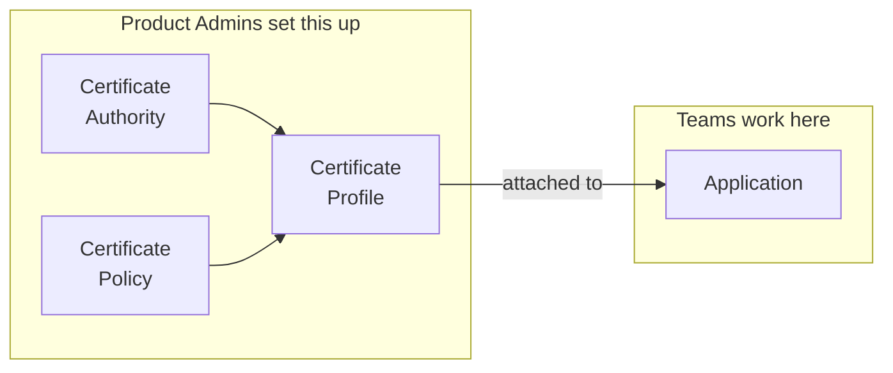

<Info>
  This page is for Product Admins and architects planning a Certificate Manager rollout. If you are
  a team member issuing certificates, see [Applications](/documentation/platform/pki/applications/overview).
</Info>

There are many valid ways to structure Certificate Manager. This page walks through one of them: a layout that keeps development, staging, and production separate, so a certificate for one environment cannot be issued from another. Use it as a reference and adapt it to your own organization.

The structure is the same whether you issue from your own private CAs or from an external provider such as Let's Encrypt, DigiCert, AWS Private CA, or Microsoft ADCS. Give each environment its own CA where you can. Where two environments have to share one, the policy and Application layers still keep them apart.

## How Certificate Manager is organized

Certificate Manager has four building blocks.

| Building block | What it is | Who manages it |
|----------------|-----------|----------------|
| [Certificate Authority](/documentation/platform/pki/ca/overview) | The authority that signs certificates. Either private, created inside Infisical, or external, such as Let's Encrypt or DigiCert. | Product Admins |
| [Certificate Policy](/documentation/platform/pki/settings/policies) | The rules a certificate must follow: which domain names are allowed, how long it stays valid, which key algorithms are permitted. | Product Admins |
| [Certificate Profile](/documentation/platform/pki/settings/profiles) | One CA and one policy combined into a reusable template. This is what teams request certificates from. | Product Admins |
| [Application](/documentation/platform/pki/applications/overview) | A team's workspace for one service. Profiles are attached to it, and its members issue certificates through it. | Teams |

They connect in one direction:



Teams never touch Certificate Authorities or policies. They issue certificates through a profile attached to their Application, so the rules are written once by Product Admins and enforced on every request.

This is also how environments stay separate. A team can only issue what its attached profiles permit, and it can only reach profiles through an Application it belongs to. Both ends are controlled by Product Admins, so a team cannot widen its own limits.

## Choose your boundary

The four layers hold for every organization. What changes is the boundary you write them along. This page uses environment, since that is the most common, and every step works the same way with your own boundary substituted.

| If your organization | Then |
|----------------------|------|
| Splits development, staging, and production | Follow this page as written. |
| Runs one environment, or is early | Start with one CA, one policy per certificate type, and one Application per service. Add environments later by adding a CA and a policy. |
| Separates by region or tenant rather than environment | Keep the four layers and write policies along that boundary instead. The structure does not change. |
| Has one team operating every environment | Use one Application per service, with all the environment profiles attached. Split by environment only when the operators differ. |
| Uses private CAs and cannot share a trust anchor across environments | Create a separate root per environment instead of a shared root. Expect to distribute several anchors and run several root ceremonies. |
| Needs environments that cannot share administration | Put each one in its own sub-organization. See [When you need full separation](#when-you-need-full-separation). |

## Where your current setup fits

Most organizations already issue certificates from something. This layout sits on top of what you have rather than replacing it.

| What you have today | Where it fits |
|---------------------|---------------|
| An offline root you already operate | Keep it. Create the issuing CAs in Infisical and sign them with your root. |
| Microsoft ADCS or Venafi | Connect it as an external CA. Policies, profiles, and Applications sit on top unchanged. |
| Certificates from DigiCert, Sectigo, or Let's Encrypt | Connect the provider as an external CA. Public certificates keep coming from them. |
| AWS Private CA | Connect it as an external CA, one per environment. |
| Certificates nobody has catalogued | Run [Discovery](/documentation/platform/pki/discovery/overview) to build the inventory, then structure what it finds. |

Nothing needs re-issuing. Existing certificates stay valid until they expire or are revoked.

## The layout

```
Certificate Manager
├── Certificate Authorities                  one per environment, private or external
│   ├── Production CA
│   ├── Staging CA
│   └── Development CA
│
├── Certificate Policies
│   ├── prod-tls-server        90 days   *.example.com
│   ├── staging-tls-server     90 days   *.stg.example.com
│   └── dev-tls-server         30 days   *.dev.example.com
│
├── Certificate Profiles
│   ├── prod-tls-server        Production CA  + prod-tls-server
│   ├── staging-tls-server     Staging CA     + staging-tls-server
│   └── dev-tls-server         Development CA + dev-tls-server
│
└── Applications
    ├── payments-api-prod      prod-tls-server
    ├── payments-api-staging   staging-tls-server
    ├── payments-api-dev       dev-tls-server
    ├── auth-service-prod      prod-tls-server
    ├── auth-service-staging   staging-tls-server
    └── auth-service-dev       dev-tls-server
```

Product Admins build the first three layers once. Teams own the fourth.

## Build the shared infrastructure

<Steps>
  <Step title="Set up one CA per environment">
    Give each environment its own Certificate Authority where you can. This is the strongest boundary in the layout: if one environment's CA has to be replaced, the others issue from a different CA and are untouched.

    How you create those CAs depends on where your certificates come from.

    <Tabs>
      <Tab title="Private CAs">
        Create one root CA and one issuing CA per environment. Sign the issuing CAs with the root, then take the root offline so all day-to-day issuance runs through the issuing CAs.

        ```
        Root CA R1                     10 years, offline after signing
        ├── Production CA                   5 years
        ├── Staging CA                      5 years
        └── Development CA                  5 years
        ```

        If you already operate a root outside Infisical, keep it. Create the issuing CAs here and sign them with your existing root.

        Three decisions to make while you create them:

        - **Key protection.** Set the key source to HSM to generate and hold the signing key in your own hardware, so every signing operation the CA performs runs there. Available on both roots and issuing CAs. See [HSM Connectors](/documentation/platform/pki/settings/hsm-connectors).
        - **Lifetimes.** Give each CA a validity comfortably longer than the certificates it issues, and renew an issuing CA before it drifts inside one certificate lifetime of expiry. A renewed CA cannot extend past its parent's validity. See [CA Renewal](/documentation/platform/pki/ca/ca-renewal).
        - **Revocation.** Certificates carry a CRL distribution point that relying parties have to reach. If some environments cannot reach the default endpoint, register mirror URLs, and serve the CRL at them yourself. See [CRL Distribution](/documentation/platform/pki/ca/crl-distribution).

        See [Private CA](/documentation/platform/pki/ca/private-ca).
      </Tab>
      <Tab title="External CAs">
        Register one external CA per environment where the provider supports it, so each environment's profiles bind to their own issuer.

        Public CAs do not always offer a distinct issuer per environment. Let's Encrypt, for example, publishes two directory URLs rather than three:

        | Environment | Example CA |
        |-------------|-----------|
        | Development | Let's Encrypt staging directory |
        | Staging | Let's Encrypt staging directory |
        | Production | Let's Encrypt production directory |

        Development and staging share a CA here, and that is workable. The boundary moves down a layer: each environment still gets its own policy and profile, so `dev-tls-server` cannot issue a staging hostname even though both run through the same issuer. Using the staging directory below production also keeps test issuance off production rate limits.

        Private providers usually do allow a clean split: a separate AWS Private CA per environment, or a separate Microsoft ADCS CA or DigiCert account per environment.

        See [External CA](/documentation/platform/pki/ca/external-ca).
      </Tab>
    </Tabs>

    <Note>
      Private and external CAs can sit side by side. Issue internal service certificates from a
      private CA and public-facing certificates from a provider, with one CA per environment in
      each case.
    </Note>
  </Step>

  <Step title="Write one policy per environment">
    A policy sets what a certificate is allowed to contain. Write one per environment for each type of certificate you issue, and put that environment's naming rules inside it.

    | Policy | Maximum validity | Allowed domain names | Key algorithms |
    |--------|------------------|----------------------|----------------|
    | `prod-tls-server` | 90 days | `*.example.com` | ECDSA P-256, RSA-4096 |
    | `staging-tls-server` | 90 days | `*.stg.example.com` | ECDSA P-256, RSA-4096 |
    | `dev-tls-server` | 30 days | `*.dev.example.com` | ECDSA P-256, RSA-2048 |

    The environment boundary lives here. `dev-tls-server` permits only `*.dev.example.com`, so it cannot produce a certificate for `payments.example.com`.

    The layout above issues one type, TLS server certificates. If you also issue client certificates for service-to-service authentication, give them their own policy per environment, since they differ from browser-facing certificates in more than validity.
  </Step>

  <Step title="Combine them into profiles">
    A profile binds a policy to the CA that signs it. This is what teams consume.

    | Profile | Certificate Authority | Certificate Policy |
    |---------|----------------------|--------------------|
    | `prod-tls-server` | Production CA | `prod-tls-server` |
    | `staging-tls-server` | Staging CA | `staging-tls-server` |
    | `dev-tls-server` | Development CA | `dev-tls-server` |

    <Note>
      Name policies and profiles `<environment>-<type>`. When someone attaches a profile to an
      Application, the name alone tells them which environment they are wiring up.
    </Note>
  </Step>
</Steps>

## Set up the team layer

<Steps>
  <Step title="Create an Application per service and environment">
    Create one Application per service per environment, and attach only that environment's profile.

    | Application | Profile attached | Members |
    |-------------|------------------|---------|
    | `payments-api-prod` | `prod-tls-server` | `payments-oncall` as Operator, `payments-team` as Auditor, `ci-payments-prod` identity as Operator |
    | `payments-api-staging` | `staging-tls-server` | `payments-team` as Operator |
    | `payments-api-dev` | `dev-tls-server` | `payments-team` as Operator |

    Two things change across the rows. The attached profile decides what the team can produce. The membership decides who can produce it, so in production the wider team has read-only access and only the on-call rotation can issue.

    Users, groups, and machine identities can all be members. Prefer groups, so access follows your directory instead of a hand-maintained list, and give each pipeline its own identity per environment, as `ci-payments-prod` does above.
  </Step>

  <Step title="Configure enrollment">
    Certificates are requested through an enrollment method, configured on each profile attached to an Application. Until you add one, the Application has no way to issue.

    In the Application's **Settings** tab, open the attached profile and add the method your clients speak:

    | Method | Use it for |
    |--------|-----------|
    | API | UI issuance, the Infisical Agent, and custom integrations |
    | ACME | Certbot, cert-manager, and other standard tooling |
    | EST | Enterprise and IoT device enrollment |
    | SCEP | MDM systems and network devices |

    Each method's endpoint is unique to one Application and profile pair, which is what keeps issuance for one environment separate from another. See
    [Enrollment Methods](/documentation/platform/pki/applications/enrollment-methods/overview).
  </Step>

  <Step title="Assign roles">
    Two different roles share the word admin. **Product Admin** is an organization-level role over the shared building blocks: Certificate Authorities, policies, and profiles. **Application Admin** is a role inside a single Application, covering its enrollment, members, alerts, and syncs. An Application Admin has no access to the shared building blocks.

    | Who | Product-level role | Application role |
    |-----|--------------------|------------------|
    | Certificate infrastructure owner | Product Admin | Not required, they administer the product |
    | Service owner | Product Member | Admin on their service's Applications |
    | Team engineer | Product Member | Operator in lower environments, Auditor in production |
    | CI pipeline identity | Product Member | Operator on the Applications it issues for |
    | Compliance reviewer | Product Member | Auditor across the Applications in scope |

    Product Admins control every Certificate Authority in the organization, private and external. Keep that set small and deliberate.

    <Note>
      Application members also need the Product Member role to reach the Applications they are
      assigned to.
    </Note>
  </Step>
</Steps>

## Add operational controls

<CardGroup cols={2}>
  <Card title="Approvals on production" icon="check-double" href="/documentation/platform/pki/applications/approvals">
    Require review before production certificates are issued, with machine identity bypass so automated renewal continues uninterrupted.
  </Card>
  <Card title="Alerting per Application" icon="bell" href="/documentation/platform/pki/applications/alerting/overview">
    Route each Application's expiry and lifecycle alerts to the team that owns it.
  </Card>
  <Card title="Certificate discovery" icon="radar" href="/documentation/platform/pki/discovery/overview">
    Scan the network to find certificates that were never issued through Certificate Manager.
  </Card>
  <Card title="Audit logs" icon="list-check" href="/documentation/platform/audit-logs">
    Every CA, profile, and issuance action is recorded with the actor who performed it.
  </Card>
  <Card title="Certificate syncs" icon="arrows-rotate" href="/documentation/platform/pki/applications/certificate-syncs/overview">
    Deliver issued certificates to where they run, such as AWS ACM, Azure Key Vault, or a load balancer, and keep them current on renewal.
  </Card>
</CardGroup>

## What this layout gives you

**A development Application cannot issue a production hostname.** A developer asks `payments-api-dev` for `payments.example.com` and is rejected. Its only profile permits `*.dev.example.com`, and they can neither attach another nor loosen the policy.

**Replacing one environment's CA leaves the others alone.** Replace the development CA, reissue development certificates, and every environment with its own CA is untouched. Environments that share the replaced CA are reissued with it.

**A new service needs no new infrastructure.** Create its three Applications, attach the profiles that already exist, and the team configures its own enrollment. No new CA, policy, or profile, and no Product Admin involved.

## When you need full separation

Product Admins administer every CA, policy, and profile in an organization. When environments must not share administration at all, for example under different compliance rules or across different legal entities, put each one in its own [sub-organization](/documentation/platform/sub-organizations), which sits inside your existing organization.

Each sub-organization runs its own Certificate Manager, with its own Product Admins, Certificate Authorities, policies, profiles, Applications, and audit trail. Certificate Authorities do not cross the boundary, so there is no shared root between them.

## Limits of this model

- **CA, policy, and profile administration is organization-wide.** Product Admins administer all of them, and that scope cannot be narrowed to one CA or one environment. If the people who run one environment must be unable to touch another environment's CA, use a sub-organization.
- **Audit visibility covers the whole product.** Anyone who can read audit logs sees all of it. The audit log export can filter by CA or Application using event metadata, which narrows a review but does not restrict what someone can see.
- **Approvals cover issuance, not administration.** Approval policies gate certificate issuance and code signing. CA lifecycle actions such as create, renew, and revoke are not gated by approvals today.

## Next steps

<CardGroup cols={2}>
  <Card title="Certificate Authorities" icon="building-columns" href="/documentation/platform/pki/ca/overview">
    Set up each environment's CA, private or external.
  </Card>
  <Card title="Certificate Policies" icon="shield-check" href="/documentation/platform/pki/settings/policies">
    Write the rules each environment enforces.
  </Card>
  <Card title="Applications" icon="grid-2" href="/documentation/platform/pki/applications/overview">
    Create the workspaces your teams issue certificates from.
  </Card>
  <Card title="Access Control" icon="lock" href="/documentation/platform/pki/concepts/access-control">
    The full permission model behind the roles above.
  </Card>
</CardGroup>
