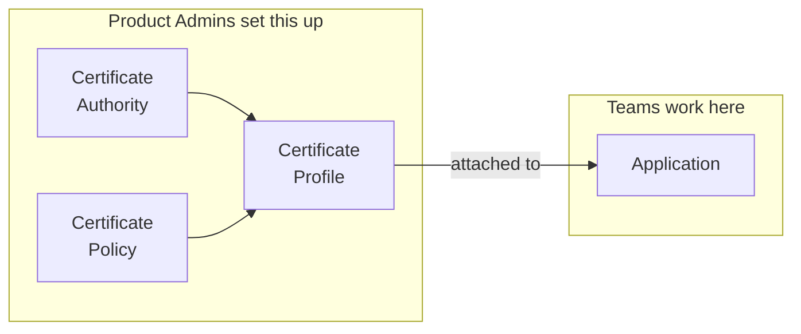

<Info>
  For PKI architects and administrators planning how their PKI will run on Infisical. Read it before
  you create your first Certificate Authority.
</Info>

This page is a reference layout for a PKI that serves multiple teams. It splits everything along one **issuance boundary**: each side of the boundary gets its own Certificate Authority, Certificate Policy, and Certificate Profile, plus one Application per service, so a certificate for one side cannot be issued from the other.

The page draws the boundary between environments (development, staging, and production), since that is the most common choice. Region, tenant, and business unit work the same way: wherever the page says environment, read your own boundary. [Choosing your boundary](#choosing-your-boundary) covers the variations, including starting with a single environment.

It works with private CAs, external providers such as Let's Encrypt or Microsoft ADCS, or both, whether you are starting from scratch or bringing a PKI you already run.

## The layout

```
Infisical
├── Certificate Authorities                  one per environment, private or external
│   ├── Production CA
│   ├── Staging CA
│   └── Development CA
│
├── Certificate Policies                     the rules
│   ├── prod-tls-rules        90 days   *.example.com
│   ├── staging-tls-rules     90 days   *.stg.example.com
│   └── dev-tls-rules         30 days   *.dev.example.com
│
├── Certificate Profiles                     what teams request from
│   ├── prod-tls-server       Production CA  + prod-tls-rules
│   ├── staging-tls-server    Staging CA     + staging-tls-rules
│   └── dev-tls-server        Development CA + dev-tls-rules
│
└── Applications                             where teams work
    ├── payments-api-prod      prod-tls-server
    ├── payments-api-staging   staging-tls-server
    ├── payments-api-dev       dev-tls-server
    ├── auth-service-prod      prod-tls-server
    ├── auth-service-staging   staging-tls-server
    └── auth-service-dev       dev-tls-server
```

The names and values throughout are one worked example. Set validity periods, key algorithms, and names to whatever your own compliance and tooling require.

Everything composes in one direction:



Policies decide what a certificate may contain. Applications decide who can get one. Product Admins own the Certificate Authorities, policies, and profiles, and they create each Application. Teams operate the Applications they are assigned to.

The rest of the page walks down the tree, one decision at a time.

## One CA per environment

A separate CA on each side is the strongest form of the boundary. If one environment's CA has to be replaced, whether it was compromised, had its credentials rotated, or moved to a different provider, every environment with its own CA carries on untouched.

With [private CAs](/documentation/platform/pki/ca/private-ca), create one root and one issuing CA per environment, sign the issuing CAs with the root, then take the root offline. If you already operate a root outside Infisical, keep it and sign the issuing CAs with it. Decide three things as you create them: [key protection](/documentation/platform/pki/settings/hsm-connectors) if the signing key belongs in your own HSM, [CA lifetimes](/documentation/platform/pki/ca/ca-renewal) comfortably longer than the certificates they issue, and whether your validators can reach the [CRL distribution point](/documentation/platform/pki/ca/crl-distribution).

With [external CAs](/documentation/platform/pki/ca/external-ca), register one per environment where the provider allows it. AWS Private CA, Microsoft ADCS, and DigiCert generally do. Public CAs often offer fewer: Let's Encrypt publishes a staging and a production directory, so development and staging share an issuer. That works, because the boundary moves down a layer to the policy, and using the staging directory below production also keeps test issuance off production rate limits.

<Note>
  Private and external CAs sit side by side. Issue internal service certificates from a private CA
  and public-facing certificates from a provider, with one CA per environment in each case.
</Note>

## One policy per environment

A policy sets what a certificate is allowed to contain: validity, allowed names, key algorithms. It holds what certificate templates hold in Microsoft ADCS. Write one per environment for each type of certificate you issue, and put that environment's naming rules inside it.

| Policy | Maximum validity | Allowed domain names | Key algorithms |
|--------|------------------|----------------------|----------------|
| `prod-tls-rules` | 90 days | `*.example.com` | ECDSA P-256, RSA-4096 |
| `staging-tls-rules` | 90 days | `*.stg.example.com` | ECDSA P-256, RSA-4096 |
| `dev-tls-rules` | 30 days | `*.dev.example.com` | ECDSA P-256, RSA-2048 |

The boundary is enforced here. A developer who asks a development Application for `payments.example.com` is refused, because `dev-tls-rules` permits only `*.dev.example.com`, and the policy and the profile above it are administered by someone else.

This example issues one type, TLS server certificates. If you also issue client certificates for service-to-service authentication, give them their own policy per environment, since they differ from browser-facing certificates in more than validity.

## One profile per policy

A profile binds a policy to the CA that signs it. This is what teams request from.

| Profile | Certificate Authority | Certificate Policy |
|---------|----------------------|--------------------|
| `prod-tls-server` | Production CA | `prod-tls-rules` |
| `staging-tls-server` | Staging CA | `staging-tls-rules` |
| `dev-tls-server` | Development CA | `dev-tls-rules` |

Give a policy and its profile different names. They are separate objects that appear side by side in tables, requests, and audit events, so distinct names keep it clear which one a sentence means. Naming both after the environment, as above, also tells anyone attaching a profile which environment they are wiring up.

## One Application per service and environment

A Product Admin creates each Application and attaches only that environment's profile. Teams operate them from there.

| Application | Profile attached | Members |
|-------------|------------------|---------|
| `payments-api-prod` | `prod-tls-server` | `payments-oncall` as Operator, `payments-team` as Auditor, `ci-payments-prod` identity as Operator |
| `payments-api-staging` | `staging-tls-server` | `payments-team` as Operator |
| `payments-api-dev` | `dev-tls-server` | `payments-team` as Operator |

Two things change across the rows. The attached profile decides what the team can produce. The membership decides who can produce it, so in production the wider team is read-only and issuance is limited to the on-call rotation and the deployment pipeline's identity. Users, groups, and machine identities can all be members; prefer groups so access follows your directory instead of a hand-maintained list, and give each pipeline its own identity per environment.

Issuance begins once an [enrollment method](/documentation/platform/pki/applications/enrollment-methods/overview) is configured on the attached profile, which the team can do itself: API for custom integrations, ACME for certbot and cert-manager, EST and SCEP for devices and MDM. Each method's endpoint is unique to one Application and profile pair, which keeps issuance on each side of the boundary separate. On production, consider [approvals](/documentation/platform/pki/applications/approvals) with machine identity bypass, so review applies to people while automated renewal continues.

Adding a service later reuses everything above. Create its Applications, attach the profiles that already exist, and the team configures its own enrollment.

## Who administers, who issues

Two different roles share the word admin. **Product Admin** is an organization-level role over the Certificate Authorities, policies, and profiles. **Application Admin** is a role inside a single Application, covering its enrollment, members, alerts, and syncs. Application Admins work strictly inside their own Application.

| Who | Product-level role | Application role |
|-----|--------------------|------------------|
| Certificate infrastructure owner | Product Admin | Not required, they administer the product |
| Service owner | Product Member | Admin on their service's Applications |
| Team engineer | Product Member | Operator in lower environments, Auditor in production |
| CI pipeline identity | Product Member | Operator on the Applications it issues for |
| Compliance reviewer | Product Member | Auditor across the Applications in scope |

Application members need the Product Member role to reach the Applications they are assigned to. Product Admins control every Certificate Authority in the organization, private and external, so keep that set small and deliberate.

## Where your current setup fits

Infisical sits on top of whatever you issue from today. Existing certificates stay valid until they expire or are revoked, and nothing needs re-issuing to adopt this layout.

| What you run today | How it comes across |
|---------------------|---------------------|
| No PKI yet, or self-signed certificates handed out ad hoc | Create private CAs in Infisical and build the layout as written. Run [Discovery](/documentation/platform/pki/discovery/overview) to catalogue what is already deployed. |
| An offline root you already operate | Keep it. Create the issuing CAs in Infisical and sign them with your root. |
| [Microsoft ADCS](/documentation/platform/pki/ca/adcs) or [Venafi](/documentation/platform/pki/ca/venafi) | Connect it as an external CA. Policies, profiles, and Applications sit on top unchanged. |
| [AWS Private CA](/documentation/platform/pki/ca/aws-pca) | Connect it as an external CA, one per environment. |
| Certificates from DigiCert, Sectigo, or Let's Encrypt | Connect the provider as an external CA. Public certificates keep coming from them. |
| Certificates nobody has catalogued | Run [Discovery](/documentation/platform/pki/discovery/overview) to build the inventory, then structure what it finds. |

## Choosing your boundary

Environment is the most common boundary, but the structure holds along whichever one you pick.

| If your organization | Then |
|----------------------|------|
| Runs one environment, or is early | Start with one CA, one policy per certificate type, and one Application per service. Add environments later by adding a CA and a policy. |
| Separates by region or tenant rather than environment | Keep the same structure and write policies along that boundary instead. |
| Has one team operating every environment | Use one Application per service, with all the environment profiles attached. Split by environment when the operators differ. |
| Uses private CAs and cannot share a trust anchor across environments | Create a separate root per environment instead of a shared root. Expect to distribute several anchors and run several root ceremonies. |
| Needs environments that cannot share administration | Put each one in its own sub-organization, described below. |

### When you need full separation

Product Admins administer every CA, policy, and profile in an organization. When environments must be administered by different people, for example under different compliance rules or across different legal entities, put each one in its own [sub-organization](/documentation/platform/sub-organizations), which sits inside your existing organization.

Each sub-organization runs its own Certificate Authorities, policies, profiles, Applications, Product Admins, and audit trail. Certificate Authorities stay within their sub-organization, so there is no shared root between them.

## Limits of this model

- **CA, policy, and profile administration is organization-wide.** Product Admins administer all of them, and that scope covers every CA and every environment. Where one environment's operators must be kept away from another environment's CA, use a sub-organization.
- **Audit visibility covers the whole product.** Anyone who can read audit logs sees all of it. The audit log export carries CA and Application in event metadata, so a reviewer can narrow an exported set, though everyone with access still sees everything.
- **Approvals cover issuance.** Approval policies gate certificate issuance and code signing. CA lifecycle actions such as create, renew, and revoke fall outside approvals today.

## Next steps

<CardGroup cols={2}>
  <Card title="Certificate Authorities" icon="building-columns" href="/documentation/platform/pki/ca/overview">
    Set up each environment's CA, private or external.
  </Card>
  <Card title="Certificate Policies" icon="shield-check" href="/documentation/platform/pki/settings/policies">
    Write the rules each environment enforces.
  </Card>
  <Card title="Applications" icon="grid-2" href="/documentation/platform/pki/applications/overview">
    Create the workspaces your teams issue certificates from.
  </Card>
  <Card title="Access Control" icon="lock" href="/documentation/platform/pki/concepts/access-control">
    The full permission model behind the roles above.
  </Card>
</CardGroup>
