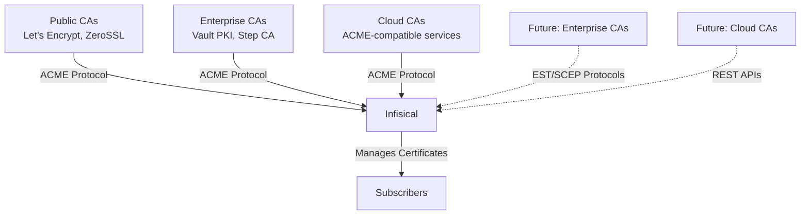

## Concept

In addition to creating a Private CA hierarchy, Infisical allows you to integrate with External Certificate Authorities (CAs) to issue digital certificates for your [subscribers](/documentation/platform/pki/subscribers). This integration enables you to leverage established certificate authority infrastructure while centralizing your certificate management within Infisical.

When you integrate an External CA with Infisical, you benefit from:

1. **Trust by Default**: Certificates issued by public CAs are trusted by default in browsers and operating systems.
2. **Unified Management**: Manage all certificates—both internally and externally issued—from a single platform.
3. **Automation**: Leverage Infisical's automation capabilities for certificate lifecycle management.
4. **Compliance**: Meet requirements for publicly trusted certificates, especially for public-facing services.
5. **Flexibility**: Choose the most appropriate CA for different use cases while maintaining consistent management.

## General Workflow

A typical workflow for integrating an External CA with Infisical consists of the following steps:

1. **Select External CA Type**: Choose the appropriate external CA based on your requirements and supported protocols.
2. **Configure Prerequisites**: Set up any required credentials, connections, or configurations specific to your chosen CA type.
3. **Register External CA**: Add the External CA configuration to your Infisical project.
4. **Create Subscribers**: Set up subscribers that use the External CA as their issuing authority.
5. **Manage Certificate Lifecycle**: Handle certificate issuance, renewal, and revocation through Infisical's unified interface.

The specific steps and requirements vary depending on the External CA type you choose to integrate.

## Supported Integration Methods

Infisical currently supports integration with External Certificate Authorities through the following protocol:

### ACME Protocol Integration

ACME (Automatic Certificate Management Environment) is a widely adopted protocol for automated certificate issuance and management. Infisical can integrate with any CA that supports the ACME protocol, including:

**Public Certificate Authorities:**
- Let's Encrypt - Free, automated SSL/TLS certificates
- ZeroSSL - Free and premium SSL certificates  
- Buypass - Norwegian CA with free ACME certificates

**Enterprise Certificate Authorities:**
- HashiCorp Vault PKI - Enterprise secret management with ACME support
- Step CA - Open-source certificate authority with ACME

**Cloud Certificate Authorities:**
- Some managed certificate services that support ACME protocol

[Learn more about ACME integration →](/documentation/platform/pki/acme-ca)

## Use Cases

External CA integration is ideal for various scenarios:

### Public-Facing Services
Use publicly trusted CAs for websites and services that need browser compatibility:
- Web applications and APIs
- Load balancers and CDNs  
- Public-facing microservices

### Compliance Requirements
Meet specific compliance standards that require certificates from accredited CAs:
- PCI DSS compliance
- SOC 2 requirements
- Industry-specific regulations

### Hybrid Infrastructure
Combine internal and external CAs for different use cases:
- Internal services with Private CAs
- Public services with External CAs
- Development vs. production environments

### Legacy System Integration
Integrate with existing enterprise PKI infrastructure:
- Windows Active Directory Certificate Services
- Network device management
- IoT device provisioning

## Benefits of Centralized Management

Managing External CAs through Infisical provides several advantages over direct CA management:

### Unified Certificate Inventory
- Single dashboard for all certificates
- Centralized expiration tracking
- Cross-CA certificate analytics

### Automated Lifecycle Management
- Automatic certificate reissuance before expiration
- Proactive expiration alerts
- Standardized certificate management processes

### Enhanced Security
- Centralized access controls
- Audit trails for all certificate operations
- Policy enforcement across CAs

### Operational Efficiency
- Reduced manual certificate management
- Consistent deployment workflows
- API-driven automation
- Integration with existing tools

## Available Integration Guides

Get started with External CA integration:

<CardGroup cols={2}>
  <Card title="ACME Protocol Integration" icon="certificate" href="/documentation/platform/pki/acme-ca">
    Set up automated certificate issuance with any ACME-compatible CA
  </Card>
  <Card title="API Integrations" icon="code" color="#gray">
    Custom CA integrations via REST APIs (Coming Soon)
  </Card>
</CardGroup>

## FAQ

<AccordionGroup>
  <Accordion title="Which External CAs does Infisical currently support?">
    Currently, Infisical supports any Certificate Authority that implements the ACME protocol, including:
    
    - **Public CAs**: Let's Encrypt, ZeroSSL, Buypass
    - **Enterprise CAs**: HashiCorp Vault PKI, Step CA  
    - **Cloud CAs**: ACME-compatible managed services
    
    Integration uses DNS-01 validation through Route53. Learn more about [supported DNS validation methods](/documentation/platform/pki/acme-ca#what-dns-validation-methods-are-supported).
    
    Support for additional integration protocols (EST, SCEP, direct APIs) is planned for future releases.
  </Accordion>
  <Accordion title="Can I use both Private CAs and External CAs in the same project?">
    Yes. You can have both Private CAs (root and intermediate) and External CAs in the same project, allowing you flexibility in how you issue certificates for different use cases. This hybrid approach enables you to:
    
    - Use Private CAs for internal services and applications
    - Use External CAs for public-facing services
    - Apply consistent management practices across all certificate types
    - Implement appropriate security controls based on certificate usage
  </Accordion>
  <Accordion title="What types of certificates can I issue through External CAs?">
    The types of certificates you can issue depend on the External CA provider and type:
    
    - **Public CAs**: Typically support Domain Validation (DV) certificates, with some offering Organization Validation (OV)
    - **Enterprise CAs**: Support internal certificates, device certificates, and custom certificate types
    - **Cloud CAs**: Support various certificate types depending on the service
    
    Certificate capabilities vary by provider and integration method.
  </Accordion>
  <Accordion title="How does certificate renewal work with External CAs?">
    Certificate reissuance is handled automatically by Infisical based on the CA type:
    
    - **Public CAs**: Automatic reissuance using ACME protocol with the same certificate extensions before expiration
    - **Other CA types**: Certificate management methods depend on the specific integration (when available)
    
    All certificate lifecycle events are tracked and managed through Infisical's unified interface, ensuring continuous certificate validity.
  </Accordion>
  <Accordion title="What authentication methods are supported for External CAs?">
    Authentication methods vary by CA type:
    
    - **Public CAs**: ACME account registration with email and account keys
    - **Enterprise CAs**: Client certificates, username/password, or domain authentication (when available)
    - **Cloud CAs**: API keys, OAuth tokens, or service account authentication (when available)
    
    Infisical securely stores and manages all authentication credentials.
  </Accordion>
  <Accordion title="Can I enforce policies on certificates from External CAs?">
    Yes, Infisical provides policy enforcement capabilities:
    
    - Certificate template constraints
    - Monitoring and alerting policies
    - Access controls for certificate operations
    
    These policies ensure consistent governance across both internal and external certificate sources.
  </Accordion>
</AccordionGroup>