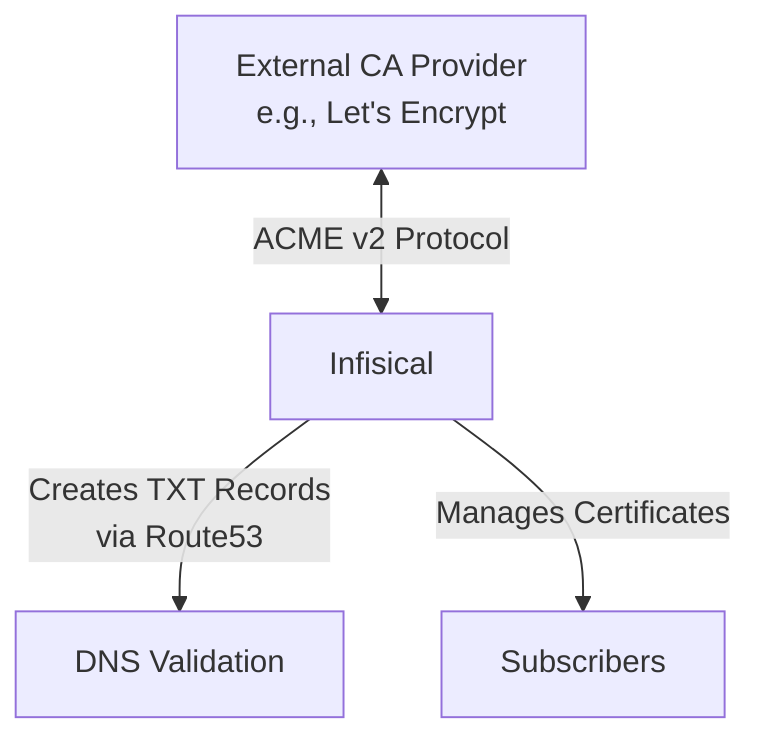

## Concept

In addition to creating a Private CA hierarchy, Infisical allows you to integrate with External Certificate Authorities (CAs) to issue digital certificates for your [subscribers](/documentation/platform/pki/subscribers). This integration enables you to leverage established public CA infrastructure while centralizing your certificate management within Infisical.

<div align="center">



</div>

When you integrate an External CA with Infisical, you benefit from:

1. **Trust by Default**: Certificates issued by public CAs like Let's Encrypt are trusted by default in browsers and operating systems.
2. **Unified Management**: Manage all certificates—both internally and externally issued—from a single platform.
3. **Automation**: Leverage Infisical's automation capabilities for certificate lifecycle management.
4. **Compliance**: Meet requirements for publicly trusted certificates, especially for public-facing services.

## Workflow

A typical workflow for integrating an External CA with Infisical consists of the following steps:

1. Configuring DNS provider credentials in Infisical to enable automatic domain validation.
2. Registering an External CA provider with Infisical using the ACME v2 protocol.
3. Creating subscribers that use the External CA as their issuing authority.
4. Managing certificate lifecycle events such as certificate issuance, renewal, and revocation.

<Note>
  Currently, Infisical supports integrating with External CAs via the ACME v2 protocol with DNS-01 validation through Route53 as the DNS provider. Additional integration methods and DNS providers will be supported in future releases.
</Note>

## Understanding ACME DNS-01 Challenge

The DNS-01 challenge is one method used by ACME CA providers to verify that you control a domain before issuing a certificate. Here's how Infisical handles this process:

1. **Challenge Request**: When you request a certificate, Let's Encrypt (or another ACME provider) issues a challenge token.

2. **DNS Record Creation**: Infisical creates a TXT record at `_acme-challenge.<YOUR_DOMAIN>` with a value derived from the challenge token.

3. **DNS Propagation**: The TXT record must propagate through the DNS system (usually takes a few minutes, depending on TTL settings).

4. **Validation**: The ACME provider checks for the existence of this TXT record to verify domain control.

5. **Cleanup**: After validation completes successfully, Infisical automatically removes the TXT record from your DNS.

This automated process eliminates the need for manual intervention in domain validation, streamlining certificate issuance.

## Guide to Registering an External CA

In the following steps, we explore how to register an External CA with Infisical using the ACME v2 protocol with Route53 for DNS-01 validation.

### Step 1: Set Up AWS Connection with Required Permissions

Before proceeding with the External CA registration, you need to set up an AWS connection with the appropriate permissions for DNS validation:

1. Navigate to your Organization Settings > App Connections and create a new AWS connection.

2. Ensure your AWS connection has the following minimum permissions for Route53 DNS validation:

```json
{
  "Version": "2012-10-17",
  "Statement": [
    {
      "Effect": "Allow",
      "Action": "route53:GetChange",
      "Resource": "arn:aws:route53:::change/*"
    },
    {
      "Effect": "Allow",
      "Action": "route53:ListHostedZonesByName",
      "Resource": "*"
    },
    {
      "Effect": "Allow",
      "Action": [
        "route53:ListResourceRecordSets"
      ],
      "Resource": [
        "arn:aws:route53:::hostedzone/YOUR_HOSTED_ZONE_ID"
      ]
    },
    {
      "Effect": "Allow",
      "Action": [
        "route53:ChangeResourceRecordSets"
      ],
      "Resource": [
        "arn:aws:route53:::hostedzone/YOUR_HOSTED_ZONE_ID"
      ],
      "Condition": {
        "ForAllValues:StringEquals": {
          "route53:ChangeResourceRecordSetsRecordTypes": [
            "TXT"
          ]
        }
      }
    }
  ]
}
```

Replace `YOUR_HOSTED_ZONE_ID` with your actual Route53 hosted zone ID.

For detailed instructions on setting up an AWS connection, see the [AWS Connection](/integrations/app-connections/aws) documentation.

### Step 2: Create External Certificate Authority

<Tabs>
  <Tab title="Infisical UI">
<Steps>
    <Step title="Registering an External CA">
        To register an External CA, head to your Project > Internal PKI > Certificate Authorities and press the **+** button in the External Certificate Authorities section.

        

        Fill out the details for the External CA registration:

        

        Here's guidance on each field:

        - Type: Select "ACME" as the External CA type.
        - Name: Enter a name for the External CA (e.g., "lets-encrypt-production").
        - DNS App Connection: Select from available DNS app connections or configure a new one. This connection provides Infisical with the credentials needed to create and remove DNS records for ACME validation.
        - Hosted Zone ID: Enter your Route53 hosted zone ID (e.g., Z04044I124N1GOOMCOYX1) for the domain(s) you'll be requesting certificates for.
        - Directory URL: Enter the ACME v2 directory URL for your chosen CA provider (e.g., `https://acme-v02.api.letsencrypt.org/directory` for Let's Encrypt).
        - Account Email: Email address to associate with your ACME account. This email will receive important notifications about your certificates.
        - Disable Direct Issuance: Toggle on to require subscribers for issuance (recommended).

        Finally, press **Create** to register the External CA with Infisical.
    </Step>
    <Step title="Managing External CAs">
        Once registered, your External CA will appear in the External Certificate Authorities section.

        

        From here, you can:
        
        - View the status of the External CA registration
        - Edit the configuration settings
        - Disable or re-enable the External CA
        - Delete the External CA registration if no longer needed

        You can now use this External CA to issue certificates for your subscribers directly.

        Check out the [Subscribers](/documentation/platform/pki/subscribers) page to learn more about how to issue X.509 certificates using your registered External CA.
    </Step>
</Steps>
  </Tab>
  <Tab title="API">
    To register an External CA with Infisical using the API, make a request to the Create External CA endpoint:
    
    ### Sample request
    
    ```bash Request
    curl 'https://app.infisical.com/api/v1/pki/ca/acme' \
      -H 'Authorization: Bearer <your-access-token>' \
      -H 'Content-Type: application/json' \
      --data-raw '{
        "projectId": "0fccb6ee-1381-4ff1-8d5f-0cb93c6cc4d6",
        "name": "lets-encrypt-production",
        "type": "acme",
        "status": "active",
        "disableDirectIssuance": false,
        "configuration": {
          "dnsAppConnection": {
            "id": "1e5f8c0d-09d2-492c-9b28-469acd8e841b",
            "name": "acme-dns-test-connection"
          },
          "dnsProviderConfig": {
            "provider": "route53",
            "hostedZoneId": "Z040441124N1GOOMCQYX1"
          },
          "directoryUrl": "https://acme-v02.api.letsencrypt.org/directory",
          "accountEmail": "sheen@infisical.com",
          "dnsAppConnectionId": "1e5f8c0d-09d2-492c-9b28-469acd8e841b"
        }
      }'
    ```
    
    ### Sample response
    
    ```bash Response
    {
        "id": "c48b701e-a20c-4a9a-8119-68f54e5fbb05",
        "name": "lets-encrypt-production",
        "type": "acme",
        "status": "active",
        "projectId": "0fccb6ee-1381-4ff1-8d5f-0cb93c6cc4d6",
        "disableDirectIssuance": false,
        "configuration": {
            "accountEmail": "sheen@infisical.com",
            "directoryUrl": "https://acme-v02.api.letsencrypt.org/directory",
            "dnsAppConnection": {
            "id": "1e5f8c0d-09d2-492c-9b28-469acd8e841b",
            "name": "acme-dns-test-connection"
            },
            "dnsAppConnectionId": "1e5f8c0d-09d2-492c-9b28-469acd8e841b",
            "dnsProviderConfig": {
            "provider": "route53",
            "hostedZoneId": "Z040441124N1GOOMCQYX1"
            }
        }
    }
    ```
  </Tab>
</Tabs>

## Example: Integrating with Let's Encrypt

Let's Encrypt is one of the most popular free, automated, and open Certificate Authorities. Here's a step-by-step example of integrating Infisical with Let's Encrypt using ACME v2:

1. **Prepare your Route53 setup**:
   - Ensure your domain's DNS is hosted on Route53
   - Note your hosted zone ID from the Route53 console
   - Create AWS credentials with appropriate permissions as detailed above

2. **Configure the integration in Infisical**:
   - Type: ACME
   - Name: lets-encrypt-production
   - Directory URL: `https://acme-v02.api.letsencrypt.org/directory` (Note: this is the ACME v2 endpoint)
   - Account Email: Your email address for Let's Encrypt notifications
   - Hosted Zone ID: Your Route53 hosted zone ID

3. **Issue certificates**:
   - Create a subscriber in Infisical specifying the Let's Encrypt External CA as the issuing authority
   - Request certificates with domains that match records in your Route53 hosted zone
   - When a certificate is requested, Infisical will:
     1. Generate a key pair for the certificate
     2. Send a Certificate Signing Request (CSR) to Let's Encrypt
     3. Receive a DNS-01 challenge from Let's Encrypt
     4. Create a TXT record in Route53 to satisfy the challenge
     5. Notify Let's Encrypt that the challenge is ready for validation
     6. Once validated, Let's Encrypt will issue the certificate
     7. Infisical will store and manage the certificate for your subscriber

<Note>
  Let's Encrypt has rate limits that may affect your certificate issuance. For testing purposes, you can use Let's Encrypt's staging environment by setting the Directory URL to `https://acme-staging-v02.api.letsencrypt.org/directory`. Certificates issued through the staging environment are not trusted by browsers but allow you to test your setup without hitting production rate limits.
</Note>

## FAQ

<AccordionGroup>
  <Accordion title="What DNS validation methods are supported?">
    Currently, Infisical supports DNS validation through AWS Route53. Support for additional DNS providers is planned for future releases.
  </Accordion>
  <Accordion title="Can I use both Private CAs and External CAs in the same project?">
    Yes. You can have both Private CAs (root and intermediate) and External CAs in the same project, allowing you flexibility in how you issue certificates for different use cases. This hybrid approach enables you to:
    
    - Use Private CAs for internal services and applications
    - Use External CAs for public-facing services
    - Apply consistent management practices across all certificate types
    - Implement appropriate security controls based on certificate usage
  </Accordion>
  <Accordion title="What types of certificates can I issue through an External CA?">
    The types of certificates you can issue depend on the External CA provider. Most ACME providers support domain validation (DV) certificates. For organization validation (OV) or extended validation (EV) certificates, you may need to use a different integration method which will be supported in future releases.
  </Accordion>
  <Accordion title="Can I automate certificate renewal with External CAs?">
    Yes. Certificates issued through External CAs connected to Infisical can be automatically renewed before expiry, ensuring continuous certificate validity without manual intervention. This automation eliminates one of the most common causes of TLS-related outages.
  </Accordion>
  <Accordion title="Will other External CA integration methods be supported?">
    Yes. In addition to ACME, Infisical plans to support other integration methods with popular External CA providers in future releases. Stay tuned for updates.
  </Accordion>
  <Accordion title="How does Infisical's External CA integration help with certificate management?">
    Infisical's External CA integration provides a complete certificate lifecycle management solution that offers:
    
    1. **Automated renewals**: Certificates are automatically renewed before expiry
    2. **Centralized visibility**: All certificates are tracked in one place
    3. **Audit trails**: Complete history of certificate issuance and revocation
    4. **Programmatic access**: API-driven certificate issuance for automation
    5. **Consistent processes**: Standardized workflows for certificate requests across different CAs
    6. **Deployment**: Integration with your infrastructure for certificate distribution
    7. **Monitoring**: Visibility into certificate status and upcoming expirations
    8. **Revocation**: Centralized management of certificate revocation when needed
    
    This end-to-end management eliminates common challenges like expired certificates, scattered certificate storage, and manual renewal processes that often lead to outages.
  </Accordion>
</AccordionGroup>