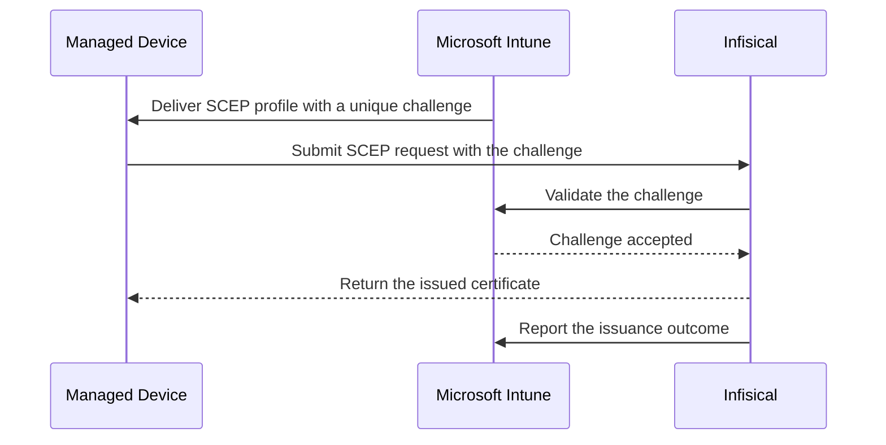

Issue certificates to devices managed by [Microsoft Intune](https://learn.microsoft.com/en-us/mem/intune/) using Infisical's [SCEP enrollment](/documentation/platform/pki/applications/enrollment-methods/scep). Intune delivers a certificate profile to each managed device, and Infisical validates every request with Intune before issuing a certificate.

Because Intune vouches for each individual request, you never distribute a shared challenge password to devices, and every certificate Infisical issues is recorded against the device that asked for it in Intune.

<Info>
  This guide is for administrators who manage both Microsoft Intune and Infisical Certificate Manager. If your devices are managed by a different MDM tool, see the [Jamf Pro guide](/documentation/platform/pki/guides/applications/jamf-pro-scep) or use a static or dynamic challenge as described in [SCEP Enrollment](/documentation/platform/pki/applications/enrollment-methods/scep).
</Info>

## How It Works

Intune generates a unique, single-use challenge for each device and seals it inside the SCEP request. Infisical asks Intune to confirm the challenge, issues the certificate, and reports the outcome back to Intune so the certificate appears against the device record.

Every step happens inside a single request. Intune has no pending state, so anything that prevents Infisical from issuing immediately is reported to Intune as a failed enrollment rather than left waiting for a later decision.

## Prerequisites

- A Microsoft Entra ID tenant with Microsoft Intune enabled, and permission to grant admin consent
- An Infisical [internal CA](/documentation/platform/pki/ca/private-ca) and a [certificate profile](/documentation/platform/pki/settings/profiles) using it
- An [Application](/documentation/platform/pki/applications/overview) with that profile attached
- One or more devices enrolled in Intune

<Note>
  Intune validation currently supports profiles backed by an internal CA, and the profile must have no [approval policy](/documentation/platform/pki/applications/approvals) applied to it. Intune has no pending state, so a request held for review cannot complete. Infisical rejects both combinations when you configure the enrollment.
</Note>

## Guide

<Steps>
    <Step title="Register an application in Microsoft Entra ID">
        Infisical authenticates to Intune with a client secret and requires two application permissions.

        Follow [Setup Azure application](/integrations/app-connections/microsoft-intune#setup-azure-application) to register the application, assign the permissions below, grant admin consent, and collect the credentials.

        | Permission | API | Purpose |
        |------------|-----|---------|
        | `Application.Read.All` | Microsoft Graph | Endpoint discovery |
        | `scep_challenge_provider` | Microsoft Intune | Challenge validation |

        

        Collect the **Directory (tenant) ID**, **Application (client) ID**, and **Client Secret**.
    </Step>

    <Step title="Create the Microsoft Intune App Connection">
        Follow [Microsoft Intune Connection](/integrations/app-connections/microsoft-intune) to create the connection using the credentials from the previous step.

        Infisical verifies the credentials when you save the connection, so a successful save confirms that the permissions were granted correctly.

        <Note>
          Microsoft Intune is an enterprise App Connection and requires a paid plan.
        </Note>
    </Step>

    <Step title="Configure SCEP enrollment in Infisical">
        Open **Applications** and select your Application, go to the **Settings** tab, then open the row menu on the profile you want to use and choose **Configure Enrollment**.

        

        Add the **SCEP** enrollment method and set:

        - **Challenge Type**: `Microsoft Intune`
        - **Microsoft Intune connection**: the connection created above
        - **Sign RA certificate with the CA**: enabled

        

        <Warning>
          **Sign RA certificate with the CA is required for Intune.** It makes Infisical's SCEP identity chain to the CA certificate you deploy in the next steps. Left disabled, Intune rejects Infisical's response before any device submits a certificate request, so Infisical requires the option for Intune validation. It cannot be changed once SCEP enrollment exists, so set it before saving.
        </Warning>

        Copy the **SCEP endpoint URL** shown on the enrollment.
    </Step>

    <Step title="Download the CA certificate">
        Devices must trust the CA that issues their certificates, which is the CA behind the profile you just configured.

        Navigate to **Certificate Authorities**, open that CA, and in the **CA Certificates** section select **Download CA Certificate**.

        <Note>
          Infisical exports the certificate as `cert.pem`. Intune's upload field expects a `.cer` extension, so rename the file to `cert.cer` before uploading it.
        </Note>

        

        <Note>
          If that CA is an intermediate, devices must trust the CAs above it as well. Select **Download CA Certificate Chain** to get them, and create one Trusted certificate profile per certificate in the next step, since each profile holds a single certificate.
        </Note>
    </Step>

    <Step title="Create the Trusted certificate profile in Intune">
        This profile installs the CA certificate onto each device. Create it before the SCEP profile, because the SCEP profile references it.

        Create a separate profile for each device platform you support.

        1. In the [Microsoft Intune admin center](https://intune.microsoft.com), go to **Devices** > **Configuration** and click **Create** > **New Policy**.

            

        2. Select your **Platform**, set **Profile type** to **Templates**, then choose **Trusted certificate**. The screenshots here use macOS, and the same steps apply to Windows and the other platforms.

            

        3. Give the profile a name, for example `Infisical Issuing CA`.
        4. On Apple platforms, set **Deployment Channel**. Select **Device Channel** to install the certificate for every user on the device, and **User Channel** only where the certificate must be scoped to a single user. Microsoft's requirement is that this profile be assigned to the same groups as the SCEP profile, so align the assignments rather than the channels.
        5. Upload the `.cer` file from the previous step.
        6. Assign the profile to the device or user groups that will receive certificates, then create it.

        <Note>
          Windows profiles have no Deployment Channel. They add a **Destination Store** field instead, offering **Computer certificate store - Root**, **Computer certificate store - Intermediate**, and **User certificate store - Intermediate**. Choose the Root store for a root CA and an Intermediate store for an intermediate.
        </Note>

        

        <Note>
          Infisical's SCEP identity needs no profile of its own. Because you signed it with your CA in the previous step, this profile already establishes trust for it.
        </Note>
    </Step>

    <Step title="Create the SCEP certificate profile in Intune">
        1. Go to **Devices** > **Configuration** and click **Create** > **New Policy** again.
        2. Select the same **Platform**, set **Profile type** to **Templates**, then choose **SCEP certificate**.

            

        3. Set the two values this integration depends on:

        | Setting | Value |
        |---------|-------|
        | **Root Certificate** | The Trusted certificate profile created above |
        | **SCEP Server URLs** | The **SCEP endpoint URL** copied from Infisical |

        Then set the subject name format and subject alternative name to what your devices require, and complete the remaining fields. **Certificate type** governs what those two fields may contain: user attributes, or device attributes only.

        The remaining settings fall into two groups. Some travel to Infisical in the device's certificate request and shape the certificate it issues. Intune never sends the others and does not check them against the certificate it receives, so the Infisical certificate profile decides those values:

        | Where the issued value comes from | Settings |
        |----------------------------|----------|
        | The device's request | **Subject name format**, **Subject alternative name**, **Key size**, **Key usage** |
        | The Infisical certificate profile | **Certificate validity period**, **Extended key usage** |

        

        <Warning>
          **Mirror these values on the Infisical certificate profile.** Intune reports the enrollment as successful without checking the validity period or extended key usages of the certificate it receives, so any divergence passes silently. Set the Infisical profile's TTL and extended key usages to match the values you enter here. A profile with no TTL defaults to 90 days, and a profile whose extended key usages are unset or empty issues certificates that carry none. The profile's [certificate policy](/documentation/platform/pki/settings/policies) must also permit these values, otherwise issuance fails after Intune has already validated the challenge.
        </Warning>

    </Step>

    <Step title="Assign and create the profile">
        Assign the SCEP profile to the same groups as the Trusted certificate profile, then review and create it.

        
    </Step>

    <Step title="Verify certificate issuance">
        Sync a target device, or wait for its next check-in.

        - In Intune, open the SCEP profile and confirm **Device and user check-in status** reports **Succeeded**.
        - Open the **Certificates** report on that profile to see each issued certificate with its thumbprint, serial number, and subject.
        - On the device, confirm the certificate is installed. On Windows use `certlm.msc` or `certmgr.msc`, and on macOS use **Keychain Access**.
        - In Infisical, open your Application and confirm the same certificates appear in the certificate list.

        
    </Step>
</Steps>

## Troubleshooting

<AccordionGroup>
  <Accordion title="Enrollment fails immediately with a validation error">
    Infisical asked Intune to validate the challenge and Intune declined. Common causes:

    - The Entra application is missing `scep_challenge_provider`, or admin consent was never granted
    - The client secret has expired
    - The request came from a device that Intune does not consider enrolled, or the profile was not actually assigned to it

    Check the audit log in Infisical for the SCEP enrollment event, which records the reason reported by Intune.
  </Accordion>
  <Accordion title="Enrollment returns a failure even though the challenge was accepted">
    The challenge passed but issuance did not complete. Either the requested certificate violates the certificate policy, or the profile is attached to an approval policy and the request is waiting for review.

    Intune has no pending state, so Infisical reports these to Intune as failures rather than leaving the device polling. Use a profile with no approval policy for Intune validation.
  </Accordion>
  <Accordion title="The device receives a certificate but does not trust it">
    The Trusted certificate profile did not reach the device. Confirm it is assigned to the same groups as the SCEP profile, that it uploaded the certificate of the CA behind your profile, and on Windows that the **Destination Store** matches the CA type: the Root store for a root CA, an Intermediate store for an intermediate.
  </Accordion>
</AccordionGroup>

## FAQ

<AccordionGroup>
  <Accordion title="How do certificates renew?">
    Intune re-enrolls the device through the same SCEP profile when the certificate reaches the profile's **Renewal threshold**, and that request carries a fresh challenge just like the first enrollment.

    Infisical's **Allow Certificate-Based Renewal** option stays off for Intune validation, because renewing against an existing certificate would skip the challenge and bypass Intune's per-request validation.
  </Accordion>
  <Accordion title="Which certificate authorities can I use?">
    Intune validation currently supports profiles backed by an internal CA. Attach an internal-CA-backed profile to your Application and configure SCEP enrollment on that profile.
  </Accordion>
  <Accordion title="Do I need separate profiles for each device platform?">
    Yes. Intune configuration profiles are platform-specific, so each platform you support needs its own Trusted certificate profile and SCEP certificate profile. The Infisical side is shared: every platform can point at the same SCEP endpoint URL.

    Which SCEP profile fields Intune offers also depends on the platform. **Key storage provider** appears on Windows, **Hash algorithm** on Windows and Android, and **Deployment Channel** on Apple platforms. See [Use SCEP certificate profiles with Microsoft Intune](https://learn.microsoft.com/en-us/mem/intune/protect/certificates-profile-scep) for the full field list.
  </Accordion>
  <Accordion title="Can I change the Deployment Channel on a profile I already deployed?">
    No. Unlike the other fields, the deployment channel is fixed once the profile is deployed, so switching channels means creating a new profile. The channel decides which keychain holds the certificate: the Device Channel uses the system keychain, and the User Channel uses the user keychain. On macOS, a profile assigned to the user channel supports only the **User** certificate type.
  </Accordion>
  <Accordion title="Can one Infisical profile serve both Intune devices and other SCEP clients?">
    No. The challenge type belongs to the SCEP enrollment, so a profile set to Microsoft Intune validation only accepts challenges that Intune issued. Attach a second certificate profile to the Application with a static or dynamic challenge to serve clients that Intune does not manage.
  </Accordion>
</AccordionGroup>

## What's Next?

<CardGroup cols={2}>
  <Card title="SCEP Enrollment" icon="mobile" href="/documentation/platform/pki/applications/enrollment-methods/scep">
    Learn more about SCEP enrollment configuration.
  </Card>
  <Card title="Microsoft Intune Connection" icon="windows" href="/integrations/app-connections/microsoft-intune">
    Review the App Connection setup and credentials.
  </Card>
  <Card title="Certificate Policies" icon="shield-halved" href="/documentation/platform/pki/settings/policies">
    Control what certificates this profile can issue.
  </Card>
  <Card title="Alerting" icon="bell" href="/documentation/platform/pki/applications/alerting/overview">
    Get notified when certificates are about to expire.
  </Card>
</CardGroup>
