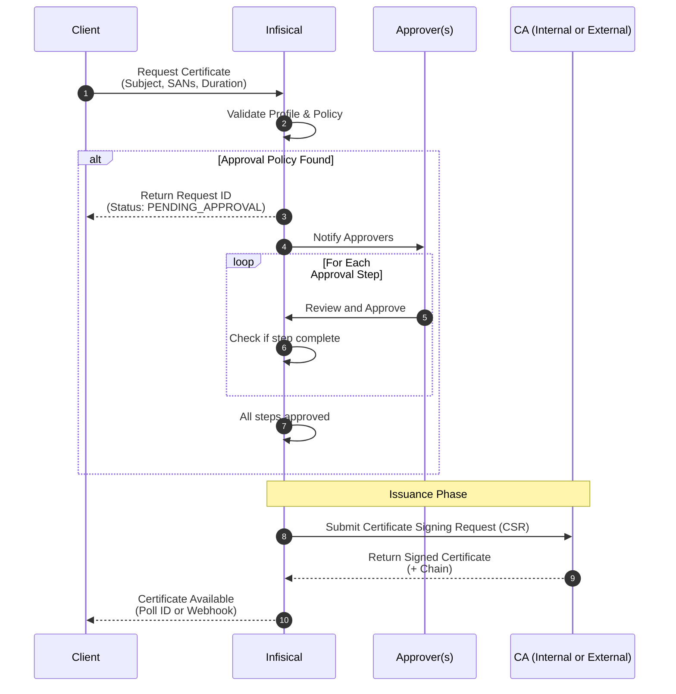

This guide walks through setting up [approval workflows](/documentation/platform/pki/approvals) for certificate issuance. Approval workflows add a human review step before certificates are issued, helping enforce separation of duties and meet compliance requirements.

## Diagram

The following sequence diagram illustrates the certificate issuance workflow when an approval policy is configured.



## Guide

In the following steps, we set up an approval workflow for certificate issuance.

<Steps>
  <Step title="Create a certificate authority">
    First, follow the guide to create a [certificate authority](/documentation/platform/pki/ca/overview) to issue certificates from.
  </Step>
  <Step title="Create a certificate policy">
    Next, create a [certificate policy](/documentation/platform/pki/certificates/policies) that defines permitted certificate attributes. See the [guide to creating a certificate policy](/documentation/platform/pki/certificates/policies#guide-to-creating-a-certificate-policy) for detailed instructions.
  </Step>
  <Step title="Create a certificate profile">
    Create a [certificate profile](/documentation/platform/pki/certificates/profiles) that references your CA and certificate policy. See the [guide to creating a certificate profile](/documentation/platform/pki/certificates/profiles#guide-to-creating-a-certificate-profile) for detailed instructions.

    Select an [enrollment method](/documentation/platform/pki/enrollment-methods/overview) (API, ACME, or EST) based on how certificates will be requested.
  </Step>
  <Step title="Create an approval policy">
    Navigate to your Certificate Management Project > Certificate Manager > Approvals > Policies and click **Create Policy**. See the [guide to creating an approval policy](/documentation/platform/pki/approvals#guide-to-creating-an-approval-policy) for detailed instructions.

    Configure the policy:

    1. **Configuration Step**:
       - Enter a descriptive policy name (e.g., `production-cert-approval`)
       - Optionally set a maximum request TTL (e.g., `7d` for requests to expire after 7 days)
       - Select the certificate profile(s) that require approval
       - Optionally enable bypass for [machine identities](/documentation/platform/identities/machine-identities) if automated workloads need to issue certificates without approval

    2. **Approval Sequence Step**:
       - Add one or more approval steps
       - For each step, select the users or groups who can approve
       - Set the required number of approvals per step
       - Enable notifications to alert approvers when their review is needed

    3. **Review Step**:
       - Review your configuration and click **Create**

  </Step>
  <Step title="Request a certificate">
    Request a certificate using your chosen enrollment method:

    - **[API](/documentation/platform/pki/enrollment-methods/api)**: Make a request to the [Issue Certificate](/api-reference/endpoints/certificates/create-certificate) endpoint
    - **[ACME](/documentation/platform/pki/enrollment-methods/acme)**: Use an ACME client to request a certificate
    - **[EST](/documentation/platform/pki/enrollment-methods/est)**: Use an EST client to enroll for a certificate

    Since an approval policy is configured, the request will be placed in a `PENDING_APPROVAL` status.

    ### Sample API Request

    ```bash
    curl --location --request POST 'https://app.infisical.com/api/v1/cert-manager/certificates' \
      --header 'Authorization: Bearer <access-token>' \
      --header 'Content-Type: application/json' \
      --data-raw '{
          "profileId": "<profile-id>",
          "attributes": {
            "commonName": "example.com",
            "altNames": [
              { "type": "DNS", "value": "www.example.com" }
            ],
            "ttl": "365d"
          }
      }'
    ```

    ### Sample Response (Pending Approval)

    ```json
    {
      "status": "PENDING_APPROVAL",
      "certificateRequestId": "<request-id>",
      "message": "Certificate request requires approval",
      "projectId": "<project-id>"
    }
    ```

  </Step>
  <Step title="Approve the request">
    Navigate to your Certificate Management Project > Certificate Manager > Approvals > Requests.

    1. Find the pending request in the list
    2. Click on it to view the details
    3. Review the certificate request information:
       - Requester identity
       - Common name and SANs
       - Key usages and validity period
    4. Click **Approve** to approve the request (or **Reject** to deny it)

    If the policy has multiple approval steps, the request advances to the next step after each approval.

    Once all approval steps are complete, the certificate is automatically issued.

  </Step>
  <Step title="Retrieve the issued certificate">
    After approval, retrieve the certificate using the certificate request ID or by fetching the latest certificate from the profile:

    ### Get Certificate by Request ID

    ```bash
    curl --location --request GET 'https://app.infisical.com/api/v3/cert-manager/certificate-requests/<request-id>' \
      --header 'Authorization: Bearer <access-token>'
    ```

  </Step>
</Steps>
