import RequestCertSetup from "/snippets/documentation/platform/pki/guides/request-cert-setup.mdx";

The [ACME enrollment method](/documentation/platform/pki/enrollment-methods/acme) lets any [ACME client](https://letsencrypt.org/docs/client-options/) obtain TLS certificates from Infisical using the [ACME protocol](https://en.wikipedia.org/wiki/Automatic_Certificate_Management_Environment).
This includes ACME clients like [Certbot](https://certbot.eff.org/), [cert-manager](https://cert-manager.io/) in Kubernetes using the [ACME issuer type](https://cert-manager.io/docs/configuration/acme/), and more.

Infisical currently supports the [HTTP-01 challenge type](https://letsencrypt.org/docs/challenge-types/#http-01-challenge) for domain validation as part of the ACME enrollment method.

## Diagram

The following sequence diagram illustrates the certificate enrollment workflow for requesting a certificate via ACME from Infisical.

```mermaid
sequenceDiagram
  autonumber
  participant ACME as ACME Client
  participant Infis as Infisical ACME Server
  participant Authz as HTTP-01 Challenge<br/>Validation Endpoint
  participant CA as CA<br/>(Internal or External)

  Note over ACME: ACME Client discovers<br/>Infisical ACME Directory URL

  ACME->>Infis: GET /directory
  Infis-->>ACME: Directory + nonce + endpoints

  ACME->>Infis: HEAD /new-nonce
  Infis-->>ACME: Return nonce in Replay-Nonce header

  ACME->>Infis: POST /new-account<br/>(contact, ToS agreed)
  Infis-->>ACME: Return account object

  Note over ACME,Infis: Requesting a certificate

  ACME->>Infis: POST /new-order<br/>(identifiers: DNS names)
  Infis-->>ACME: Return order<br/>with authorization URLs

  loop For each authorization (one per DNS name)
    ACME->>Infis: POST /authorizations/:authzId
    Infis-->>ACME: Return HTTP-01 challenge<br/>(URL + token + keyAuth)

    Note over ACME: Client must prove control<br/>over the domain via HTTP

    ACME->>Authz: Provision challenge response<br/>at<br/>/.well-known/acme-challenge/<token>

    ACME->>Infis: POST /authorizations/:authzId/challenges/:challengeId<br/>(trigger validation)

    Infis->>Authz: HTTP GET /.well-known/acme-challenge/<token>
    Authz-->>Infis: Return keyAuth

    Infis-->>ACME: Authorization = valid
  end

  Note over Infis: All authorizations valid → ready to finalize

  ACME->>ACME: Generate keypair locally<br/>and create CSR
  ACME->>Infis: POST /orders/:orderId/finalize<br/>(CSR)

  Infis->>CA: Request certificate issuance<br/>(CSR)
  CA-->>Infis: Signed certificate (+ chain)

  Infis-->>ACME: Return order with certificate URL<br/>(status: valid)

  ACME->>Infis: POST /orders/:orderId/certificate
  Infis-->>ACME: Return certificate<br/>and certificate chain
```

## Guide

In the following steps, we explore an end-to-end workflow for obtaining a certificate via ACME with Infisical.

<Steps>
  <RequestCertSetup />
  <Step title="Create a certificate profile">
    Next, follow the guide [here](/documentation/platform/pki/certificates/profiles#guide-to-creating-a-certificate-profile) to create a [certificate profile](/documentation/platform/pki/certificates/profiles)
    that will be referenced when requesting a certificate.

    The certificate profile specifies which certificate policy and issuing CA should be used to validate an incoming certificate request and issue a certificate;
    it also specifies the [enrollment method](/documentation/platform/pki/enrollment-methods/overview) for how certificates can be requested against this profile
    to begin with.
    
    You should specify the certificate policy from Step 2, the issuing CA from Step 1, and the **ACME** option in the **Enrollment Method** dropdown when creating the certificate profile.

  </Step>
  <Step title="Request a certificate">
    Finally, follow the guide [here](/documentation/platform/pki/enrollment-methods/acme#guide-to-certificate-enrollment-via-acme) to request a certificate against the certificate profile
    using an [ACME client](https://letsencrypt.org/docs/client-options/).
    
    The ACME client will connect to Infisical's ACME server at the **ACME Directory URL** and authenticate using the **EAB Key Identifier (KID)** and **EAB Secret** credentials as part of the ACME protocol.

    The typical ACME workflow looks likes this:

    - The ACME client creates (or reuses) an ACME account with Infisical using EAB credentials.
    - The ACME client creates an order for one or more DNS names.
    - For each DNS name, the ACME client receives an `HTTP-01` challenge and provisions the corresponding token response at `/.well-known/acme-challenge/&lt;token&gt;`.
    - Once all authorizations are valid, the ACME client finalizes the order by sending a CSR to Infisical.
    - Infisical issues the certificate from the issuing CA on the certificate profile and returns it (plus the chain) back to the ACME client.

    ACME clients typically handle renewal by tracking certificate expiration and completing the lifecycle once again to request a new certificate.

    <Note>
        We recommend reading more about the ACME protocol [here](https://letsencrypt.org/how-it-works/).
    </Note>

  </Step>
</Steps>
