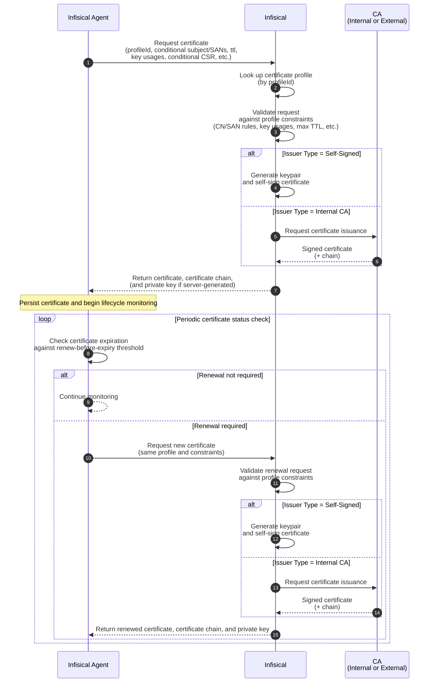

import RequestCertSetup from "/snippets/documentation/platform/pki/guides/request-cert-setup.mdx";

The [Infisical Agent](/integrations/platforms/certificate-agent) is an installable client daemon that can request TLS and other X.509 certificates from Infisical using the [API enrollment method](/documentation/platform/pki/enrollment-methods/api) configured on a [certificate profile](/documentation/platform/pki/certificates/profiles), persist it to a specified path on the filesystem, and automatically monitor and renew it before expiration.

Instead of [manually requesting](/documentation/platform/pki/guides/request-cert-api) and renewing a certificate via the [Issue Certificate](/api-reference/endpoints/certificates/create-certificate) API endpoint, you can install and launch the Infisical Agent to have it perform these steps for you automatically.

## Diagram



## Guide

In the following steps, we explore an end-to-end workflow for requesting and continuously renewing a certificate using the Infisical Agent.

<Steps>
  <RequestCertSetup />
  <Step title="Create a certificate profile">
    Next, follow the guide [here](/documentation/platform/pki/certificates/profiles#guide-to-creating-a-certificate-profile) to create a [certificate profile](/documentation/platform/pki/certificates/profiles)
    that will be referenced when requesting a certificate.
    
    The certificate profile specifies which certificate template and issuing CA should be used to validate an incoming certificate request and issue a certificate;
    it also specifies the [enrollment method](/documentation/platform/pki/enrollment-methods/overview) for how certificates can be requested against this profile
    to begin with.
    
    You should specify the certificate template from Step 2, the issuing CA from Step 1, and the **API** option in the **Enrollment Method** dropdown when creating the certificate profile.

    <Note>
        Note that if you're looking to issue self-signed certificates, you should select the **Self-Signed** option in the **Issuer Type** dropdown when creating the certificate profile.
    </Note>

  </Step>
  <Step title="Request a certificate">
    Next, [install the Infisical CLI](/cli/overview) on the target machine you wish to request the certificate on and follow the documentation [here](/integrations/platforms/certificate-agent#operating-the-agent) to set up the Infisical Agent on it.
    
    As part of the setup, you must create an [agent configuration file](/integrations/platforms/certificate-agent#agent-configuration) that specifies how the agent should authenticate with Infisical using a [machine identity](/documentation/platform/identities/machine-identities), the certificate profile it should request against (from Step 3), what kind of certificate to request, where to persist the certificate, and how it should be managed in terms of auto-renewal.
    
    Finally, start the agent with that configuration file so it can start requesting and continuously renewing the certificate on your behalf using the command below:

    ```bash
    infisical cert-manager agent --config /path/to/your/agent-config.yaml
    ```

    The certificate, certificate chain, and private key will be persisted to the filesystem at the paths specified in the `file-output` section of the agent configuration file.

  </Step>
</Steps>
