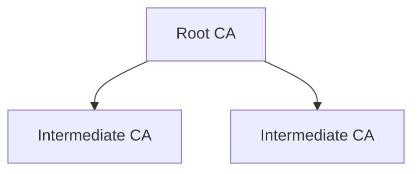

## Concept

The first step to creating your Internal PKI is to create a Private Certificate Authority (CA) hierarchy that is a structure of entities
used to issue digital certificates for services, applications, and devices.

## Workflow

A typical workflow for setting up a Private CA hierarchy consists of the following steps:

1. Configuring a root CA with details like name, validity period, and path length.
2. Configuring and chaining intermediate CA(s) with details like name, validity period, path length, and imported certificate.
3. Managing the CA lifecycle events such as CA succession.

<Note>
  Note that this workflow can be executed via the Infisical UI or manually such
  as via API. If manually executing the workflow, you may have to create a
  Certificate Signing Request (CSR) for the intermediate CA, create an
  intermediate certificate using the root CA private key and CSR, and import the
  intermediate certificate back to the intermediate CA as part of Step 2.
</Note>

## Guide

In the following steps, we explore how to create a simple Private CA hierarchy
consisting of a root CA and an intermediate CA using the Infisical UI.

<Steps>
    <Step title="Creating a root CA">
        To create a root CA, head to your Project > Internal PKI > Certificate Authorities and press **Create CA**.

        

        Here, set the **CA Type** to **Root** and fill out details for the root CA.

        

        Here's some guidance on each field:

        - Valid Until: The date until which the CA is valid in the date time string format specified [here](https://developer.mozilla.org/en-US/docs/Web/JavaScript/Reference/Global_Objects/Date#date_time_string_format). For example, the following formats would be valid: `YYYY`, `YYYY-MM`, `YYYY-MM-DD`, `YYYY-MM-DDTHH:mm:ss.sssZ`.
        - Path Length: The maximum number of intermediate CAs that can be chained to this CA. A path of `-1` implies no limit; a path of `0` implies no intermediate CAs can be chained.
        - Organization (O): The organization name.
        - Country (C): The country code.
        - State or Province Name: The state or province.
        - Locality Name: The city or locality.
        - Common Name: The name of the CA.

        <Note>
            The Organization, Country, State or Province Name, Locality Name, and Common Name make up the **Distinguished Name (DN)** or **subject** of the CA.
            At least one of these fields must be filled out.
        </Note>
    </Step>
    <Step title="Creating an intermediate CA">
        1.1. To create an intermediate CA, press **Create CA** again but this time specifying the **CA Type** to be **Intermediate**. Fill out the details for the intermediate CA.

        

        1.2. Next, press the **Install Certificate** option on the intermediate CA from step 1.1.

        

        Here, set the **Parent CA** to the root CA created in step 1 and configure the intended **Valid Until** and **Path Length** fields on the intermediate CA; feel free to use the prefilled values.

        

        Here's some guidance on each field:

        - Parent CA: The parent CA to which this intermediate CA will be chained. In this case, it should be the root CA created in step 1.
        - Valid Until: The date until which the CA is valid in the date time string format specified [here](https://developer.mozilla.org/en-US/docs/Web/JavaScript/Reference/Global_Objects/Date#date_time_string_format). The date must be within the validity period of the parent CA.
        - Path Length: The maximum number of intermediate CAs that can be chained to this CA. The path length must be less than the path length of the parent CA.

        Finally, press **Install** to chain the intermediate CA to the root CA; this creates a Certificate Signing Request (CSR) for the intermediate CA, creates an intermediate certificate using the root CA private key and CSR, and imports the signed certificate back to the intermediate CA.

        

        Great! You've successfully created a Private CA hierarchy with a root CA and an intermediate CA.
        Now check out the [Certificates](/documentation/platform/pki/certificates) page to learn more about how to issue X.509 certificates using the intermediate CA.

</Step>
</Steps>

## FAQ

<AccordionGroup>
  <Accordion title="What algorithms are supported as part of private key generation and certificate signing?">
    Infisical currently only supports `RSA_2048` and `SHA256WITHRSA` for the
    private key and signing algorithm. We are working to add support for more
    algorithms in the future.
  </Accordion>
</AccordionGroup>
