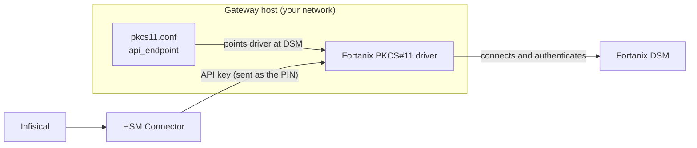

Infisical connects to Fortanix Data Security Manager (DSM) through an [HSM Connector](/documentation/platform/pki/settings/hsm-connectors). Once connected, Infisical features that support HSM-backed keys can generate and use keys that stay in your Fortanix DSM. This guide covers the full setup: installing the Fortanix PKCS#11 driver on a [Gateway](/documentation/platform/gateways/overview) inside your network, pointing it at your DSM, and creating the Connector in Infisical.

## Prerequisites

- A Fortanix DSM account with a group and an application configured for PKCS#11 access.
- A host inside your network that can reach your DSM endpoint over HTTPS, where you can install the Fortanix PKCS#11 client and run an [Infisical Gateway](/documentation/platform/gateways/overview).
- Permission to create HSM Connectors in Infisical (`HSM Connectors > Create`).

## How it works

Infisical reaches your DSM through the HSM Connector. Each operation goes from Infisical to the Connector, which routes it to a Gateway inside your network. The Gateway loads the Fortanix PKCS#11 driver, runs the operation against your DSM, and returns the result. DSM is reached only through the Connector and its Gateway, never from Infisical directly.



Two pieces of configuration are involved, and they are separate:

- **The driver's config file (`pkcs11.conf`) on the Gateway host** tells the Fortanix driver which DSM endpoint to connect to. This is the standard Fortanix client configuration that any PKCS#11 application uses.
- **The Connector's PIN in Infisical** is your Fortanix API key. The Gateway passes it to DSM as the PKCS#11 login credential.

Your API key is a credential, so it goes only in Infisical as the PIN. It does not belong in `pkcs11.conf`.

## Set up the connection

<Steps>
  <Step title="Get your Fortanix application API key">
    In the Fortanix DSM dashboard, go to **Apps**, open the application you use for PKCS#11 access, and find the **API Key** section. Click **View API Key Details** to copy the key, or **Regenerate** to create a new one.

    The application can only use keys in the groups it belongs to (shown in the **Groups** section of the app), so make sure the keys you want Infisical to use live in a group this app can access.

    You will enter this API key in Infisical as the Connector's PIN in the final step.
  </Step>

  <Step title="Install the driver and point it at your DSM">
    Gateway HSM support runs on Linux only, so install the Fortanix PKCS#11 library on the Linux machine that will run the Gateway. Fortanix publishes it on its [PKCS#11 library page](https://support.fortanix.com/docs/fortanix-dsm-clients-pkcs11-library) as a `.deb` package, an `.rpm` package, or a standalone `.so`. A `.deb` apt repository is also available (`deb https://download.fortanix.com/linux/apt focal main`). The driver installs to `/opt/fortanix/pkcs11/fortanix_pkcs11.so`.

    Confirm the driver file is readable by the Gateway user:

    ```bash
    ls -l /opt/fortanix/pkcs11/fortanix_pkcs11.so
    ```

    Create the Fortanix client configuration file at `/etc/fortanix/pkcs11.conf` with the DSM endpoint for your region:

    ```toml
    api_endpoint = "https://amer.smartkey.io"
    ```

    This is the only setting the driver needs here. Infisical supplies the API key as the PIN in the final step.
  </Step>

  <Step title="Start the Gateway with the driver attached">
    Append `--pkcs11-module=/opt/fortanix/pkcs11/fortanix_pkcs11.so` to the Gateway start (or systemd install) command:

    <Tabs>
      <Tab title="Linux (systemd)">
        ```bash
        sudo infisical gateway systemd install <gateway-name> \
          --enroll-method=token \
          --token=<enrollment-token> \
          --domain=<your-infisical-domain> \
          --pkcs11-module=/opt/fortanix/pkcs11/fortanix_pkcs11.so
        sudo systemctl start <gateway-name>
        ```
      </Tab>
      <Tab title="Foreground">
        ```bash
        infisical gateway start <gateway-name> \
          --enroll-method=token \
          --token=<enrollment-token> \
          --domain=<your-infisical-domain> \
          --pkcs11-module=/opt/fortanix/pkcs11/fortanix_pkcs11.so
        ```
      </Tab>
    </Tabs>

    The Gateway logs a line confirming the PKCS#11 module loaded.
  </Step>

  <Step title="Create the HSM Connector in Infisical">
    In **Certificate Manager > Settings > HSM Connectors**, click **Add HSM Connector** and fill in:

    | Field | Value |
    |-------|-------|
    | **Name** | Slug-friendly identifier, e.g. `fortanix-prod`. |
    | **Gateway** | The Gateway you started above (or a Pool that contains it). |
    | **Slot label** | `Fortanix Token` by default. If you configured a custom token label, use that value instead. |
    | **PIN** | Your Fortanix application API key from Step 1. |
    | **Key label prefix** | Optional prefix added to every key label Infisical creates in this slot. |
  </Step>
</Steps>

## Troubleshooting

<AccordionGroup>
  <Accordion title="The slot can't be found">
    The slot label must match the `token label` the driver reports, exactly and case-sensitive. List it on the Gateway host:

    ```bash
    pkcs11-tool --module /opt/fortanix/pkcs11/fortanix_pkcs11.so --list-token-slots
    ```

    On Fortanix DSM the value is `Fortanix Token`.
  </Accordion>
  <Accordion title="Login to the HSM failed">
    The PIN must be your Fortanix application API key, not the DSM account password. If you regenerated the API key in the Fortanix dashboard, update the Connector's PIN in Infisical to match.
  </Accordion>
  <Accordion title="The Gateway can't reach DSM">
    Check `api_endpoint` in `/etc/fortanix/pkcs11.conf`. It must point to your DSM region and be reachable over HTTPS from the Gateway host.
  </Accordion>
  <Accordion title="The Gateway is unreachable for HSM operations">
    The Gateway must run with `--pkcs11-module` so the driver loads. Check the Gateway log for the PKCS#11 module load line.
  </Accordion>
  <Accordion title="Operations through the HSM feel slow">
    Every operation makes a round-trip to DSM. Run the Gateway in the same network as DSM to keep latency low.
  </Accordion>
</AccordionGroup>

## What's next?

<CardGroup cols={2}>
  <Card title="HSM Connectors" icon="shield-halved" href="/documentation/platform/pki/settings/hsm-connectors">
    Concept overview and the generic setup flow.
  </Card>
  <Card title="Signers" icon="signature" href="/documentation/platform/pki/code-signing/signers">
    Create an HSM-backed Signer that uses this Connector.
  </Card>
</CardGroup>
