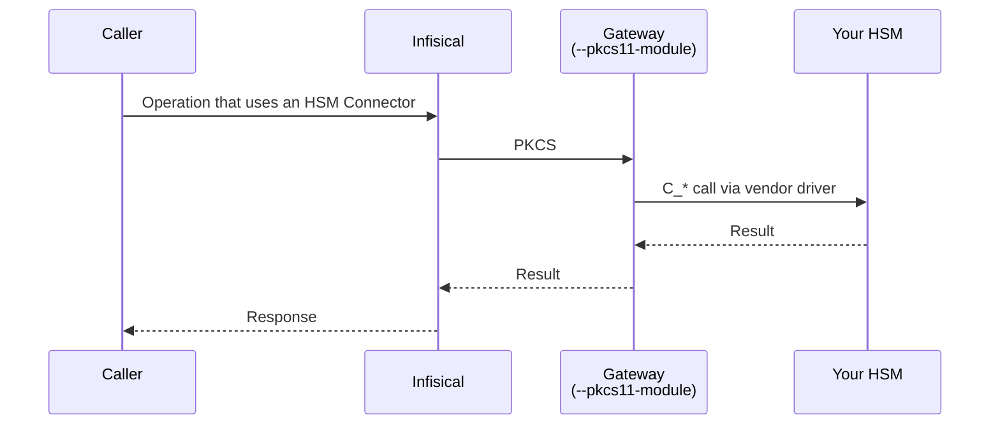

An **HSM Connector** is a resource that tells Infisical how to reach a slot on your Hardware Security Module. The Connector carries the routing (which Gateway can talk to the HSM) and the credentials (slot label, PIN) needed to authenticate to that slot. Infisical features that support HSM-backed keys reference the Connector to perform PKCS#11 operations on your HSM.

Infisical never talks to the HSM directly. A Gateway you run inside your network does, using your HSM vendor's PKCS#11 driver. The Connector itself stores nothing about your HSM keys. It is a routing and credentials record.

## How it fits together



Three pieces have to be in place for an HSM Connector to be usable:

1. **A Gateway** running on a host that can talk to your HSM, started with `--pkcs11-module=<path to vendor .so/.dll>`.
2. **An HSM Connector** that points at that Gateway (or a Pool that contains it) and carries the slot credentials.
3. **A consumer**, a feature that supports HSM-backed keys. See the feature's own docs for how it references an HSM Connector.

## Run a Gateway with PKCS#11 enabled

The same Gateway binary you already deploy can serve HSM operations: just pass the PKCS#11 driver path at start time. A Gateway started without that flag stays a regular Gateway. HSM Connectors will skip it automatically.

<Steps>
  <Step title="Install your HSM's PKCS#11 driver on the Gateway host">
    Install the PKCS#11 library shipped by your HSM vendor on the same machine where the Gateway will run. Note the absolute path to the `.so` or `.dll`. You will pass it to the Gateway in the next step.

    For example, a Fortanix DSM deployment typically installs its driver at `/opt/fortanix/pkcs11/fortanix_pkcs11.so`. Any vendor with a PKCS#11 driver works the same way.

    Follow the vendor's onboarding to provision a slot, configure operator credentials, and confirm `pkcs11-tool --module <driver> --list-slots` returns the expected slot label.
  </Step>

  <Step title="Create the Gateway in the Infisical UI">
    Go to **Organization Settings > Networking > Gateways**, click **Create Gateway**, name it, and pick an auth method. Then click **Show deploy command** and copy the install command for your platform. This is the same flow as a regular Gateway. See [Gateway Deployment](/documentation/platform/gateways/gateway-deployment) for full setup detail (relay, firewall, AWS or token auth).
  </Step>

  <Step title="Start the Gateway with --pkcs11-module">
    Append `--pkcs11-module=<absolute path>` to the start command. The Gateway loads the driver once on startup, advertises PKCS#11 capability in its heartbeat, and serves HSM operations alongside its other traffic.

    <Tabs>
      <Tab title="Linux (Production)">
        ```bash
        sudo infisical gateway systemd install <gateway-name> \
          --enroll-method=token \
          --token=<enrollment-token> \
          --domain=<your-infisical-domain> \
          --pkcs11-module=/opt/fortanix/pkcs11/fortanix_pkcs11.so
        sudo systemctl start <gateway-name>
        ```

        The systemd unit captures the `--pkcs11-module` flag, so restarts pick up the same driver.
      </Tab>
      <Tab title="Foreground">
        ```bash
        infisical gateway start <gateway-name> \
          --enroll-method=token \
          --token=<enrollment-token> \
          --domain=<your-infisical-domain> \
          --pkcs11-module=/opt/fortanix/pkcs11/fortanix_pkcs11.so
        ```
      </Tab>
    </Tabs>

    On startup you should see a log line like `PKCS#11 module loaded, Gateway will serve HSM requests`. If the driver path is wrong or unreadable, the Gateway exits with an error before connecting.
  </Step>

  <Step title="(Optional) Add the Gateway to a Pool">
    For high availability, deploy two or more PKCS#11-enabled Gateways and add them to the same [Gateway Pool](/documentation/platform/gateways/gateway-pools). HSM Connectors that target the pool route each request to a randomly chosen, healthy, PKCS#11-capable member. Non-capable members in the same pool are silently skipped.
  </Step>
</Steps>

<Note>
PKCS#11 driver libraries are vendor-specific binaries. Place them on the Gateway host with the same file permissions the Gateway process expects to read, and verify the driver matches your HSM firmware version before connecting it to production traffic.
</Note>

## Create an HSM Connector

Once you have a PKCS#11-enabled Gateway running and heartbeating, create the Connector in Cert Manager.

In **Certificate Manager > Settings > HSM Connectors**, click **Add HSM Connector**. The wizard walks you through three steps.

<Steps>
  <Step title="Basics">
    | Field | Description |
    |-------|-------------|
    | **Name** | Slug-friendly identifier (lowercase, dashes). Example: `fortanix-prod`. |
    | **Description** | Optional. Context for your team. Example: *Fortanix DSM, production keys*. |
  </Step>

  <Step title="Reached from">
    Pick how Infisical reaches your HSM:

    - **Gateway**: route every operation through one specific Gateway. Use this if you have a single PKCS#11-enabled Gateway, or if you want strict routing.
    - **Gateway Pool**: route through any healthy, PKCS#11-capable member of the pool. Recommended for production so a single Gateway outage doesn't stop operations. Non-PKCS#11 members of the pool (regular Gateways serving other resources) are skipped automatically.

    Only Gateways that have advertised PKCS#11 capability in their last heartbeat are eligible. The "Reached from" step shows the filtered list. If the dropdown is empty, double-check the Gateway is running with `--pkcs11-module`.
  </Step>

  <Step title="Access">
    Supply the credentials Infisical uses to authenticate to the HSM slot through the Gateway.

    | Field | Description |
    |-------|-------------|
    | **Slot label** | The PKCS#11 token label of the slot to use. For example, `Fortanix Token`. Find it with `pkcs11-tool --module <driver> --list-slots`. |
    | **PIN** | The PKCS#11 user PIN for that slot. Stored encrypted with your KMS key, sent to the Gateway over the proxied TLS channel on every request. |
    | **Key label prefix** | Optional prefix prepended to every key label Infisical creates in this slot. Example: `infisical-` produces labels like `infisical-{id}`. Useful when the HSM hosts keys for multiple applications. |

    Click **Create HSM Connector**. Infisical runs a Verify against the HSM before persisting the Connector. Wrong PIN, unknown slot label, or unreachable Gateway are caught at this point and the Connector is not saved.
  </Step>
</Steps>

After creation, the Connector appears in the list with a per-row **Verify** action that re-runs the same round-trip on demand.

## FAQ

<AccordionGroup>
  <Accordion title="What happens to keys on the HSM when I delete a referencing resource?">
    Nothing. Infisical removes its reference to the key label. The actual key object remains on your HSM. Delete it through your HSM's own tooling if you want to free the slot.
  </Accordion>
  <Accordion title="Can I route HSM traffic through the same Gateway that serves my databases or app connections?">
    Yes. Append `--pkcs11-module` to the start command of an existing Gateway and that Gateway will serve HSM operations alongside its other traffic. Restart is required for the driver to load.
  </Accordion>
  <Accordion title="Does a Gateway Pool need every member to be PKCS#11-capable?">
    No. Connectors routed through a pool ignore non-capable members. You can mix one or two PKCS#11-enabled Gateways with the rest of your pool freely.
  </Accordion>
  <Accordion title="Which mechanisms are supported?">
    The PKCS#11 bridge supports `CKM_RSA_PKCS`, `CKM_SHA256_RSA_PKCS`, `CKM_SHA384_RSA_PKCS`, `CKM_SHA512_RSA_PKCS`, and `CKM_ECDSA_SHA256` / `SHA384` / `SHA512`. Key algorithms supported for generation are `RSA_2048`, `RSA_4096`, `ECC_P256`, and `ECC_P384`.
  </Accordion>
  <Accordion title="Can I rotate the PIN without recreating resources that reference the Connector?">
    Yes. Edit the Connector and update the PIN. The next operation uses the new credential. Existing references continue to work unchanged.
  </Accordion>
</AccordionGroup>

## What's next?

<CardGroup cols={2}>
  <Card title="Gateway Deployment" icon="server" href="/documentation/platform/gateways/gateway-deployment">
    Full Gateway setup including relay, firewall, and AWS auth.
  </Card>
  <Card title="Gateway Pools" icon="object-group" href="/documentation/platform/gateways/gateway-pools">
    Group PKCS#11-enabled Gateways for high availability.
  </Card>
</CardGroup>
