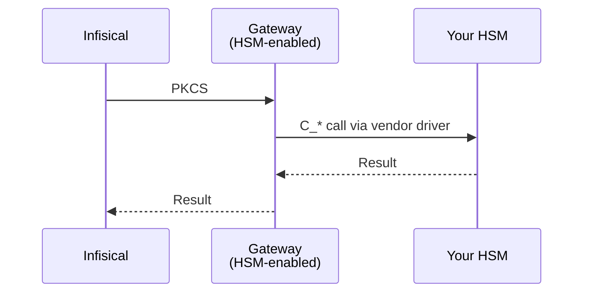

An **HSM Connector** is the resource you create in Infisical to register a slot on your Hardware Security Module. It holds the slot's credentials (slot label, PIN) and a reference to a [Gateway](/documentation/platform/gateways/overview) running inside your network that can talk to the HSM. Infisical features that support HSM-backed keys reference the Connector when they need to perform PKCS#11 operations on your HSM.

The Connector itself stores no key material. It is a credentials and routing record. Infisical never talks to the HSM directly. Instead, a Gateway acts as the bridge, loading your HSM vendor's PKCS#11 driver in the network where the HSM lives.

## Before you start

Have these on hand before you create a Connector:

- A **running, HSM-capable Gateway** on a host that can reach your HSM. New to Gateways? Start at [Gateway Deployment](/documentation/platform/gateways/gateway-deployment), then come back. The Gateway must be started with `--pkcs11-module=<absolute path>` so it loads your HSM's PKCS#11 driver.
- The **absolute path to the PKCS#11 driver** (`.so`) provided by your HSM vendor. Gateway HSM support runs on Linux only.
- The **slot label** and **PIN** of the HSM slot Infisical should use. Both come from your HSM provider.

## How it fits together

At the top level there are three actors:


The detailed exchange Infisical performs against the HSM through the Gateway looks like this:



Three pieces have to be in place for an HSM Connector to be usable:

1. **A Gateway** running on a Linux host that can talk to your HSM, started with `--pkcs11-module=<path to vendor .so>`. See [Gateway Deployment](/documentation/platform/gateways/gateway-deployment).
2. **An HSM Connector** that points at that Gateway (or a Pool that contains it) and carries the slot credentials.
3. **A consumer**, a feature that supports HSM-backed keys. See the feature's own docs for how it references an HSM Connector.

## Run a Gateway with PKCS#11 enabled

The Gateway is the agent Infisical talks to when it needs your HSM. You install it once on a host inside your network, start it with your HSM's PKCS#11 driver path, and Infisical routes every HSM operation through it. A Gateway started without the PKCS#11 driver path is not eligible for HSM Connectors and is skipped automatically.

If you have never deployed a Gateway before, read [Gateway Deployment](/documentation/platform/gateways/gateway-deployment) first for the general install and auth flow, then return here for the HSM-specific flag.

<Steps>
  <Step title="Install your HSM's PKCS#11 driver on the Gateway host">
    Install the PKCS#11 library shipped by your HSM vendor on the Linux machine where the Gateway will run. Note the absolute path to the `.so`. You will pass it to the Gateway in the next step.

    For example, the Fortanix DSM PKCS#11 driver is commonly placed at `/opt/fortanix/pkcs11/fortanix_pkcs11.so` by Fortanix's installer, though you can put it anywhere the Gateway process can read.

    Follow the vendor's onboarding to provision a slot, configure operator credentials, and confirm `pkcs11-tool --module <driver> --list-slots` returns the expected slot label.
  </Step>

  <Step title="Create the Gateway in the Infisical UI">
    Go to **Organization Settings > Networking > Gateways**, click **Create Gateway**, name it, and pick an auth method. Then click **Show deploy command** and copy the install command for your platform. See [Gateway Deployment](/documentation/platform/gateways/gateway-deployment) for full setup detail (relay, firewall, AWS or token auth).
  </Step>

  <Step title="Start the Gateway with --pkcs11-module">
    Append `--pkcs11-module=<absolute path>` to the start command. The Gateway loads the driver once on startup and serves HSM operations alongside its other traffic.

    <Tabs>
      <Tab title="Linux (Production)">
        ```bash
        sudo infisical gateway systemd install <gateway-name> \
          --enroll-method=token \
          --token=<enrollment-token> \
          --domain=<your-infisical-domain> \
          --pkcs11-module=/opt/fortanix/pkcs11/fortanix_pkcs11.so
        sudo systemctl start <gateway-name>
        ```

        The systemd unit captures the `--pkcs11-module` flag, so restarts pick up the same driver.
      </Tab>
      <Tab title="Foreground">
        ```bash
        infisical gateway start <gateway-name> \
          --enroll-method=token \
          --token=<enrollment-token> \
          --domain=<your-infisical-domain> \
          --pkcs11-module=/opt/fortanix/pkcs11/fortanix_pkcs11.so
        ```
      </Tab>
    </Tabs>

    On startup you should see a log line confirming the PKCS#11 module loaded. If the driver path is wrong or unreadable, the Gateway exits with an error before connecting.
  </Step>

  <Step title="(Optional) Add the Gateway to a Pool">
    For high availability, deploy two or more PKCS#11-enabled Gateways and add them to the same [Gateway Pool](/documentation/platform/gateways/gateway-pools). HSM Connectors that target the pool route each request to a randomly chosen, healthy, PKCS#11-capable member. Non-capable members in the same pool are silently skipped.
  </Step>
</Steps>

<Note>
PKCS#11 driver libraries are vendor-specific binaries. Make sure the file is readable by the user running the Gateway (typically owner-only readable, mode 0640 with the Gateway user in the owning group, or 0644 if simpler). Verify the driver matches your HSM firmware version before connecting it to production traffic.
</Note>

## Create an HSM Connector

Once you have a PKCS#11-enabled Gateway running, create the Connector in Cert Manager.

In **Certificate Manager > Settings > HSM Connectors**, click **Add HSM Connector**. The wizard walks you through three steps.

<Steps>
  <Step title="Basics">
    | Field | Description |
    |-------|-------------|
    | **Name** | Slug-friendly identifier (lowercase, dashes). Example: `fortanix-prod`. |
    | **Description** | Optional. Context for your team. Example: *Fortanix DSM, production keys*. |
  </Step>

  <Step title="Connection">
    Pick the **Gateway** Infisical uses to reach your HSM:

    - **Gateway**: route every operation through one specific Gateway. Use this if you have a single PKCS#11-enabled Gateway, or if you want strict routing.
    - **Gateway Pool**: route through any healthy, PKCS#11-capable member of the pool. Recommended for production so a single Gateway outage doesn't stop operations. Pool members without PKCS#11 enabled are skipped automatically.

    Only HSM-capable Gateways are eligible. The Gateway dropdown shows the filtered list. If it's empty, double-check the Gateway is running with `--pkcs11-module`.
  </Step>

  <Step title="Credentials">
    Supply the credentials Infisical uses to authenticate to the HSM slot through the Gateway.

    | Field | Description |
    |-------|-------------|
    | **Slot label** | The PKCS#11 token label of the slot to use. |
    | **PIN** | The PKCS#11 user PIN for that slot. Stored encrypted with your KMS key, sent to the Gateway over the proxied TLS channel on every request. |
    | **Key label prefix** | Optional prefix prepended to every key label Infisical creates in this slot. Example: `infisical-` produces labels like `infisical-{id}`. Useful when the HSM hosts keys for multiple applications. |

    Click **Add HSM Connector**. Infisical runs a Verify against the HSM before persisting the Connector. Wrong PIN, unknown slot label, or unreachable Gateway are caught at this point and the Connector is not saved.
  </Step>
</Steps>

## FAQ

<AccordionGroup>
  <Accordion title="What happens to keys on the HSM when I delete a referencing resource?">
    Nothing. Infisical removes its reference to the key label. The actual key object remains on your HSM. Delete it through your HSM's own tooling if you want to free the slot.
  </Accordion>
  <Accordion title="Can I route HSM traffic through the same Gateway that serves my databases or app connections?">
    Yes. Append `--pkcs11-module` to the start command of an existing Gateway and that Gateway will serve HSM operations alongside its other traffic. Restart is required for the driver to load.
  </Accordion>
  <Accordion title="Does a Gateway Pool need every member to be PKCS#11-capable?">
    No. Connectors routed through a pool ignore non-capable members. You can mix one or two PKCS#11-enabled Gateways with the rest of your pool freely.
  </Accordion>
  <Accordion title="Which mechanisms are supported?">
    The PKCS#11 bridge supports the following signing mechanisms:

    | Mechanism | What it does |
    |-----------|--------------|
    | RSA PKCS#1 v1.5 | Raw RSA signing of a pre-hashed digest |
    | SHA-256 with RSA PKCS#1 v1.5 | RSA signing with SHA-256 inside the HSM |
    | SHA-384 with RSA PKCS#1 v1.5 | RSA signing with SHA-384 inside the HSM |
    | SHA-512 with RSA PKCS#1 v1.5 | RSA signing with SHA-512 inside the HSM |
    | ECDSA with SHA-256 | ECDSA signing with SHA-256 inside the HSM |
    | ECDSA with SHA-384 | ECDSA signing with SHA-384 inside the HSM |
    | ECDSA with SHA-512 | ECDSA signing with SHA-512 inside the HSM |

    Key algorithms supported for generation: RSA 2048-bit, RSA 4096-bit, ECDSA P-256, and ECDSA P-384.
  </Accordion>
  <Accordion title="Can I rotate the PIN without recreating resources that reference the Connector?">
    Yes. Edit the Connector and update the PIN. The next operation uses the new credential. Existing references continue to work unchanged.
  </Accordion>
</AccordionGroup>

## What's next?

<CardGroup cols={2}>
  <Card title="Fortanix DSM" icon="shield-halved" href="/documentation/platform/pki/settings/hsm-connectors-fortanix-dsm">
    Step-by-step Fortanix Data Security Manager setup.
  </Card>
  <Card title="Gateway Deployment" icon="server" href="/documentation/platform/gateways/gateway-deployment">
    Full Gateway setup including relay, firewall, and AWS auth.
  </Card>
  <Card title="Gateway Pools" icon="object-group" href="/documentation/platform/gateways/gateway-pools">
    Group HSM-capable Gateways for high availability.
  </Card>
</CardGroup>
