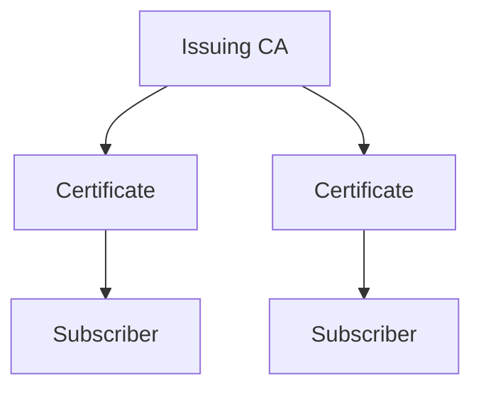

## Concept

In Infisical PKI, subscribers are logical representations of entities such as devices, servers, applications that request and receive certificates from Certificate Authorities (CAs).

<div align="center">



</div>

## Workflow

The typical workflow for managing subscribers consists of the following steps:

1. Creating a subscriber and defining which (issuing) CA will issue X.509 certificates for it as well as attributes to be included on the certificates including common name, subject alternative names, TLL, etc.
2. Requesting for a certificate against the subscriber with or without a certificate signing request (CSR).
3. Managing certificate lifecycle events such as certificate renewal and revocation. As part of the certificate revocation flow,
   you can also query for a Certificate Revocation List [CRL](https://en.wikipedia.org/wiki/Certificate_revocation_list), a time-stamped, signed
   data structure issued by a CA containing a list of revoked certificates to check if a certificate has been revoked.

<Note>
  Note that this workflow can be executed via the Infisical UI or manually such
  as via API.
</Note>

## Guide to Issuing Certificates with Subscribers

In the following steps, we explore how to issue a X.509 certificate for a subscriber.

<Steps>
  <Step title="Creating a subscriber">
    A subscriber is the logical representation of an entity that requests and
    receives certificates from a CA. With a subscriber, you can specify the
    attributes that must be present on the X.509 certificates issued for it.

    Head to your Infisical PKI Project > Subscribers to create a subscriber.

    

    

    Here's some guidance on each field.

    - Subscriber Name: A slug-friendly name for the subscriber such as `web-service`.
    - Issuing CA: The Certificate Authority (CA) that will issue X.509 certificates for the subscriber.
    - Common Name (CN): The common name to be included on certificates to be issued to the subscriber.
    - Subject Alternative Names (SANs): A comma-delimited list of Subject Alternative Names (SANs) to be included on certificates; these can be hostnames or email addresses like `app1.acme.com, app2.acme.com`.
    - TTL: The lifetime of the certificate.
    - Key Usage: The key usage extension of the certificate.
    - Extended Key Usage: The extended key usage extension of the certificate.

    <Note>
        It's possible to issue certificates for a subscriber with or without a certificate signing request (CSR).
        - If requesting without a CSR, the attributes specified on the subscriber will be used to issue a certificate for the subscriber.
        - If requesting with a CSR, the attributes on it will be validated against the attributes specified on the subscriber
        and a certificate is only issued if they comply.
    </Note>

  </Step>
  <Step title="Requesting a certificate">
    Once you have created a subscriber from step 1, you can issue a certificate for it.

    Press on the subscriber you want to issue a certificate for and click on the **Issue Certificate** button on that subscriber's page.

    

    

  </Step>
</Steps>

## Guide to Revoking Certificates

In the following steps, we explore how to revoke a X.509 certificate and obtain a Certificate Revocation List (CRL) for a CA.

<Steps>
  <Step title="Revoking a Certificate">
    Assuming that you've issued a certificate for a subscriber, you can revoke it by
    selecting the **Revoke Certificate** option on the certificate you wish to revoke
    on the subscriber's page.
    
    
    
  </Step>
  <Step title="Obtaining a CRL">
    In order to check the revocation status of a certificate, you can check it
    against the CRL of a CA by heading to its Issuing CA and downloading the CRL.

    

    To verify a certificate against the
    downloaded CRL with OpenSSL, you can use the following command:

```bash
openssl verify -crl_check -CAfile chain.pem -CRLfile crl.pem cert.pem
```

Note that you can also obtain the CRL from the certificate itself by
referencing the CRL distribution point extension on the certificate.

To check a certificate against the CRL distribution point specified within it with OpenSSL, you can use the following command:

```bash
openssl verify -verbose -crl_check -crl_download -CAfile chain.pem cert.pem
```

  </Step>
</Steps>

## FAQ

<AccordionGroup>
  <Accordion title="What is the workflow for renewing a certificate?">
    To renew a certificate, you have to issue a new certificate for the same
    subscriber. The original certificate will continue to be valid through its
    original TTL unless explicitly revoked.
  </Accordion>
</AccordionGroup>
