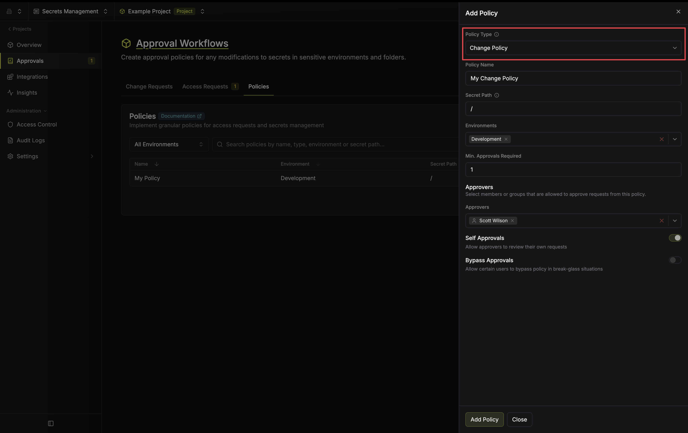
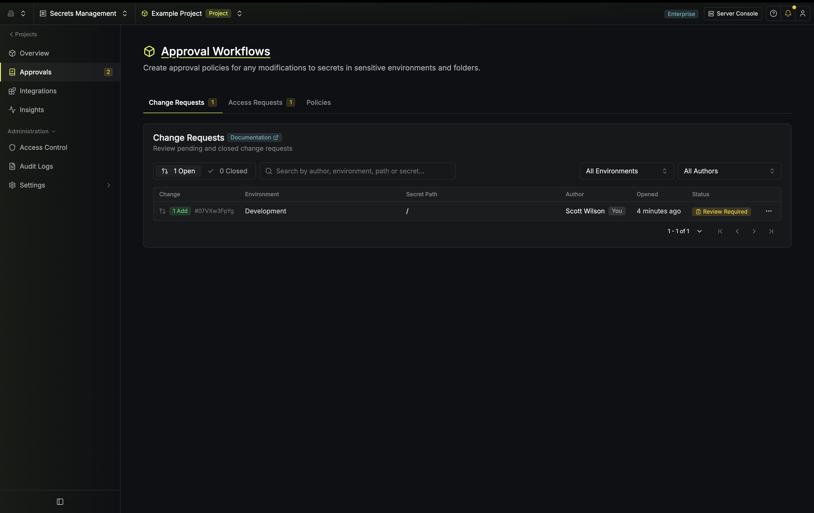
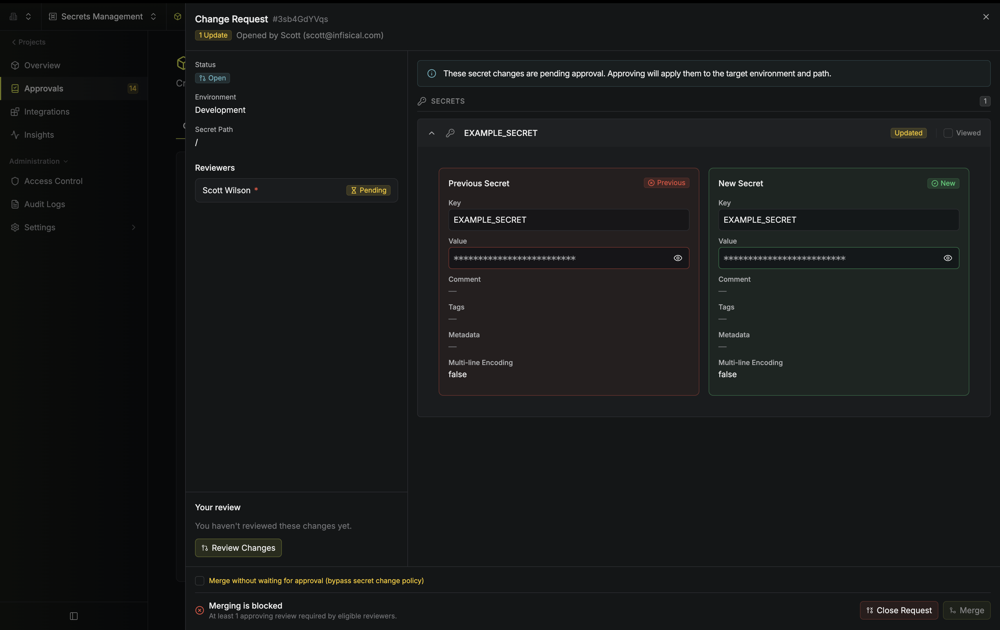

<Info>
  This feature is available under the **Pro Tier** and **Enterprise Tier** on Infisical Cloud.

  If you're self-hosting Infisical, contact sales@infisical.com to purchase an
  enterprise license.
</Info>

This guide shows you how to create approval policies that require changes to secrets in specific environments to be reviewed and approved before they take effect. For background on how approval workflows work and why they matter, see [Approval workflows (concept)](/documentation/platform/secrets-mgmt/concepts/approval-workflows).

## Prerequisites

- An Infisical project with at least one environment configured
- The **Create** permission on **Secret Approval** for the target project (typically granted to project admins or custom roles with explicit Secret Approval permissions)
- Access to the **Approvals** page in your project sidebar (**Project → Approvals**)

<Steps>
  <Step title="Create a change policy">
    Navigate to **Project → Approvals** in the Infisical dashboard and create a new policy.

    Select **Change Policy** as the policy type. Other types include **Access Policy**, which creates policies for [Access Requests](/documentation/platform/access-controls/access-requests).

    Choose the target environment (for example, `prod`) and assign one or more approvers.

    

    #### Configure self-approvals

    Enable the **Self Approvals** toggle if you want designated approvers to be able to approve their own change requests. Disable it to require approval from a different approver.

    #### Configure bypass approvals

    By default, every change matching the policy requires full approval before it can be merged.

    Enable the **Bypass Approvals** toggle to allow certain users to bypass the approval requirement in break-glass situations. If a change request is bypassed, all approvers are notified via email.

    When bypass approvals are enabled, you can select specific users or groups allowed to bypass the policy. If you do not select any users or groups, anyone can bypass.

    A bypass can only be performed by the person who created the change request. Bypassers cannot bypass requests submitted by others.

  </Step>
  <Step title="Submit a change request">
    When a user modifies secrets in an environment that has an active change policy, a change request is automatically created and sent to the assigned approvers.

    
  </Step>
  <Step title="Review and act on a change request">
    Approvers are notified by email, [Slack](/documentation/platform/workflow-integrations/slack-integration), or [Microsoft Teams](/documentation/platform/workflow-integrations/microsoft-teams-integration) when a new change request is submitted.

    In the Infisical dashboard, an approver can take the following actions:

    1. **Approve** — Submit an approval vote for the change request. The request must meet the minimum approval threshold defined in the policy before it can be merged.
    2. **Merge** — Apply the approved changes to the target environment. This is a separate action from approving and can be performed by an admin, the request creator, or an approver once sufficient approvals are met.
    3. **Reject** — Decline the change request.

    

    After a change request is merged, the updated secrets are automatically synced to connected applications (for example, through the [Infisical Kubernetes Operator](https://infisical.com/docs/integrations/platforms/kubernetes)).
  </Step>
</Steps>

## Verify the result

To confirm the workflow is working end-to-end:

1. Submit a test change to a secret in the policy-protected environment.
2. Confirm that a change request is created and approvers are notified.
3. Approve and merge the request.
4. Verify that the change request status shows as **Merged** on the **Approvals** page and the updated secret values appear in the target environment.

## Related resources

- [How approval workflows work](/documentation/platform/secrets-mgmt/concepts/approval-workflows)
- [Access Requests](/documentation/platform/access-controls/access-requests)
- [Slack Integration](/documentation/platform/workflow-integrations/slack-integration)
- [Microsoft Teams Integration](/documentation/platform/workflow-integrations/microsoft-teams-integration)
