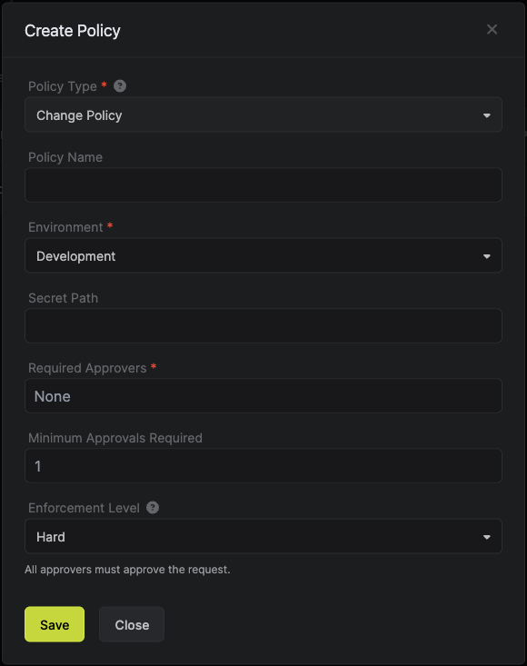

## Problem at hand

Updating secrets in high-stakes environments (e.g., production) can have a number of problematic issues: 
- Most developers should not have access to secrets in production environments. Yet, they are the ones who often need to add new secrets or change the existing ones. Many organizations have in-house policies with regards to what person should be contacted in the case of needing to make changes to secrets. This slows down software development lifecycle and distracts engineers from working on things that matter the most.   
- As a general rule, before making changes in production environments, those changes have to be looked over by at least another person. An extra pair of eyes can help reduce the risk of human error and make sure that the change will not affect the application in an unintended way. 
- After making updates to secrets, the corresponding applications need to be redeployed with the right set of secrets and configurations. This process is often not automated and hence prone to human error. 

## Solution

As a wide-spread software engineering practice, developers have to submit their code as a PR that needs to be approved before the code is merged into the main branch. 

In a similar way, to solve the above-mentioned issues, Infisical provides a feature called `Approval Workflows` for secret management. This is a set of policies and workflows that help advance access controls, compliance procedures, and stability of a particular environment. In other words, **Approval Workflows** help you secure, stabilize, and streamline the change of secrets in high-stakes environments. 

### Setting a policy

First, you would need to create a set of policies for a certain environment. In the example below, a generic change policy for a production environment is shown. In this case, any user who submits a change to `prod` would first have to get an approval by a predefined approver (or multiple approvers).

### Policy enforcement levels

The enforcement level determines how strict the policy is. A **Hard** enforcement level means that any change that matches the policy will need full approval prior merging. A **Soft** enforcement level allows for break glass functionality on the request. If a change request is bypassed, the approvers will be notified via email.

### Example of creating a change policy

When creating a policy, you can choose the type of policy you want to create. In this case, we will be creating a `Change Policy`. Other types of policies include `Access Policy` that creates policies for **[Access Requests](/documentation/platform/access-controls/access-requests)**.

### Example of updating secrets with Approval workflows

When a user submits a change to an enviropnment that is under a particular policy, a corresponsing change request will go to a predefined approver (or multiple approvers). 

Approvers are notified by email and/or Slack as soon as the request is initiated. In the Infisical Dashboard, they will be able to `approve` and `merge` (or `deny`) a request for a change in a particular environment. After that, depending on the workflows setup, the change will be automatically propagated to the right applications (e.g., using [Infisical Kubernetes Operator](https://infisical.com/docs/integrations/platforms/kubernetes)).

