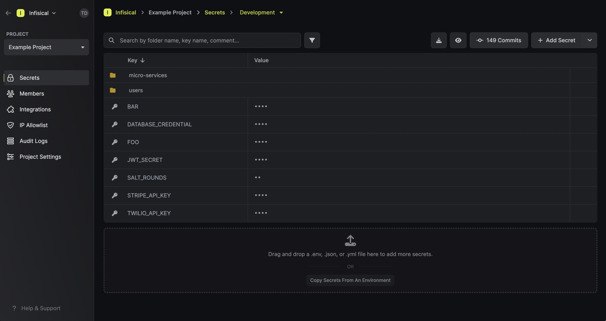

A project houses environment variables for an application.

## Dashboard

The dashboard page is where you can manage environment variables for a given project.

### Environment variables

Environment variables can be added or removed from a project. By default, they are pre-populated in your first project for demonstration. For any subsequent project, it can be convenient to import existing environment variables by dragging and dropping a .env file containing them.

Here's what dragging and dropping a .env looks like:

### Environments

In most cases, environment variables belong to specific environments: development, staging, testing, and production. You can input environment variables for each environment that your project uses.

### Personal overrides

Every environment variable value can be overriden with a custom value.

- An overriden value can only be read and accesssed by the user that overrode the original shared value. 
- A (default) shared value can be read and accesssed by other users in a project.

You can turn overrides on/off by toggling the override/branch icon:

### Search

You can search for any environment variable by its key.

### Hide/Un-hide

You can hide or un-hide the values of your environment variables. By default, the values are hidden for your privacy.

### Download as .env

You can download your environment variables back in a .env file.

