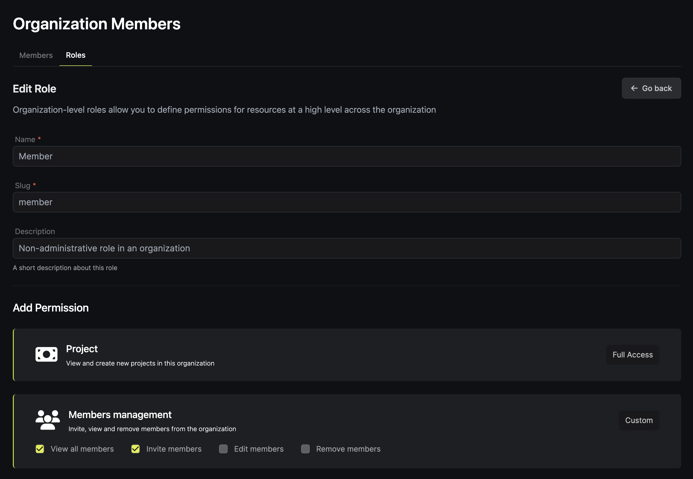
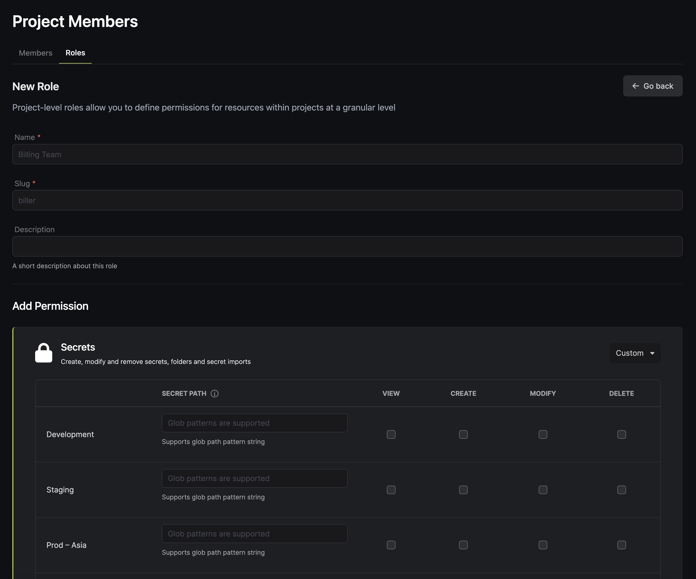

### General access controls

Access Control Policies provide a highly granular declarative way to grant or forbid access to certain resources and operations in Infisical. In general, access controls can be split up across projects and organizations.

### Organization-level access controls

By default, every user in a organization is either an **admin** or a **member**. 

Admins are able to perform every action with the organization, including adding and removing organization members, managing access controls, setting up security settings, and creating new projects. Members, on the other hand, are restricted from removing organization members, modifying billing information, updating access controls, and performing a number of other actions. 

Overall, organization-level access controls are significantly of administrative nature. Access to projects, secrets and other sensitive data is specified on the project level. 

### Project-level access controls

By default, every user in a project is either a **viewer**, **developer**, or an **admin**. Each of these roles comes with a varying access to different features and resources inside projects. As such, **admins** by default have access to all environments, folders, secrets, and actions within the project. At the same time, **developers** are restricted from performing project control actions, updating PR Workflow policies, managing roles/members, and more. Lastly, **viewer** is the most limiting default role on the project level – it forbids developers to perform any action and rather shows them in the read-only mode. 

### Creating custom roles

By creating custom roles, you are able to adjust permissions to the needs of your organization. This can be useful for: 
- Creating superadmin roles, roles specific to SRE engineers, etc. 
- Restricting access of users to specific secrets, folders, and environments. 
- Embedding these specific roles into [PR Workflow policies](https://infisical.com/docs/documentation/platform/pr-workflows)

