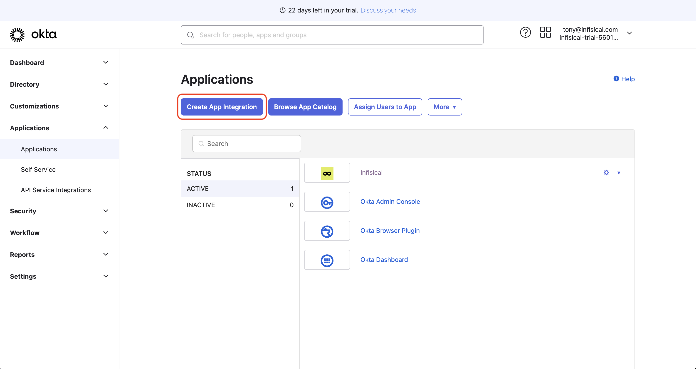
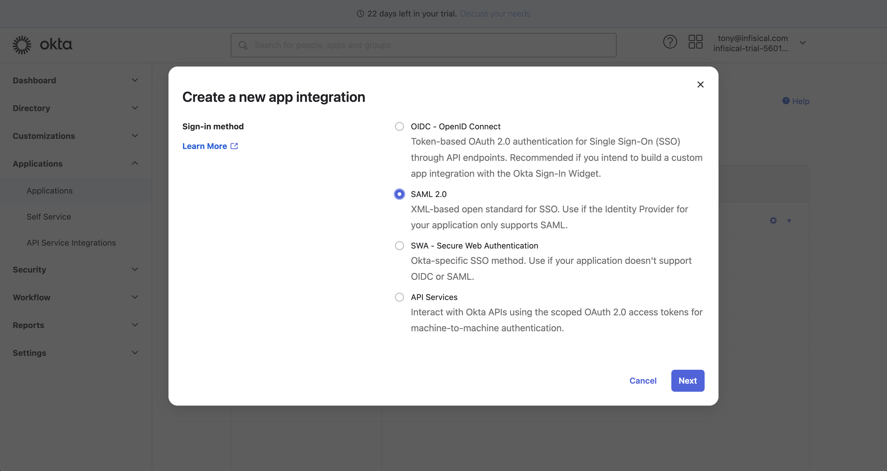
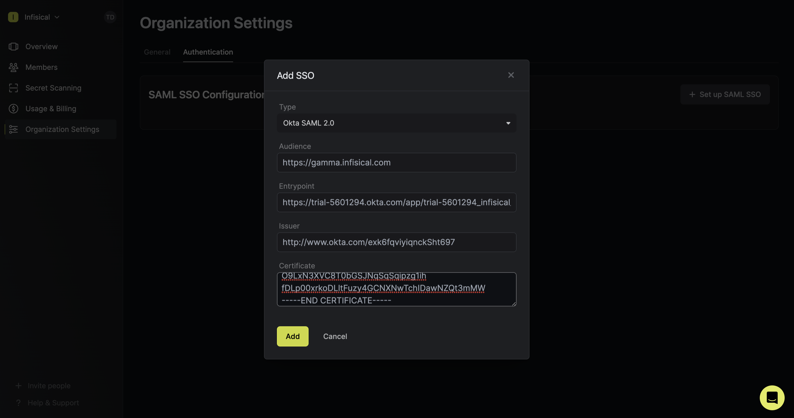
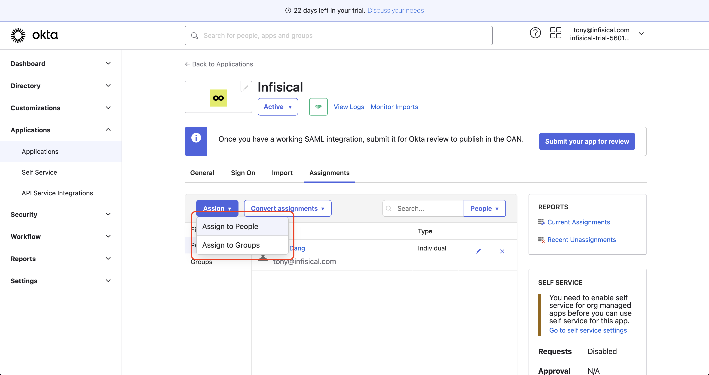

<Warning>
  Infisical currently only supports SAML SSO authentication with [Okta as the
  identity provider (IDP)](https://www.okta.com/). We're expanding support for
  other IDPs in the coming months, so stay tuned with this issue
  [here](https://github.com/Infisical/infisical/issues/442).
</Warning>

You can configure your organization in Infisical to have members authenticate with the platform via protocols like [SAML 2.0](https://en.wikipedia.org/wiki/SAML_2.0).

To note, configuring SSO retains the end-to-end encrypted architecture of Infisical because we decouple the **authentication** and **decryption** steps. In all login with SSO implementations,
your IDP cannot and will not have access to the decryption key needed to decrypt your secrets.

## Configuration

Head over to your organization Settings > Authentication > SAML SSO Configuration.

Next, press "Set up SAML SSO" in the SAML SSO and follow the instructions
below to configure SSO for your identity provider:

<Note>
  Note that only members with the `owner` or `admin` roles in an organization
  can configure SSO for it.
</Note>

<AccordionGroup>
  <Accordion title="Okta SAML 2.0">
    1. In the Okta Admin Portal, select Applications > Applications from the
    navigation. On the Applications screen, select the Create App Integration
    button.
    
    

    2. In the Create a New Application Integration dialog, select the SAML 2.0 radio button:

    

    3. On the General Settings screen, give the application a unique, Infisical-specific name and select Next.

    4. On the Configure SAML screen, configure the following fields:

    - Single sign on URL: `https://app.infisical.com/api/v1/sso/saml2/:identifier`; we'll update the `:identifier` part later in step 6.
    - Audience URI (SP Entity ID): `https://app.infisical.com`

    

    <Note>
        If you're self-hosting Infisical, then you will want to replace `https://app.infisical.com` with your own domain.
    </Note>

    4. Also on the Configure SAML screen, configure the Attribute Statements to map:

    - `id -> user.id`,
    - `email -> user.email`,
    - `firstName -> user.firstName`
    - `lastName -> user.lastName`

    

    Once configured, select the Next button to proceed to the Feedback screen and select Finish.

    5. Get IDP values

    Once your application is created, select the Sign On tab for the app and select the View Setup Instructions button located on the right side of the screen:

    Copy the Identity Provider Single Sign-On URL, the Identity Provider Issuer, and the X.509 Certificate to be pasted into your Infisical SAML SSO configuration details with the following map:

    - `Audience -> Okta Audience URI (SP Entity ID)`
    - `Entrypoint -> Okta Identity Provider Single Sign-On URL`
    - `Issuer -> Identity Provider Issuer`
    - `Certificate -> X.509 Certificate`.

    

    

    6. Create the SSO configuration and copy your SSO identifier in Infisical; update `:identifier` from step 4 earlier to be this value.

    

    7. Assignments

    Finally, Navigate to the Assignments tab and select the Assign button:

    You can assign access to the application on a user-by-user basis using the Assign to People option, or in-bulk using the Assign to Groups option.

    

    At this point, you have configured everything you need within the context of the Okta Admin Portal.

    8. Return to Infisical and enable SAML SSO.

    Enabling SAML SSO enforces all members in your organization to only be able to log into Infisical via Okta.

  </Accordion>
</AccordionGroup>
